# CLIVE Master Design Specification

> Consolidated master specification for CLIVE — a cognitive-health training app for adults 55+
> Version: 1.0 (consolidated)
> Status: Draft
> Product: CLIVE
> Platform: iOS / Android / Web
> Framework Target: React + TailwindCSS + shadcn/ui + Framer Motion
> Source: assembled from a ChatGPT PDF export ("CLIVE Design System v1.pdf", chapters 1-24 and Appendices A-M, O-AB) plus the ChatGPT design-exploration chat that produced the visual concepts and Brand Guidelines (Appendix N and Appendix AB)

**Note on this consolidation:** this file merges two sources. The chapter/appendix body (chapters 1–24, Appendices A–M and O–AB) comes from a ChatGPT-generated PDF export. Appendix N (Visual Concept Gallery) was assembled separately from a ChatGPT chat that produced high-fidelity screen concepts; the images for one screen (Story & Recall) could not be recovered because their preview expired in that chat's shared link. Two accidental duplicate sections in the source PDF (a repeated "21. Design System Governance" chapter and a repeated "Appendix F. Design Review Rubric", each generated twice/three times in a row by ChatGPT) were de-duplicated to a single copy. Appendix number **N** did not exist in the original PDF sequence (it jumped from M to O) — it has been used here for the Visual Concept Gallery so the appendix lettering now runs continuously A–AB.

---

# 1. Brand DNA

CLIVE is not a game.

CLIVE is not an educational app.

CLIVE is not a medical application.

CLIVE is a premium cognitive wellness product designed for adults over 55.

Every visual decision must reinforce calmness, confidence and clarity.

The interface should feel closer to:

• Apple Health
• Oura
• Headspace
• Kinfolk Magazine

than to

• Lumosity
• Candy Crush
• Duolingo
• Generic React Dashboard

The application should never feel childish.

Never use bright saturated colors.

Never use visual noise.

Never use unnecessary decoration.

White space is considered functional.

---
# Design Principles

## Calm

The interface never competes with the content.

Animations are slow.

Movements are soft.

Contrast is high.

Spacing is generous.

---

## Premium

Every screen should feel like an expensive printed magazine.

Typography dominates.

Illustrations replace decoration.

Cards feel tactile.

Everything breathes.

---

## Human

No aggressive gamification.

No explosions.

No fireworks.

No confetti.

Achievements should feel satisfying but quiet.

---

## Accessible

Accessibility is a feature.
Not an afterthought.

Every interaction must work for adults 55+.

---

# Emotional Keywords

Calm

Warm

Premium

Confident

Optimistic

Natural

Editorial

Timeless

Elegant

Human

Focused

---

# Brand Personality

If CLIVE were a person...

Age:
55–65

Profession:
Trusted cognitive therapist

Voice:
Warm

Appearance:
Minimal
Energy:
Calm

Confidence:
High

Never arrogant.

Never playful.

Never childish.

Never clinical.

---

# Things CLIVE Never Does

❌ Neon gradients
❌ Glassmorphism
❌ Gaming badges
❌ Emoji UI
❌ Comic illustrations
❌ Cartoon avatars
❌ Flashing animations
❌ Loud success screens
❌ Tiny typography
❌ Dense layouts
---

# Design Language

Everything is built from five ideas.

1.
Light.
Natural warm backgrounds.

2.
Paper.

Cards feel like premium paper.

3.
Wood.

Illustrations often contain natural materials.

4.
Nature.

Leaves.

Branches.

Stone.

Ceramics.

Morning light.

5.
Editorial.

Magazine layout.

Large typography.

Big margins.

---

# 2. Design Tokens

The following tokens are the single source of truth for the entire CLIVE interface.

No component may define its own colors, spacing or typography.

Every value must reference these tokens.

---

# Color System
## Canvas

```json
{
  "canvas": "#F8F5EF",
  "surface": "#FFFCF8",
  "surface-secondary": "#F4EEE5",
  "surface-elevated": "#FFFFFF"
}
```

Canvas is the default application background.

Never pure white.

---

## Text

```json
{
  "text-primary": "#1F2A32",
  "text-secondary": "#5E6973",
  "text-tertiary": "#8B949D",
  "text-disabled": "#B8C0C8",
  "text-inverse": "#FFFFFF"
}
```

Rules

Primary text only for headings.

Secondary for descriptions.

Tertiary only for metadata.

Disabled only inside disabled controls.

---

## Brand

```json
{
  "primary": "#214A57",
  "primary-hover": "#193945",
  "primary-active": "#102A33",
 "secondary": "#6D8A73",

 "accent": "#C5A26C",

 "focus": "#8AB9FF"
}
```

---

## Semantic

```json
{
  "success": "#5E8F66",
  "warning": "#D0A24A",
  "error": "#C56A62",
  "info": "#6B92C7"
}
```

Errors should never be bright red.

Warnings should never be orange.

---

## Borders

```json
{
  "border-light": "#ECE4D8",
  "border-default": "#DDD4C8",
  "border-strong": "#CBBEAE"
}
```

---

# Opacity

```json
{
  "disabled": 0.38,
  "hover": 0.08,
  "pressed": 0.12,
  "selected": 0.16
}
```

---

# Radius

```json
{
    "xs":8,
    "sm":12,
    "md":16,
    "lg":24,
    "xl":32,
    "2xl":40,
    "full":999
}
```

Rules

Buttons

32

Cards

24

Dialogs

32

Badges

999

Never use sharp corners.

---

# Spacing Scale

```json
{
  "0":0,
  "1":4,
  "2":8,
 "3":12,
 "4":16,
 "5":20,
 "6":24,
 "8":32,
 "10":40,
 "12":48,
 "16":64,
 "20":80,
 "24":96
}
```

Every layout must use this scale.

Never invent spacing values.

---

# Grid

Mobile width

390

Columns

4

Margin

24

Column gap

16

Desktop

Columns

12

Maximum width

1440

Content width
1200

---

# Elevation

Level 0

No shadow.

Level 1

```css
0 2px 8px rgba(0,0,0,.04)
```

Level 2

```css
0 8px 24px rgba(0,0,0,.08)
```

Level 3

```css
0 16px 48px rgba(0,0,0,.12)
```

Only Hero cards may use Level 3.

---

# Blur

Background blur is forbidden.

Glassmorphism is forbidden.

---

# Icon Grid

Icon size

20

24
28

32

Stroke

2px

Rounded joins

Rounded caps

Never use filled icons together with outline icons.

The icon library must be visually consistent.

---

# Motion

Default duration

200ms

Slow

350ms

Large transitions

500ms

Default easing

ease-out

Preferred spring

stiffness: 280

damping: 28

Animations should communicate state.

Never decorate.

---
# Layout Rules

Minimum screen padding

24

Preferred screen padding

32

Maximum readable text width

680

Minimum touch target

56×56

Preferred touch target

64×64

---

# Safe Areas

All layouts must respect iOS and Android safe areas.

No floating element may overlap the home indicator.

Bottom navigation must sit above the safe area.

---

# Component Rules

Every component must satisfy:

- Auto Layout compatible
- Dynamic Type compatible
- VoiceOver compatible
- Keyboard accessible (Web)
- WCAG AA contrast
- Minimum touch area 56×56
- Uses only Design Tokens
- No hardcoded colors
- No hardcoded spacing
- No hardcoded typography
- Supports Light Theme

---

# 3. Components

Components are immutable building blocks.

Screens never invent UI.

Every screen is composed exclusively from components defined in this section.

---

# Component: Primary Button

Component ID

button.primary

Purpose

Primary call-to-action.

Exactly one primary button should exist in any visual hierarchy.

Examples

- Continue
- Start Session
- Save
- Next
- Finish

Never

- Cancel
- Delete
- Back

---

## Variants

Primary

Secondary
Outline

Ghost

Destructive

Icon

FAB

Only Primary is defined here.

---

## Sizes

Small

Height: 48

Padding X: 20

Radius: 24

Icon: 18

Font: Label Medium

---

Medium

Height: 56

Padding X: 24

Radius: 28

Icon: 20

Font: Label Large

---

Large

Height: 64
Padding X: 32

Radius: 32

Icon: 24

Font: Body XL

Large is the default size throughout CLIVE.

---

## Width

Intrinsic

Fits content.

Preferred for dialogs.

---

Fill

Occupies available width.

Default for mobile screens.

---

Maximum Width

480px

Buttons should never become visually stretched.

---

## Layout

Auto Layout

Direction

Horizontal

Alignment
Center

Gap

12

Padding

32 horizontal

20 vertical

Minimum Width

120

Minimum Height

64

---

## Colors

Background

Primary

Foreground

Text Inverse

Border

None

---

Hover

Background

Primary Hover

Elevation

Level 2
---

Pressed

Background

Primary Active

Scale

0.98

Duration

120ms

---

Focused

3px Focus Ring

Focus Token

focus

---

Disabled

Background

Surface Secondary

Text

Disabled

Shadow

None

Pointer Events

Disabled

---
Loading

Spinner replaces trailing icon.

Button width must remain unchanged.

Label remains visible.

Button cannot be pressed.

---

## Typography

Style

Body XL

Weight

600

Alignment

Center

Letter Spacing

0

No uppercase.

Never bold beyond 600.

---

## Icons

Leading icon

Optional

Trailing icon

Optional

Never both unless explicitly required.
Icon size

24

Spacing

12

Icon color follows text color.

---

## Animation

Hover

200ms

Pressed

120ms

Loading

Infinite rotate

Duration

900ms

Success

Background fades to Success Green

Duration

250ms

---

## Accessibility

Minimum touch target

64 × 64

Contrast
AA

Role

button

Focus visible

Always

Keyboard

Enter

Space

VoiceOver label required.

---

## Usage Rules

Use only one Primary button per viewport.

Never place two Primary buttons adjacent.

Never combine Primary and Destructive in the same visual weight.

If two actions exist:

Primary

Secondary

If three actions exist:

Primary

Secondary

Text

---

## Do

✓ Continue
✓ Start Exercise

✓ Save Progress

✓ Finish

---

## Don't

✗ OK

✗ Click Here

✗ Submit Form

✗ Yes

---

# Component: Secondary Button

Component ID

button.secondary

Purpose

Alternative action with lower emphasis.

Examples

Back

Skip

Later

Cancel

Review

---

## Height

64
Radius

32

Padding X

32

---

## Background

Surface Elevated

Border

Border Default

Text

Primary

---

Hover

Surface Secondary

Border Strong

---

Pressed

Surface Secondary

Scale 0.98

---

Disabled

Opacity 38%

---

Accessibility
Same as Primary Button.

---

Usage

Never compete visually with Primary.

Always accompanies Primary or stands alone for non-critical actions.

---

# Component: Icon Button

Component ID

button.icon

Purpose

Compact action.

Examples

Settings

Close

Back

Help

Share

Bookmark

---

## Sizes

Small

40

Medium

48
Large

56

---

Shape

Circle

---

Padding

Auto

---

Background

Transparent

---

Hover

Surface Secondary

---

Pressed

Surface Secondary

Scale 0.94

---

Icon

24

Stroke

2

Rounded
---

Accessibility

Every icon button requires an accessibility label.

Never rely on icon meaning alone.

---

# Component: Card

Component ID

card.base

Purpose

Generic surface container.

Used throughout the application.

---

Radius

24

---

Background

Surface Elevated

---

Border

Border Light

---

Shadow

Level 1

---
Padding

24

---

Gap

20

---

Layout

Vertical

Auto Layout

---

Maximum Width

Unlimited

---

Minimum Height

None

Content defines height.

---

Children

Title

Description

Content

Actions

Optional Footer

---
Typography

Title

Heading Small

Description

Body Large

Metadata

Label Medium

---

Interaction

Static

Interactive

Selectable

Disabled

---

Hover

Only interactive cards elevate.

Static cards never animate.

---

Pressed

Scale 0.995

Shadow Level 0

---

Accessibility

Interactive cards use role="button".
Decorative cards use no interactive semantics.

---

Usage

Dashboard

Exercise

Statistics

Insight

Result

Recommendation

Dialog Content
---

# Component: Hero Card

Component ID

card.hero

Purpose

Primary content block on Dashboard and Results.

Used to communicate the most important information on a screen.

Only one Hero Card should appear per viewport.

---

## Dimensions

Minimum Height

220

Preferred Height

240
Maximum Height

320

Radius

32

Padding

32

Gap

24

---

## Layout

Auto Layout

Direction

Vertical

Alignment

Start

Justification

Space Between

---

## Structure

Hero Card

├── Eyebrow
├── Heading
├── Description
├── Illustration
└── Primary Action

Illustration is optional.
Primary Action is optional.

---

## Background

Surface Elevated

---

## Border

None

---

## Shadow

Level 2

---

## Typography

Eyebrow

Label Medium

Secondary Color

Uppercase Forbidden

---

Heading

Heading XL

Primary Color

Maximum

2 lines

---

Description
Body Large

Secondary Color

Maximum

4 lines

---

Button

Primary Button Large

---

## Illustration

Preferred Position

Bottom Right

Maximum Width

40%

Maximum Height

50%

Illustration must never overlap text.

Illustrations use muted colors only.

No gradients.

No cartoon characters.

---

## Animation

Enter

Fade

Move Y 12
Duration

350ms

Exit

Fade

Move Y -8

Duration

200ms

---

## Accessibility

Heading exposed as screen heading.

Button reachable by keyboard.

Illustration hidden from screen readers unless meaningful.

---

## Usage

Dashboard

Results

Insights

Daily Recommendation

Welcome

---

# Component: Exercise Card

Component ID

card.exercise

Purpose
Represents a single cognitive exercise.

Used on Dashboard.

Library.

Recommendations.

---

## Dimensions

Width

Fill

Minimum Height

180

Preferred Height

200

Radius

24

Padding

24

Gap

16

---

## Structure

Exercise Card

├── Category
├── Illustration
├── Title
├── Description
├── Difficulty
└── CTA
---

## Category

Examples

Memory

Attention

Executive Function

Language

Reasoning

Orientation

Category uses Label Small.

---

## Illustration

Size

64

Preferred

Top Right

Style

Botanical

Minimal

Flat

Never realistic.

---

## Title

Heading Medium
Maximum

2 lines

---

## Description

Body Medium

Maximum

3 lines

---

## Difficulty

Uses Badge component.

Easy

Medium

Hard

Adaptive

---

## CTA

Always Primary Button Small.

Label examples

Start

Continue

Play Again

---

## States

Default
Hover

Pressed

Completed

Locked

Recommended

---

### Completed

Shows checkmark.

Progress

100%

Accent color

Success

---

### Locked

Reduced opacity

No hover

Disabled interaction

---

### Recommended

Small "Recommended" badge.

Hero elevation.

---

## Accessibility

Entire card acts as one button.
Nested buttons forbidden.

---

# Component: Progress Ring

Component ID

progress.ring

Purpose

Visualizes completion.

---

## Sizes

Small

40

Medium

64

Large

96

Extra Large

140

---

## Stroke

6

Rounded caps

---

## Colors

Track
Border Light

Progress

Primary

Complete

Success

---

## Animation

Progress animates.

Duration

600ms

Ease Out

---

## Content

Center content optional.

Percentage

Days

Score

Level

---

## Accessibility

Always expose numeric progress.

Never rely only on color.

---

# Component: Progress Bar
Component ID

progress.bar

Purpose

Linear progress.

Used during games.

---

## Height

8

Radius

999

---

## Background

Border Light

---

## Fill

Primary

Animated

---

## Labels

Optional

Current

Remaining

Percentage

---
## Animation

Progress interpolation

300ms

---

## Usage

Exercise progress

Loading

Onboarding

---

# Component: Badge

Component ID

badge

Purpose

Compact metadata.

---

## Variants

Neutral

Primary

Success

Warning

Error

Difficulty

Recommendation

---
## Height

32

Padding X

12

Radius

999

Gap

8

---

## Typography

Label Medium

---

## Icons

Optional

16px

Leading only

---

## Usage

Difficulty

Completed

Today's Pick

New

Research Based

Adaptive
---

# Component: Timer

Component ID

timer

Purpose

Countdown inside exercises.

---

## Variants

Circular

Linear

Numeric

---

## Default

Circular

---

## Size

72

---

## Typography

Heading Medium

Centered

---

## States

Running
Paused

Finished

Warning

---

## Warning

Less than 5 seconds.

Color

Warning

Subtle pulse every second.

No shaking.

No flashing.

---

## Finished

Automatically transitions.

No user action required.

---

## Accessibility

Announce

10

5

3

2

1

Finished
VoiceOver compatible.

---

# Component: Bottom Navigation

Component ID

navigation.bottom

Purpose

Primary application navigation.

Persistent across the application.

---

## Height

88

---

## Safe Area

Always includes bottom inset.

---

## Background

Surface Elevated

---

## Border

Top Border Light

---

## Shadow

Level 2

---
## Items

Maximum

5

Default

Dashboard

Exercises

Insights

Profile

Settings

---

## Item Structure

Icon

Label

Active Indicator

---

## Icon

24

Outline

Rounded

---

## Label

Label Small

Maximum

1 line
---

## Active State

Primary icon

Primary text

2px indicator

---

## Inactive

Secondary text

No indicator

---

## Interaction

Tap

Ripple forbidden.

Opacity transition only.

---

## Accessibility

Tab role.

Keyboard navigation.

VoiceOver announces selected state.
---

# Component: Top App Bar

Component ID

navigation.top

Purpose
Provides page title and contextual actions.

Appears on every screen except full-screen exercises.

---

## Height

72

Safe Area

Included

Padding Horizontal

24

Gap

16

---

## Structure

Top App Bar

├── Leading Action
├── Title
├── Subtitle (optional)
└── Trailing Actions

---

## Leading Action

Optional

Usually

Back

Close

Menu

---
## Title

Heading Large

Maximum

1 line

Ellipsis enabled

---

## Subtitle

Body Small

Secondary color

Optional

---

## Trailing Actions

Maximum

2

Preferred

Settings

Help

Share

Profile

---

## Background

Transparent

Becomes Surface Elevated after scrolling 24px.

---
## Scroll Behavior

Transparent

↓

Surface Elevated

↓

Shadow Level 1

Transition

200ms

---

## Accessibility

Back button announced first.

Title exposed as page heading.

---

# Component: Section Header

Component ID

section.header

Purpose

Separates logical groups of content.

---

## Structure

Title

Subtitle

Optional Action

---
## Title

Heading Medium

Maximum

2 lines

---

## Subtitle

Body Medium

Secondary

Optional

---

## Action

Text Button

Examples

See All

View History

Learn More

---

## Spacing

Top

32

Bottom

20

---

# Component: Text Field
Component ID

input.text

Purpose

Single-line text input.

---

## Height

64

Radius

24

Padding Horizontal

20

Padding Vertical

16

---

## States

Default

Focused

Filled

Error

Disabled

Read Only

---

## Background

Surface Elevated
---

## Border

Border Default

Focused

Focus Token

Error

Error Token

---

## Placeholder

Body Large

Tertiary

---

## Label

Label Medium

Always visible.

Never placeholder-only.

---

## Supporting Text

Optional

Used for validation.

Maximum

2 lines

---

## Leading Icon
Optional

24

---

## Trailing Icon

Optional

Clear

Search

Voice

---

## Accessibility

Programmatic label required.

Error announced automatically.

Supports Dynamic Type.

---

# Component: Search Field

Component ID

input.search

Based on

input.text

---

## Additional Features

Leading Search Icon

Clear Button

Optional Voice Search
Recent Searches

---

## Placeholder

Search exercises

Search history

Search articles

---

## Interaction

Focus opens search results immediately.

---

# Component: Toggle Switch

Component ID

switch

Purpose

Binary preference.

---

## Width

56

Height

32

Thumb

28

---

## States
On

Off

Disabled

---

## Colors

On

Primary

Off

Border Default

---

## Animation

Thumb slides.

Duration

180ms

---

## Accessibility

Role

switch

State announced.

---

# Component: Checkbox

Component ID

checkbox

Purpose
Multiple selection.

---

## Size

24

Radius

8

---

## States

Unchecked

Checked

Indeterminate

Disabled

---

## Animation

Checkmark draws.

Duration

120ms

---

## Label

Body Medium

Gap

12

---

# Component: Radio Button
Component ID

radio

Purpose

Single selection.

---

## Size

24

---

## States

Selected

Unselected

Disabled

---

## Interaction

Entire row clickable.

---

# Component: Bottom Sheet

Component ID

sheet.bottom

Purpose

Temporary contextual surface.

---

## Radius

32
Top Only

---

## Padding

32

---

## Width

Fill

---

## Height

Content

Maximum

90% viewport

---

## Handle

Width

48

Height

4

Radius

999

Color

Border Strong

---

## Drag
Enabled

Snap Points

Content

50%

90%

---

## Animation

Spring

350ms

---

## Accessibility

Focus trapped.

Dismiss via Escape.

Dismiss via swipe.

---

# Component: Modal Dialog

Component ID

dialog.modal

Purpose

Critical decisions.

Confirmation.

Permissions.

Warnings.

---
## Width

Mobile

90%

Tablet

560

Desktop

640

---

## Radius

32

Padding

32

Gap

24

---

## Structure

Icon

Title

Description

Actions

---

## Actions

Maximum

2 buttons
Primary

Secondary

---

## Forbidden

Three buttons.

Long forms.

Complex navigation.

---

# Component: Toast

Component ID

toast

Purpose

Temporary confirmation.

---

## Position

Bottom

Above Navigation

---

## Height

Auto

Minimum

56

Maximum Width

480
---

## Lifetime

3 seconds

---

## Variants

Success

Info

Warning

Error

---

## Structure

Icon

Message

Optional Action

---

## Animation

Fade

Move Up

Duration

180ms

---

# Component: Empty State

Component ID

empty.state
Purpose

Displays absence of content.

---

## Structure

Illustration

Title

Description

Primary Button

Optional Secondary Button

---

## Illustration

120×120

Muted colors only.

---

## Examples

No Results

No History

Offline

No Exercises

---

# Component: Loading State

Component ID

loading.state

Purpose
Communicates background work.

---

## Variants

Skeleton

Spinner

Progress

---

## Skeleton

Preferred.

Must resemble final layout.

Animation

Shimmer

Duration

1200ms

---

## Spinner

Only for operations shorter than 2 seconds.

Size

32

---

## Progress

Used only when measurable.

---

# Component: Result Card
Component ID

card.result

Purpose

Summarizes exercise completion.

---

## Structure

Score

Performance Label

Key Metrics

Insight

Recommendation

Primary Action

---

## Metrics

Accuracy

Time

Mistakes

Streak

Difficulty

---

## Performance Labels

Excellent

Great

Good
Needs Practice

---

## Insight

One concise sentence.

Examples

"You remembered visual items better than numbers."

"Reaction time improved by 12%."

---

## Recommendation

Always actionable.

Examples

Try Number Chain next.

Repeat this exercise tomorrow.

Increase difficulty.

---

## CTA

Continue

Done

Next Exercise

---

## Accessibility

Metrics exposed as text.

Charts never convey information by color alone.

---
---

# Component: Insight Card

Component ID

card.insight

Purpose

Displays AI-generated cognitive insights after exercises and on the Insights screen.

---

## Dimensions

Width

Fill

Minimum Height

180

Radius

24

Padding

24

Gap

20

---

## Structure

Insight Card

├── Category
├── Headline
├── Insight Text
├── Trend
├── Confidence
└── Learn More
---

## Category

Memory

Attention

Executive Function

Processing Speed

Language

Visual Memory

---

## Headline

Heading Medium

Maximum

2 lines

---

## Insight Text

Body Large

Maximum

6 lines

Plain language.

Never medical terminology.

---

## Trend

Improving

Stable
Needs Attention

Declining

Represented by icon and text.

Never icon alone.

---

## Confidence

Low

Medium

High

Shown only when supported by sufficient data.

---

## CTA

Learn More

View History

Start Exercise

---

## Accessibility

Insight must be readable without charts.

---

# Component: Statistic Card

Component ID

card.statistic

Purpose

Displays one quantitative metric.
---

## Dimensions

Height

140

Radius

24

Padding

24

---

## Structure

Label

Value

Delta

Icon

---

## Value

Heading XL

Examples

92%

14 days

1,240 pts

5 min

---

## Delta
+8%

-2%

Stable

---

## Delta Colors

Positive

Success

Negative

Error

Stable

Secondary

---

## Icon

32px

Outline only.

---

## Usage

Dashboard

Results

Insights

Profile

---

# Component: Trend Chart

Component ID
chart.trend

Purpose

Shows cognitive progress over time.

---

## Types

Line

Area

Bar

Only Line is default.

---

## Height

220

---

## Stroke

3

Rounded

---

## Grid

Horizontal only.

Very subtle.

---

## Labels

Minimum

Week
Month

Year

---

## Tooltip

Shows

Date

Value

Change

---

## Empty State

Displays informative message.

Never empty axes.

---

## Accessibility

Each point available via keyboard.

Summary available below chart.

---

# Component: Difficulty Selector

Component ID

difficulty.selector

Purpose

Allows users to choose exercise difficulty.

---

## Variants
Automatic

Easy

Medium

Hard

Expert

---

## Layout

Vertical List

Default

---

## Card Height

72

Radius

20

Padding

20

---

## Selected State

Primary Border

Primary Background Tint

Checkmark

---

## Recommended

Displays "Recommended" badge.
---

## Accessibility

Entire row selectable.

Radio semantics.

---

# Component: Exercise Header

Component ID

exercise.header

Purpose

Persistent header during exercises.

---

## Height

80

---

## Structure

Back Button

Exercise Title

Progress

Timer

---

## Progress

Linear

Top aligned.

---
## Timer

Optional.

Right aligned.

---

## Background

Canvas

---

## Scroll

Fixed.

---

# Component: Memory Grid

Component ID

memory.grid

Purpose

Displays memorization content.

Used in:

Shopping List

Matching Pairs

Number Chain

Route

---

## Grid Sizes

2×2

2×3
3×3

4×4

Adaptive

---

## Gap

16

---

## Cell Radius

20

---

## Cell Background

Surface Elevated

---

## Cell States

Idle

Highlighted

Correct

Incorrect

Hidden

Disabled

---

## Animations

Reveal

Fade In
150ms stagger

Hide

Fade Out

Selection

Scale 1.03

---

## Accessibility

Logical reading order.

Screen reader announces coordinates.

---

# Component: Illustration Block

Component ID

illustration.block

Purpose

Decorative visual supporting comprehension.

---

## Sizes

Small

64

Medium

120

Large

180

Hero
240

---

## Style

Editorial

Soft shadows

Muted palette

Rounded geometry

Natural textures

---

## Forbidden

Photographs

3D renders

Cartoons

Emoji

Clipart

---

## Placement

Centered

Top Right

Bottom Right

Never behind text.

---

# Component: Recommendation Card

Component ID
card.recommendation

Purpose

Suggests the next action.

---

## Structure

Headline

Reason

Exercise Preview

CTA

---

## Headline

Heading Medium

---

## Reason

One sentence.

Example

"Based on today's performance, practicing visual memory may help."

---

## Exercise Preview

Exercise Card Compact

---

## CTA

Start Now

---
# Component: Achievement Card

Component ID

card.achievement

Purpose

Highlights milestones without excessive gamification.

---

## Examples

7-Day Streak

100 Exercises Completed

Memory Improved

Consistency Award

---

## Structure

Icon

Title

Description

Date

---

## Visual Style

Minimal

No confetti

No fireworks

No gold explosions

Premium editorial appearance.
---

# Component: Cognitive Score

Component ID

score.cognitive

Purpose

Displays overall cognitive wellness score.

---

## Range

0–100

---

## Labels

Excellent

Strong

Good

Average

Needs Practice

---

## Display

Large Number

Supporting Label

Trend

---

## Color Rules

Color supplements text.
Never replaces it.

---

## Explanation

Every score must include:

What it means.

Why it changed.

What to do next.

---

# Component: Daily Goal

Component ID

goal.daily

Purpose

Shows today's recommended activity.

---

## Structure

Goal Title

Progress

Remaining

CTA

---

## Example

Today's Goal

Complete 3 exercises

2 of 3 completed
Continue

---

## Completion

Progress reaches 100%.

Card transitions to Success state.

---

# Component: Divider

Component ID

divider

Purpose

Separates related content.

---

## Height

1

---

## Color

Border Light

---

## Margin

Vertical

24

---

## Variants

Full Width
Inset

Vertical

---

## Usage

Forms

Lists

Settings

Dialogs

Never use multiple dividers consecutively.

---

# Component: List Item

Component ID

list.item

Purpose

Standard row used throughout Settings, Profile, and Help.

---

## Height

72

Radius

20

Padding

20

---

## Structure
Leading Icon

Title

Subtitle (optional)

Trailing Content

Chevron (optional)

---

## Trailing Content

Toggle

Badge

Value

Chevron

None

---

## Interaction

Entire row clickable.

Hover elevation forbidden.

Pressed opacity only.

---
---

# 4. Screen Specifications

Screens are compositions of components.

Screens must never introduce custom UI.

Every element must be defined in Components.

---
# Screen: Welcome

Screen ID

screen.welcome

Purpose

First impression of CLIVE.

The screen establishes trust, calmness and quality.

The user should immediately understand:

- this is about brain health
- this is premium
- this is simple

Never feel like a game.

---

## Layout

Canvas

↓

Status Bar

↓

Hero Illustration

↓

Headline

↓

Supporting Text

↓

Primary CTA

↓
Secondary CTA

↓

Legal Links

---

## Safe Area

Top

Included

Bottom

Included

---

## Padding

Horizontal

32

Top

48

Bottom

32

Gap

32

---

## Hero Illustration

Size

220

Alignment
Center

Style

Editorial

Botanical

Warm

Natural

---

## Headline

Typography

Heading XXL

Maximum

3 lines

Example

Train your mind.

Stay sharp.

---

## Supporting Text

Typography

Body XL

Maximum

4 lines

Width

100%

Color
Secondary

---

## Primary Action

Primary Button Large

Label

Get Started

Width

Fill

---

## Secondary Action

Ghost Button

Label

Learn More

---

## Footer

Privacy Policy

Terms

Version

Small typography

---

## Motion

Illustration

Fade

Scale
0.98 → 1.0

Duration

600ms

Headline

Move Up

12px

Duration

400ms

CTA

Fade

Delay

300ms

---

## Accessibility

Reading order

Illustration skipped.

Headline

Body

Primary

Secondary

Footer

---

# Screen: Dashboard

Screen ID
screen.dashboard

Purpose

Primary home screen.

Users return here every day.

Dashboard should answer:

What should I do today?

How am I doing?

What should I improve?

Within 5 seconds.

---

## Layout

Status Bar

↓

Greeting

↓

Hero Card

↓

Daily Goal

↓

Exercises

↓

Insights

↓

Bottom Navigation
---

## Scroll

Vertical

---

## Padding

Horizontal

24

Top

24

Bottom

120

Gap

24

---

## Greeting

Heading Large

Example

Good Morning, Alex

Secondary Text

Ready for today's session?

---

## Hero Card

Uses

card.hero
---

## Daily Goal

Uses

goal.daily

---

## Exercise Section

Section Header

↓

Exercise Cards

Grid

2 Columns

Gap

16

---

## Exercise Order

Continue

Recommended

Recent

Remaining

---

## Insight Preview

One Insight Card

Maximum Height

220
CTA

View Insights

---

## Bottom Navigation

Persistent

---

## Empty State

If user has no history

Display

Welcome Hero

↓

Recommended Exercises

↓

Why Training Matters

---

## Motion

Cards appear with stagger.

80ms

Maximum

400ms

---

## Accessibility

Dashboard landmarks

Header
Main

Navigation

---

# Screen: Exercise Introduction

Screen ID

screen.exercise.intro

Purpose

Prepare the user before exercise begins.

Reduce anxiety.

Explain objective clearly.

---

## Layout

Illustration

↓

Exercise Title

↓

Description

↓

Difficulty

↓

Expected Duration

↓

Tips

↓
Start Button

---

## Illustration

140

Centered

---

## Description

Maximum

5 lines

Plain language only.

---

## Difficulty

Badge

---

## Expected Duration

Example

About 2 minutes

---

## Tips

Maximum

3 bullets

Example

Remember the order.

Don't rush.
Accuracy matters more than speed.

---

## Primary Action

Start Exercise

---

## Secondary

Back

---

# Screen: Exercise

Screen ID

screen.exercise

Purpose

Active gameplay.

Maximum focus.

Zero distractions.

---

## Layout

Exercise Header

↓

Instruction

↓

Exercise Area

↓

Optional Hint
↓

Bottom Safe Area

---

## Header

Exercise Header Component

---

## Instruction

Heading Medium

Maximum

2 lines

---

## Exercise Area

Flexible

Occupies remaining space.

Centered vertically whenever possible.

---

## Hint

Optional.

Collapsed by default.

---

## Background

Canvas

---

## Interaction Rules
No floating menus.

No notifications.

No navigation.

No advertisements.

---

## Pause

Back action opens confirmation dialog.

Progress preserved.

---

## Accessibility

VoiceOver optimized.

Large Dynamic Type supported.

---

# Screen: Exercise Complete

Screen ID

screen.exercise.complete

Purpose

Short transition before results.

Creates emotional closure.

---

## Duration

1500ms

Maximum

---
## Layout

Success Icon

↓

Completion Message

↓

Progress Indicator

---

## Success Icon

Simple checkmark.

No trophies.

No medals.

---

## Message

Examples

Exercise Complete

Well Done

Nice Work

---

## Animation

Checkmark draws.

Progress fades.

Auto transition.

---

## User Interaction
Disabled.

Automatically continues.

---

# Screen: Results

Screen ID

screen.results

Purpose

Explain performance.

Encourage continuation.

Avoid judgment.

---

## Layout

Hero Score

↓

Statistics

↓

Insight

↓

Recommendation

↓

Primary CTA

↓

Secondary CTA

---
## Hero Score

Uses

score.cognitive

---

## Statistics

Statistic Cards

Grid

2 Columns

---

## Metrics

Accuracy

Time

Mistakes

Difficulty

---

## Insight

Insight Card

---

## Recommendation

Recommendation Card

---

## CTA

Continue

---
## Secondary

Back to Dashboard

---

## Language

Avoid

"You failed."

Use

"Let's strengthen this skill."

---

## Accessibility

All graphs summarized in text.
---

# Screen: Insights

Screen ID

screen.insights

Purpose

Help users understand long-term cognitive trends.

Never overwhelm with numbers.

Focus on actionable guidance.

---

## Layout

Top App Bar

↓

Cognitive Score

↓
Trend Chart

↓

Insight Cards

↓

Recommendations

↓

Research Section

---

## Scroll

Vertical

---

## Padding

Horizontal

24

Top

24

Bottom

120

Gap

24

---

## Cognitive Score

Component

score.cognitive
Displayed once.

Largest element on screen.

---

## Trend Chart

Component

chart.trend

Default Range

30 Days

Options

Week

Month

6 Months

Year

All Time

---

## Insight Cards

Maximum

3 visible

Remaining collapsed.

---

## Recommendation Section

Section Header

↓

Recommendation Cards
Vertical Stack

---

## Research Section

Purpose

Educate users.

Contains

Article

Video

Tip

---

## Empty State

No history available.

Display

Illustration

↓

Headline

↓

Description

↓

Start First Exercise Button

---

## Accessibility

Every chart has textual summary.

---
# Screen: Profile

Screen ID

screen.profile

Purpose

Display user information and progress.

---

## Layout

Avatar

↓

User Name

↓

Statistics

↓

Achievements

↓

Settings Shortcut

↓

Support

↓

Version

---

## Avatar

Diameter

96
Rounded

---

## Statistics

Exercises Completed

Current Streak

Total Minutes

Longest Streak

Average Accuracy

---

## Achievements

Horizontal scroll.

Maximum card width

220

---

## Support

Help Center

Contact Support

Privacy

Terms

---

## Footer

Version

Build Number

---
# Screen: Settings

Screen ID

screen.settings

Purpose

Application preferences.

---

## Layout

Top Bar

↓

Grouped List Sections

↓

About

---

## Sections

General

Accessibility

Notifications

Privacy

Account

About

---

## General

Language

Theme
Units

---

## Accessibility

Text Size

High Contrast

Reduce Motion

Voice Guidance

Haptic Feedback

---

## Notifications

Daily Reminder

Weekly Summary

Research Updates

---

## Privacy

Export Data

Delete Data

Analytics

Permissions

---

## About

Version

Licenses

Contact
Privacy Policy

Terms

---

# Screen: Help Center

Screen ID

screen.help

Purpose

Provide answers without leaving the app.

---

## Layout

Search

↓

FAQ Categories

↓

Popular Questions

↓

Contact Support

---

## Categories

Getting Started

Exercises

Progress

Account

Privacy
Accessibility

---

## Contact

Email

Feedback

Bug Report

---

## Accessibility

Search available by keyboard.

---

# Screen: Onboarding

Screen ID

screen.onboarding

Purpose

Introduce CLIVE in three concise steps.

Never exceed 60 seconds.

---

## Step 1

Illustration

↓

Headline

↓

Description

↓
Next

---

Headline

Train your brain every day.

---

## Step 2

Illustration

↓

Headline

↓

Description

↓

Next

---

Headline

Track your cognitive wellness.

---

## Step 3

Illustration

↓

Headline

↓

Description

↓
Get Started

---

Headline

Build healthy habits.

---

## Skip

Available on every page.

Top Right.

---

## Progress

Three indicators.

Animated.

---

# Screen: Notifications

Screen ID

screen.notifications

Purpose

Display reminders and important updates.

---

## Layout

Top Bar

↓

Grouped Notifications

---
## Notification Types

Reminder

Insight

Achievement

Research

System

---

## Notification Card

Icon

Title

Description

Time

Optional CTA

---

## Empty State

You're all caught up.

---

# Screen: History

Screen ID

screen.history

Purpose

Browse previous exercise sessions.

---

## Layout
Filter

↓

Date Groups

↓

Exercise Cards

---

## Filters

Exercise

Difficulty

Date

Score

---

## Card

Exercise Name

Date

Duration

Accuracy

CTA

View Details

---

## Empty State

No completed exercises.

---

# Screen: Daily Summary
Screen ID

screen.daily.summary

Purpose

Summarize today's activity.

---

## Layout

Headline

↓

Today's Score

↓

Exercises Completed

↓

Minutes Trained

↓

Recommendation

↓

Continue Tomorrow

---

## Metrics

Exercises

Time

Accuracy

Consistency

---
## CTA

Done

---

# Screen: Weekly Summary

Screen ID

screen.weekly.summary

Purpose

Reflect on weekly progress.

---

## Layout

Headline

↓

Weekly Trend

↓

Highlights

↓

Areas to Improve

↓

Next Week Goal

---

## Highlights

Best Exercise

Most Improved Skill

Longest Streak
---

## Improvement

Generated from Insight Engine.

Maximum

3 recommendations.

---

# Screen: Research Article

Screen ID

screen.article

Purpose

Display educational content.

---

## Layout

Hero Image

↓

Title

↓

Author

↓

Reading Time

↓

Article Content

↓

Related Articles
---

## Typography

Body Width

680px

Maximum

---

## Images

Rounded

24

Responsive

---

## Related

Exercise

Article

Insight

---

# Screen: Error

Screen ID

screen.error

Purpose

Gracefully recover from failures.

---

## Layout

Illustration
↓

Headline

↓

Description

↓

Retry

↓

Back

---

## Tone

Calm.

Never blame the user.

---

Examples

Unable to load your progress.

Please try again.

---

# Screen: Offline

Screen ID

screen.offline

Purpose

Communicate loss of connection.

---

## Layout
Illustration

↓

Headline

↓

Description

↓

Retry

---

## Offline Features

Previously downloaded exercises remain available.

Cached insights remain readable.

Synchronization resumes automatically.

---

# Screen: Maintenance

Screen ID

screen.maintenance

Purpose

Temporary service interruption.

---

## Layout

Illustration

↓

Headline

↓
Estimated Time

↓

Status Link

---

Message

We're improving CLIVE.

We'll be back shortly.

---

# Global Screen Rules

Every screen must:

- Respect safe areas.
- Use 24px minimum horizontal padding.
- Use Auto Layout.
- Avoid nested scrolling.
- Support Dynamic Type.
- Support portrait orientation.
- Maintain WCAG AA contrast.
- Preserve focus order.
- Never rely on color alone.
- Animate only meaningful state changes.
- Load progressively with skeletons when necessary.
- Keep primary actions within thumb reach on mobile.
- Never display more than one primary CTA per viewport.
---

# 5. Game Specifications

All games follow the same interaction philosophy.

The player should always understand:

- what to do
- why they are doing it
- when the exercise is complete

Instructions must never exceed 2–3 short sentences.
The game itself teaches the interaction.

Never require a tutorial.

---

# Game: Shopping List

Game ID

game.shopping_list

Primary Cognitive Domain

Working Memory

Secondary Domains

Attention

Recall

Processing Speed

---

## Goal

Memorize a shopping list.

Recall the correct items.

Ignore distractors.

---

## Difficulty Levels

Level 1

Items

4

Display Time

20s
Distractors

2

Categories

1

---

Level 2

Items

5

Display Time

18s

Distractors

3

Categories

2

---

Level 3

Items

6

Display Time

16s

Distractors

4

Categories

2
---

Level 4

Items

7

Display Time

14s

Distractors

5

Categories

3

---

Level 5

Items

8

Display Time

12s

Distractors

6

Categories

4

---

Adaptive Mode

Difficulty adjusts automatically.

Increase
Accuracy ≥90%

Decrease

Accuracy <60%

---

# Screen Flow

Dashboard

↓

Intro

↓

Memorize

↓

Transition

↓

Recall

↓

Results

↓

Recommendation

↓

Dashboard

---

# Intro Screen

Components

Exercise Header
Illustration

Title

Description

Difficulty Badge

Duration

Primary Button

---

Message

You will see a shopping list.

Try to remember every item.

When the list disappears, select only the products you saw.

---

# Memorization Screen

Purpose

Encoding information.

---

Layout

Header

↓

Shopping List

↓

Countdown

---

Shopping List Card
Radius

24

Padding

28

---

List Item

Height

56

Gap

16

Leading

Illustration

Middle

Product Name

Trailing

None

---

Illustration

32×32

Muted

Consistent style.

---

Countdown

Circular Timer
Bottom aligned.

---

Interaction

Disabled.

The user only observes.

---

Animation

Items fade in.

60ms stagger.

No movement.

---

# Transition

Duration

600ms

---

Animation

Shopping list fades.

Background remains unchanged.

Instruction fades in.

---

Instruction

Now select the items you remember.

---

# Recall Screen
Purpose

Recognition task.

---

Layout

Header

↓

Instruction

↓

Selection Grid

↓

Continue Button

---

Grid

Columns

2

Gap

16

---

Card Height

72

---

Selection Card

Illustration

Product Name
Checkbox

---

States

Idle

Selected

Correct

Incorrect

Disabled

---

Selection Rules

Tap once

Select

Tap again

Deselect

Unlimited corrections before submission.

---

Continue Button

Disabled

Until at least one item selected.

---

Maximum Time

120 seconds.

No countdown shown.

---
# Correct Answer

Correct card

Success Border

Success Background Tint

Checkmark

---

# Incorrect Answer

Error Border

Error Tint

X icon

---

# Omitted Correct Item

Amber Border

Amber Tint

---

# Results Screen

Components

Hero Score

↓

Accuracy

↓

Time

↓

Correct Items
↓

Incorrect Items

↓

Insight

↓

Recommendation

↓

Continue

---

Metrics

Accuracy %

Correct

Incorrect

Reaction Time

Difficulty

---

Insight Examples

You remembered visual items well.

Distractors reduced your accuracy.

Your recall improves when fewer categories are shown.

---

Recommendation Examples

Repeat at the same difficulty.

Increase difficulty.
Try Story & Recall next.

---

# Scoring

Accuracy

80%

Completion Time

10%

Consistency

10%

Overall Score

0–100

---

# Failure Conditions

User exits.

↓

Progress saved.

---

Time exceeded.

↓

Auto-submit.

---

No items selected.

↓

Prompt confirmation.
---

# Accessibility

Every product announced individually.

Selection announced.

Correctness announced after submission.

Supports Dynamic Type.

Minimum touch target

64×64

---

# Content Rules

Items should belong to familiar everyday categories.

Examples

Fruit

Vegetables

Bakery

Household

Pharmacy

Kitchen

Never

Medical terminology.

Brand names.

Regional slang.

Rare foods.

Ambiguous words.
---

# Item Pool

Each exercise draws from a categorized database.

Example Categories

Fruit

Apple

Banana

Pear

Orange

Kiwi

---

Vegetables

Carrot

Broccoli

Tomato

Cucumber

Pepper

---

Bakery

Bread

Bagel

Croissant

Muffin

---
Household

Soap

Toothpaste

Paper Towels

Laundry Detergent

Dish Soap

---

# Generation Rules

Avoid phonetic similarity.

Avoid duplicate first letters when possible.

Avoid visually identical illustrations.

Avoid semantically overlapping items.

Bad

Apple

Green Apple

Good

Apple

Bread

Soap

Pear

---

# Difficulty Scaling Rules

Increase:

- item count
- category diversity
- distractor similarity

Never increase by reducing font size.

Never increase by shortening touch targets.

Never hide interface elements.

Difficulty should challenge memory, not usability.
---

# Game: Find the Odd One

Game ID

game.odd-one

Primary Cognitive Domain

Visual Attention

Secondary Domains

Pattern Recognition

Processing Speed

Selective Attention

---

## Goal

Find the one object that does not belong.

The difference may be based on:

- shape
- color
- orientation
- size
- pattern
- semantic category

Only one correct answer exists.

---
# Difficulty Levels

Level 1

Objects

4

Difference

Obvious

Time Limit

None

---

Level 2

Objects

6

Difference

Moderate

Time Limit

None

---

Level 3

Objects

9

Difference

Subtle

Time Limit

45 sec
---

Level 4

Objects

12

Difference

Very subtle

Distractor similarity

High

---

Level 5

Objects

16

Mixed rule sets

Time

30 sec

---

Adaptive

Target accuracy

85%

---

# Screen Flow

Dashboard

↓

Intro
↓

Difficulty

↓

Gameplay

↓

Feedback

↓

Results

↓

Recommendation

---

# Intro

Message

One object is different.

Find it as quickly and accurately as possible.

---

# Gameplay Layout

Exercise Header

↓

Instruction

↓

Object Grid

↓

Hint Button (optional)
---

Grid

2×2

2×3

3×3

4×4

Adaptive

---

Card

Radius

20

Padding

12

Background

Surface Elevated

---

Illustration Size

64

Centered

---

Spacing

16

---

# Visual Rules
Exactly one rule changes.

Never combine two rule changes.

Example

Correct

Nine blue circles.

One blue square.

Incorrect

One red square.

One larger size.

One rotated.

---

# Rule Types

Shape

Circle

Square

Triangle

Diamond

Leaf

Star

---

Color

Muted palette only.

No saturated colors.

---
Orientation

0°

45°

90°

180°

---

Pattern

Solid

Striped

Dotted

Outlined

---

Semantic

Fruit

↓

One vegetable

Animal

↓

One tool

Furniture

↓

One plant

---

# Interaction
Tap object.

Selection locks immediately.

---

Correct

Immediate confirmation.

Auto advance after

800ms.

---

Incorrect

Brief shake.

Error outline.

User may try again.

Maximum

3 attempts.

---

# Hint

Available only after

20 seconds.

Hint highlights one quadrant.

Never reveals the answer.

Penalty

-5 score.

---

# Feedback
Correct

Green outline.

Scale

1.04

Incorrect

Red outline.

Shake

240ms

Others

Fade to 60%.

---

# Results

Metrics

Accuracy

Attempts

Reaction Time

Difficulty

Hint Used

---

Insight Examples

You identify visual patterns quickly.

Orientation changes slowed recognition.

Color differences were easiest today.

---
Recommendation

Increase difficulty.

Practice Matching Pairs.

Repeat without hints.

---

# Scoring

Accuracy

60%

Reaction Time

30%

Hints

10%

---

# Accessibility

Every object has a descriptive label.

Example

Blue striped circle.

Green outlined square.

Yellow leaf rotated right.

---

Color is never the only distinguishing feature.

---

# Content Rules

Illustrations
Flat

Minimal

High contrast

No text.

No logos.

No cultural symbols.

---

# Error Recovery

If user exits

Progress saved.

If inactive

60 seconds

Prompt

Continue?

---

# Performance

Grid renders instantly.

No animation over

300ms.

Touch latency

<100ms.

---

# Cognitive Targets

Selective attention
Visual discrimination

Speed of recognition

Pattern detection

Inhibitory control

---

# Difficulty Progression

Increase

Grid density

↓

Visual similarity

↓

Semantic similarity

↓

Orientation similarity

Never decrease icon size below

48px.

Never reduce spacing below

12px.

---

# Success Criteria

Users should complete an average round within

15–35 seconds

depending on difficulty.

Error rate target
10–20%.

---

# Adaptive AI Rules

If user consistently misses orientation differences

↓

Present more orientation-based exercises.

If user excels with semantic differences

↓

Reduce semantic frequency.

Maintain balanced exposure across all rule categories.

---
---

# Game: Story & Recall

Game ID

game.story_recall

Primary Cognitive Domain

Episodic Memory

Secondary Domains

Language Comprehension

Attention

Inference

Working Memory

---

## Goal

Read a short story carefully.
Remember important details.

Answer questions without referring back to the text.

The exercise evaluates comprehension and memory together.

---

# Difficulty Levels

Level 1

Story Length

60–80 words

Questions

3

Question Type

Direct Recall

Time Limit

None

---

Level 2

Story Length

90–120 words

Questions

4

Question Types

Direct

Order

Person
---

Level 3

Story Length

120–150 words

Questions

5

Question Types

Mixed

Time Limit

120 sec

---

Level 4

Story Length

160–190 words

Questions

6

Includes

Inference

Sequence

Location

---

Level 5

Story Length

200–250 words
Questions

8

Higher detail density

Adaptive timing

---

Adaptive Mode

Story length and complexity adapt to user performance.

Target accuracy

80–90%.

---

# Screen Flow

Dashboard

↓

Intro

↓

Read Story

↓

Transition

↓

Questions

↓

Results

↓

Recommendation
↓

Dashboard

---

# Intro Screen

Message

Read the story carefully.

When you're ready, answer questions about what you remember.

Take your time.

---

# Reading Screen

Purpose

Information encoding.

---

Layout

Exercise Header

↓

Story Card

↓

Reading Progress

↓

Continue Button

---

Story Card

Maximum Width
680px

Padding

32

Radius

28

---

Typography

Body Large

Line Height

1.7

Maximum Characters Per Line

70

---

Scrolling

Enabled only if required.

Avoid unnecessary scrolling.

---

Continue Button

Disabled

Until minimum reading time reached.

---

Minimum Reading Time

Calculated dynamically.

Approximately
220 words per minute.

---

# Transition

Duration

600ms

Story fades out.

Questions fade in.

---

Instruction

Answer from memory.

You cannot return to the story.

---

# Question Screen

Layout

Header

↓

Question Progress

↓

Question

↓

Answer Options

↓

Next Button

---
Question Progress

Example

Question 2 of 5

---

Question

Maximum

3 lines

---

Answer Options

Vertical Stack

Gap

16

---

Option Card

Minimum Height

72

Radius

20

Padding

20

---

Interaction

Single selection.

Selection may be changed before pressing Next.
---

Question Types

Direct Recall

Example

What color was Emma's bicycle?

---

Person

Who visited the bakery?

---

Location

Where did they meet?

---

Object

What did James forget?

---

Sequence

What happened before lunch?

---

Time

When did they leave?

---

Inference

Why did Sarah bring an umbrella?

---
# Feedback

No immediate correctness shown.

Feedback appears only after completing all questions.

---

# Results

Metrics

Accuracy

Reading Time

Answer Time

Difficulty

Memory Score

---

Insight Examples

You remembered names very well.

Temporal details were more difficult.

You performed best on sequence questions.

---

Recommendations

Repeat at the same difficulty.

Increase story length.

Practice Shopping List.

---

# Story Generation Rules

Stories must be:
Realistic

Positive

Calm

Everyday situations

Emotionally neutral

---

Preferred Topics

Shopping

Walking

Gardening

Cooking

Family visit

Library

Museum

Travel

Pets

Park

Coffee shop

Farmer's market

---

Avoid

Crime

Politics

Religion
Medical emergencies

Death

War

Financial stress

Violence

Romantic conflict

Fear

Negative stereotypes

---

# Character Rules

Maximum

4 named characters.

Names should be culturally neutral and easy to distinguish.

Avoid similar names.

Bad

Anna

Annie

Good

Emma

David

Lucas

Nina

---

# Story Structure
Beginning

Context

↓

Middle

Events

↓

Ending

Resolution

---

Every story should contain

People

Location

Objects

Time reference

Simple event sequence

---

# Question Generation Rules

Every important fact may be tested only once.

Questions should cover multiple memory domains.

Example Distribution

Person

1

Location

1
Object

1

Sequence

1

Inference

1

Never ask identical questions with different wording.

---

# Distractor Rules

Incorrect answers must be plausible.

Bad

What color was the car?

Blue

Purple

Invisible

Banana

Good

Blue

Green

Black

White

---

Distractors must come from the story context whenever possible.

---
# Scoring

Correct Answers

70%

Reading Consistency

10%

Response Time

10%

Difficulty Bonus

10%

Maximum

100

---

# Accessibility

Dynamic Type supported.

VoiceOver reads one paragraph at a time.

Questions announced before answer choices.

Minimum touch target

64×64

High contrast mode supported.

---

# Error Recovery

If the app closes during reading

↓

Resume from saved position.
If closed during questions

↓

Resume from current question.

Answers already submitted remain locked.

---

# Performance Targets

Story loads

<300ms

Question transition

<200ms

Answer feedback

Instant

---

# AI Adaptation Rules

If the user consistently misses:

Names

↓

Increase character-focused questions.

Sequence

↓

Present more chronological narratives.

Locations

↓

Increase spatial descriptions.
Inference

↓

Reduce abstract reasoning until accuracy improves.

The adaptive system should balance challenge without creating frustration.

---
---

# Game: Number Chain

Game ID

game.number_chain

Primary Cognitive Domain

Working Memory

Secondary Domains

Attention

Sequential Processing

Executive Function

Mental Updating

---

## Goal

Remember a sequence of numbers.

Repeat the sequence exactly.

As difficulty increases, longer sequences and mental transformations are introduced.

---

# Difficulty Levels

Level 1
Digits

3

Display Time

3 sec

Recall

Forward

---

Level 2

Digits

4

Display Time

3 sec

Recall

Forward

---

Level 3

Digits

5

Display Time

4 sec

Recall

Forward

---

Level 4
Digits

6

Display Time

4 sec

Recall

Backward

---

Level 5

Digits

7–9

Display Time

5 sec

Recall

Forward

Backward

Ascending

Adaptive

---

Adaptive Target Accuracy

80–90%

---

# Screen Flow

Dashboard

↓
Intro

↓

Sequence

↓

Transition

↓

Input

↓

Results

↓

Recommendation

↓

Dashboard

---

# Intro Screen

Message

Watch the numbers carefully.

When they disappear, repeat the sequence exactly as instructed.

---

## Sequence Screen

Purpose

Encoding the sequence.

---

Layout
Exercise Header

↓

Instruction

↓

Number Display

↓

Countdown

---

Number Display

Centered

Largest visual element

---

Typography

Display XL

Weight

Medium

Monospaced numerals

---

Display Modes

Entire sequence

Example

5291

or

One digit at a time
5

↓

2

↓

9

↓

1

Adaptive according to level.

---

Animation

Crossfade only.

No bouncing.

No flipping.

---

# Transition

Duration

500ms

Instruction changes.

---

Examples

Repeat the sequence.

Repeat backwards.

Arrange from smallest to largest.

---
# Input Screen

Layout

Header

↓

Instruction

↓

Input Area

↓

Numeric Keypad

↓

Delete

↓

Submit

---

Input Area

Boxes

One box per expected digit.

---

Filled Box

Soft highlight.

---

Empty Box

Muted outline.

---
Numeric Keypad

Layout

3×4

Buttons

0–9

Delete

Submit

---

Button Size

72×72

Minimum

---

Interaction

Tap

Digit enters next box.

Delete removes previous digit.

---

Submission

Allowed only when all boxes filled.

---

# Recall Modes

Forward

Repeat exactly.

---
Backward

Reverse order.

---

Ascending

Sort numerically.

---

Descending

Optional advanced mode.

---

Missing Number

Future expansion.

---

Alternating

Future expansion.

---

# Feedback

Correct

Green confirmation.

↓

Auto continue.

---

Incorrect

Display correct sequence.

Highlight differences.
---

Animation

150ms

Maximum.

---

# Results

Metrics

Accuracy

Longest Correct Chain

Reaction Time

Difficulty

Working Memory Score

---

Insight Examples

You performed well with short sequences.

Backward recall requires more practice.

Your working memory has improved this week.

---

Recommendations

Increase sequence length.

Repeat current level.

Try Shopping List.

---

# Sequence Generation Rules
Random generation only.

---

Never

1111

1234

4321

9999

0000

5555

Repeated patterns.

---

Avoid

Birth years.

Telephone formats.

Dates.

Cultural numbers.

---

Balanced Distribution

Even digits

Odd digits

Large digits

Small digits

---

Maximum duplicate count
2

---

Good Example

5

1

8

3

7

---

Bad Example

1

2

3

4

5

---

# Difficulty Scaling

Increase

Sequence Length

↓

Transformation Complexity

↓

Display Speed

↓
Retention Delay

Never reduce font size.

Never reduce touch targets.

Never hide entered digits.

---

# Timing

Encoding

3–5 sec

Transition

500ms

Recall

Unlimited

Unless challenge mode enabled.

---

Challenge Mode

Time per digit

3 sec

Adaptive.

---

# Scoring

Correct Digits

60%

Correct Position

20%
Difficulty Bonus

10%

Speed

10%

Maximum Score

100

---

# Error Handling

Wrong input

↓

Allow submission.

↓

Evaluate afterward.

---

Exit during exercise

↓

Save progress.

↓

Restart current round.

---

Inactive

90 seconds

↓

Prompt
Continue?

---

# Accessibility

VoiceOver announces

Digit entered.

Digit deleted.

Position number.

---

Example

Digit 5 entered in position 3.

---

Supports

Dynamic Type

High Contrast

Reduce Motion

External Keyboard

Switch Control

---

# Performance

Sequence generation

<100ms

Screen transition

<200ms

Input latency
<50ms

---

# AI Adaptation Rules

If forward recall remains above 95%

↓

Increase sequence length.

If backward recall falls below 60%

↓

Present more backward exercises.

If reaction time improves while accuracy drops

↓

Maintain difficulty instead of increasing.

The adaptive engine prioritizes accuracy over speed.

---

# Cognitive Design Principles

The exercise should challenge memory capacity, not arithmetic ability.

Users should never need to calculate unless a future exercise mode explicitly requires it.

Instructions must always specify the recall method before the input phase begins.

Visual presentation must remain identical across all difficulty levels to minimize interface
learning effects.

Only cognitive load should change as difficulty increases.
---

# Game: Matching Pairs

Game ID

game.matching_pairs
Primary Cognitive Domain

Visual Memory

Secondary Domains

Attention

Concentration

Processing Speed

Recognition Memory

---

## Goal

Find all matching pairs by remembering the location of hidden cards.

The exercise measures visual memory and efficient search strategies.

---

# Difficulty Levels

Level 1

Grid

2×2

Pairs

2

Time Limit

None

---

Level 2

Grid

2×3
Pairs

3

Time Limit

None

---

Level 3

Grid

3×4

Pairs

6

Time Limit

120 sec

---

Level 4

Grid

4×4

Pairs

8

Time Limit

90 sec

---

Level 5

Grid

4×5
Pairs

10

Time Limit

75 sec

Card similarity

High

---

Adaptive Mode

Target completion accuracy

90%

---

# Screen Flow

Dashboard

↓

Intro

↓

Preview

↓

Gameplay

↓

Completion

↓

Results

↓
Recommendation

↓

Dashboard

---

# Intro Screen

Message

Find every matching pair.

Remember where each illustration appears.

The fewer mistakes you make, the better your score.

---

# Preview Phase

Purpose

Allow the player to briefly observe every card.

---

Duration

Level 1

5 sec

Level 2

5 sec

Level 3

6 sec

Level 4

7 sec

Level 5
8 sec

---

Layout

Exercise Header

↓

Instruction

↓

Card Grid

↓

Countdown

---

Cards

All face-up.

Interaction disabled.

---

Transition

Cards flip simultaneously.

Duration

250ms

---

# Gameplay Layout

Exercise Header

↓

Progress
↓

Card Grid

↓

Moves

↓

Timer (optional)

---

Grid

Responsive

Centered

Maximum Width

720px

---

Card Size

Minimum

80×80

Maximum

120×120

---

Card Design

Radius

20

Shadow

Small
Front

Illustration

Back

CLIVE Pattern

---

Spacing

16

Minimum

---

Interaction Rules

Tap first card.

↓

Tap second card.

↓

Evaluate.

---

Correct Pair

Remain face-up.

Become inactive.

---

Incorrect Pair

Remain visible

700ms

↓
Flip back.

---

Interaction Lock

Enabled during evaluation.

Maximum lock

700ms.

---

# Matching Rules

Each illustration appears exactly twice.

No duplicate categories.

No mirrored illustrations.

No rotated variants.

Every pair must be visually identical.

---

# Illustration Categories

Plants

Kitchen Objects

Fruit

Birds

Flowers

Books

Tea Cups

Leaves

Furniture
Tools

Musical Instruments

Stationery

---

Avoid

Logos

Faces

Brand products

Currency

Letters

Numbers

Words

---

# Completion

Displayed after last pair found.

Animation

Cards brighten.

Soft celebration.

No confetti.

No fireworks.

---

Message

Great work.

You found every pair.
---

Duration

1500ms

---

# Results

Metrics

Accuracy

Moves

Completion Time

Difficulty

Memory Efficiency

---

Memory Efficiency

Measures

Correct pair discovery

vs.

Repeated mistakes.

---

Insight Examples

You rarely revisited incorrect locations.

You solved familiar objects quickly.

Visual memory improved compared to yesterday.

---

Recommendations
Increase grid size.

Repeat without timer.

Practice Find the Odd One.

---

# Scoring

Correct Matches

50%

Efficiency

25%

Completion Time

15%

Difficulty Bonus

10%

Maximum

100

---

# Difficulty Scaling

Increase

Grid Size

↓

Pair Count

↓

Illustration Similarity

↓
Available Time

Never reduce card size below

80px.

---

# Shuffle Rules

Random every session.

Never repeat previous layout.

Pairs separated whenever possible.

Avoid placing matching cards adjacent.

Maximum adjacent pairs

1

---

# Mistake Tracking

Repeated incorrect selections recorded.

Heatmap generated.

Used by adaptive engine.

---

# Adaptive AI Rules

If the user repeatedly forgets card locations

↓

Reduce grid size.

If efficiency exceeds 90%

↓

Increase pair count.
If reaction time decreases while accuracy remains stable

↓

Reduce preview duration.

---

# Accessibility

VoiceOver

Card hidden.

Card revealed.

Matching pair found.

Pair completed.

---

Keyboard Navigation

Arrow Keys

Move focus.

Space

Reveal.

Enter

Select.

---

Switch Control

Supported.

---

High Contrast

Supported.
---

Reduce Motion

Card flip replaced with dissolve.

---

# Performance Targets

Grid generation

<100ms

Flip animation

250ms

Evaluation

<50ms

Screen transition

<200ms

---

# Error Recovery

Application closed

↓

Resume current board.

Matched pairs remain completed.

Timer resumes only after interaction.

---

Inactivity

90 seconds

↓
Prompt

Continue your game?

---

# Cognitive Design Principles

The challenge should come from remembering locations, not interpreting artwork.

Illustrations must be instantly recognizable.

No illustration should require reading, cultural knowledge, or specialized vocabulary.

Every completed board should leave the user with a feeling of progress rather than pressure.

The interface should remain visually calm regardless of board size.
---

# Game: The Route

Game ID

game.the_route

Primary Cognitive Domain

Spatial Memory

Secondary Domains

Visual Attention

Planning

Sequential Recall

Navigation

Executive Function

---

## Goal

Observe a route through a map.

Remember the exact path.
Recreate the route from memory.

---

# Difficulty Levels

Level 1

Grid

3×3

Steps

4

Turns

1

Time Limit

None

---

Level 2

Grid

4×4

Steps

6

Turns

2

Time Limit

None

---

Level 3
Grid

5×5

Steps

8

Turns

4

Time Limit

120 sec

---

Level 4

Grid

6×6

Steps

10

Decision Points

High

Time Limit

90 sec

---

Level 5

Grid

7×7

Steps

12–15
Complex Paths

Adaptive

Time Limit

75 sec

---

Adaptive Target Accuracy

80%

---

# Screen Flow

Dashboard

↓

Intro

↓

Route Preview

↓

Transition

↓

Route Recall

↓

Completion

↓

Results

↓

Recommendation
↓

Dashboard

---

# Intro Screen

Message

Watch the route carefully.

When it disappears, recreate the same path.

Accuracy is more important than speed.

---

# Route Preview

Purpose

Encode spatial information.

---

Layout

Exercise Header

↓

Instruction

↓

Grid

↓

Progress Indicator

---

Grid

Square
Centered

Responsive

---

Cell Size

Minimum

64×64

Maximum

96×96

---

Route

Animated.

One step at a time.

---

Animation

Current tile

Soft highlight.

↓

Line extends.

↓

Next tile.

---

Animation Duration

350ms per step.

---
Pause

150ms

Between steps.

---

Start Cell

Green marker.

---

End Cell

Blue marker.

---

Intermediate Cells

Neutral highlight.

---

Interaction

Disabled.

Observation only.

---

# Transition

Route fades away.

Grid remains visible.

Instruction changes.

Duration

500ms.

---
Instruction

Recreate the route.

Tap each tile in order.

---

# Route Recall

Layout

Header

↓

Instruction

↓

Grid

↓

Undo

↓

Submit

---

Interaction

Tap adjacent tile.

↓

Path grows.

↓

Continue.

---

Rules
Only adjacent moves allowed.

Diagonal movement disabled.

Cannot skip cells.

Cannot jump.

---

Undo

Removes last step.

Unlimited before submission.

---

Submit

Enabled only after required number of steps entered.

---

# Path Rendering

Current Path

Warm green line.

Visited Cells

Soft tint.

Current Position

Animated pulse.

---

Invalid Move

Brief shake.

Soft vibration.

Message
That move isn't possible.

---

# Completion

Displayed immediately after submission.

Correct path overlays user path.

Differences highlighted.

---

Colors

Correct

Green

Incorrect

Red

Missed

Amber

---

Animation

300ms fade.

---

# Results

Metrics

Accuracy

Correct Turns

Correct Length

Time
Difficulty

Spatial Score

---

Insight Examples

You remembered direction changes accurately.

Long routes required more review.

You performed well with simple layouts.

---

Recommendations

Increase grid size.

Repeat current difficulty.

Practice Number Chain.

---

# Route Generation Rules

Every route must:

Have one unique solution.

Never cross itself.

Never revisit a tile.

Contain at least one turn.

---

Avoid

Perfect spirals.

Perfect symmetry.

Repeated shapes.
Closed loops.

---

Good Example

Right

↓

Down

↓

Right

↓

Up

↓

Right

---

Bad Example

Square loop.

---

# Difficulty Scaling

Increase

Grid Size

↓

Route Length

↓

Turn Frequency

↓
Visual Similarity

Never decrease cell size below

64px.

---

# Scoring

Correct Cells

40%

Correct Order

35%

Correct Turns

15%

Difficulty Bonus

10%

Maximum

100

---

# Error Handling

Invalid move

↓

Reject input.

---

Exit during exercise

↓

Save progress.
---

Inactivity

90 seconds

↓

Prompt

Continue?

---

# Accessibility

VoiceOver announces

Current row.

Current column.

Tile selected.

Step number.

---

Keyboard Support

Arrow Keys

Move focus.

Space

Select.

Undo

Backspace.

Submit

Enter.

---
High Contrast

Supported.

---

Reduce Motion

Animated route replaced with progressive highlighting.

---

# Performance Targets

Grid generation

<100ms

Route animation

60 FPS

Input latency

<50ms

Screen transition

<200ms

---

# Adaptive AI Rules

If the user frequently misses turns

↓

Increase medium-length routes with more directional changes.

If route length is completed accurately

↓

Increase grid size before increasing route complexity.

If spatial recall decreases while speed increases
↓

Reduce time pressure.

The adaptive engine always prioritizes successful recall over fast completion.

---

# Cognitive Design Principles

The exercise evaluates spatial memory, not navigation skill.

Users should focus on remembering the sequence of locations rather than interpreting map
symbols.

Visual design should remain minimal and distraction-free.

Every route should feel predictable, logical, and achievable.

The interface should encourage confidence rather than urgency.

---

# Global Game Framework

The following rules apply to **every cognitive exercise** in CLIVE.

## Session Duration

Minimum

1 minute

Recommended

2–4 minutes

Maximum

7 minutes

A complete daily session should not exceed

20 minutes.

---
## Difficulty Progression

Difficulty changes only after evaluating:

- recent accuracy
- response consistency
- completion rate
- historical performance

Difficulty must never change after a single poor attempt.

---

## Scoring Scale

90–100

Exceptional performance.

---

75–89

Strong performance.

---

60–74

Stable performance.

---

40–59

Needs reinforcement.

---

Below 40

Recommend easier exercises.

---

## Feedback Principles

Always reinforce effort.
Never shame mistakes.

Prefer:

"Let's strengthen this skill."

instead of

"You made too many mistakes."

---

## Session Completion

After every exercise

↓

Results

↓

Recommendation

↓

Dashboard

Never automatically launch another exercise.

---

## Data Collected Per Session

Exercise ID

Timestamp

Difficulty

Completion Time

Accuracy

Mistakes

Hints Used
Adaptive Changes

Device Type

Accessibility Options Enabled

---

## Privacy Rules

No cognitive diagnosis.

No medical conclusions.

No health predictions.

Only describe observed performance within the app.

---

## Design Principles

Every interaction should feel:

- Calm
- Clear
- Encouraging
- Predictable
- Accessible
- Premium

The interface should never compete with the cognitive task.

Design exists to support memory—not distract from it.
---

# 6. Adaptive Intelligence System

The Adaptive Intelligence System personalizes cognitive training while maintaining
consistency and fairness.

Its purpose is not to maximize difficulty.

Its purpose is to maximize long-term cognitive improvement.

The system should always prefer sustainable progress over rapid progression.
---

# Adaptive Principles

The engine evaluates:

- Accuracy
- Consistency
- Completion Rate
- Response Time
- Error Patterns
- Fatigue Signals
- Historical Trends

Difficulty should never change based on a single session.

---

# Evaluation Window

Default

Last 10 sessions

Minimum

3 sessions

Maximum

30 sessions

Recent sessions receive higher weight.

---

# Adaptive Variables

## Accuracy

Primary signal.

Weight

35%

---
## Completion Time

Secondary signal.

Weight

15%

---

## Error Consistency

Weight

15%

---

## Difficulty Stability

Weight

10%

---

## Daily Consistency

Weight

15%

---

## Fatigue Detection

Weight

10%

---

# Difficulty Adjustment Rules

Increase only if:

Accuracy
>

90%

AND

Completion Rate

>

95%

AND

Consistency stable.

---

Decrease only if:

Accuracy

<

60%

for

3 consecutive sessions.

---

Maintain if

Accuracy

between

70–90%.

---

Maximum change

One level per session.

---
# Fatigue Detection

Potential fatigue indicators:

Long pauses.

↓

Increased mistakes.

↓

Long response times.

↓

Exercise abandonment.

↓

Reduced daily participation.

---

If fatigue detected:

Reduce difficulty.

Reduce session length.

Increase encouragement.

Delay progression.

---

Never display

"We detected fatigue."

---

Instead display

"Today's session is designed to be a little lighter."

---
# Personal Strength Detection

Track strongest domains.

Examples

Working Memory

Visual Memory

Spatial Memory

Attention

Processing Speed

Language

Executive Function

---

Strength Criteria

Accuracy

>

90%

Across

10 sessions.

---

Weakness Criteria

Accuracy

<

65%

Across

10 sessions.
---

Weaknesses should receive more practice.

Never exceed

40%

of weekly training.

---

# Exercise Recommendation Engine

Recommendation Score

=

Need

×

Novelty

×

Recency

×

Motivation

---

Need

Higher for weak domains.

---

Novelty

Avoid repeating identical exercises.

---

Recency
Avoid presenting the same exercise twice in succession.

---

Motivation

Occasionally recommend favorite exercises.

---

# Daily Session Generator

Target

15–20 minutes.

---

Recommended Mix

Working Memory

25%

Visual Memory

20%

Attention

20%

Language

15%

Spatial

10%

Executive Function

10%

---

Maximum repetitions
2

per day.

---

# Weekly Rotation

Every cognitive domain should appear at least once every week.

No domain should exceed

35%

of total weekly training.

---

# Streak System

Purpose

Encourage consistency.

Never create pressure.

---

Daily Streak

Increases after

1 completed session.

---

Grace Period

One missed day every

14 days.

---

Broken streak language

Avoid
You lost your streak.

Use

Let's start a new chapter today.

---

# Goal System

Daily Goal

Complete one session.

---

Weekly Goal

Complete five sessions.

---

Monthly Goal

Maintain consistency.

---

Goals adapt automatically.

---

# Recovery Weeks

Every fourth week

↓

Slightly reduce overall difficulty.

↓

Increase confidence-building exercises.

↓

Reduce cognitive load.
---

Purpose

Prevent burnout.

---

# Long-Term Progress

Progress measured over:

30 days

90 days

180 days

365 days

Lifetime

---

Do not compare today's score with yesterday alone.

Use rolling averages.

---

# Plateau Detection

If improvement remains unchanged for

30 sessions

↓

Introduce greater exercise variety.

↓

Change exercise order.

↓

Adjust pacing.
---

# Confidence Estimation

Each cognitive domain has a confidence value.

Example

Working Memory

82

Visual Memory

74

Attention

89

---

Confidence increases only with repeated measurements.

---

# Recommendation Rules

Recommendations must:

Be positive.

Be specific.

Be actionable.

Contain

1 clear suggestion.

---

Good

Try another visual memory exercise tomorrow.

---
Bad

Improve your memory.

---

# AI Insight Generation

Maximum

3 insights

per session.

---

Insight Structure

Observation

↓

Explanation

↓

Recommendation

---

Example

You remembered visual information accurately.

Longer sequences were more challenging.

Practicing Number Chain may strengthen this skill.

---

# Weekly Summary Generation

Include

Strongest improvement.

Most practiced skill.
Area needing reinforcement.

Consistency.

Suggested focus next week.

---

Maximum length

250 words.

---

# Monthly Summary

Include

Overall trend.

Cognitive balance.

Exercise diversity.

Average consistency.

Future recommendation.

---

Avoid numerical overload.

---

# Adaptive Constraints

Never recommend

More than

2 identical exercises

in succession.

---

Never increase
More than

1 difficulty level

per day.

---

Never decrease

More than

1 difficulty level

per session.

---

Never reduce motivation by:

Removing achievements.

Resetting progress.

Deleting history.

---

# User Personalization

Adapt

Exercise order.

Difficulty.

Recommendations.

Reminder timing.

Insight wording.

---

Never adapt

Typography.
Button positions.

Navigation.

Core interaction model.

Accessibility settings.

---

# Privacy Principles

Adaptive calculations remain on-device whenever possible.

No raw cognitive profile is shared externally.

No medical interpretation is generated.

No diagnosis is inferred.

Only observable in-app performance is analyzed.

---

# Success Metrics

The Adaptive Intelligence System is considered effective when it:

- Maintains an average exercise accuracy of 75–90%.
- Reduces abandonment over time.
- Increases weekly consistency.
- Encourages gradual improvement without causing frustration.
- Keeps users engaged through personalized but predictable progression.

The adaptive engine exists to support confidence, curiosity, and healthy cognitive
habits—not competition or perfection.
---

# 7. Motion & Animation System

Motion in CLIVE exists to support comprehension.

Animations should communicate:

- state changes
- hierarchy
- continuity
- feedback
Motion must never exist purely for decoration.

---

# Motion Principles

Every animation should feel:

Calm

Natural

Soft

Predictable

Intentional

Accessible

Premium

---

Avoid

Elastic effects.

Overshoot.

Aggressive spring physics.

Fast rotations.

Large zooms.

Flash animations.

Confetti.

Fireworks.

---

Preferred Motion

Fade
Move

Scale

Blur

Morph

Reveal

Progressive drawing

---

# Global Timing

Instant

100ms

---

Fast

150ms

---

Normal

250ms

---

Slow

400ms

---

Extended

600ms

---

Maximum animation
800ms

---

# Easing

Primary

ease-out

---

Secondary

ease-in-out

---

Linear

Progress indicators only.

---

Never use

Bounce

Elastic

Back

---

# Screen Transitions

Forward Navigation

Current screen

↓

Fade

95%

↓
Translate

8px left

↓

Next screen

Fade In

↓

Translate

8px right

---

Duration

300ms

---

Backward Navigation

Reverse transition.

Duration

250ms.

---

Modal Presentation

Background

Blur

↓

Overlay

Fade

↓
Modal

Move Up

24px

↓

Fade In

---

Duration

300ms

---

Modal Dismiss

Reverse animation.

---

Bottom Sheet

Closed

↓

Move Up

↓

Fade

↓

Rest

---

Dismiss

↓

Move Down
↓

Fade

---

Duration

320ms

---

# Card Animations

Hover (Desktop)

Scale

1.01

Shadow

+1 level

---

Pressed

Scale

0.98

Duration

100ms

---

Release

Scale

1.0

Duration

150ms
---

Disabled

Opacity

50%

---

# Button Animations

Tap

Scale

0.98

↓

Release

1.0

---

Loading

Spinner

Fade In

Label

Fade Out

---

Success

Spinner

↓

Checkmark

↓
Label Update

---

Duration

250ms

---

# Progress Ring

Animation

Stroke Draw

---

Duration

800ms

---

Updates

Animated

Only when score changes.

---

# Progress Bar

Width interpolation.

No bouncing.

---

Duration

400ms

---

# Charts
Chart Line

Progressively drawn.

---

Duration

800ms

---

Points

Appear

80ms stagger.

---

Tooltip

Fade

150ms

---

# Exercise Cards

Entrance

Move Up

16px

↓

Fade

↓

Rest

---

Stagger
80ms

Maximum

400ms

---

# Dashboard

Greeting

↓

Hero Card

↓

Goal

↓

Exercise Cards

↓

Insights

---

Appears sequentially.

---

# Exercise Start

Instruction

↓

Fade Out

↓

Exercise

↓
Fade In

---

Duration

250ms

---

# Correct Answer

Border

Color transition.

↓

Checkmark

Scale

0.8 → 1.0

↓

Soft glow

---

Maximum duration

350ms

---

# Incorrect Answer

Shake

6px

↓

Return

↓
Border

Error

---

Duration

240ms

---

Never combine

Shake

+

Rotation

---

# Timer

Color transition only.

---

Warning

Last

10%

↓

Amber

---

Critical

Last

5%

↓
Red

↓

Pulse

Opacity only.

---

# Card Flip

Used only in

Matching Pairs.

---

Duration

250ms

---

Perspective

900

---

Rotation

180°

---

Reduce Motion

Replace

Fade

---

# Route Drawing

Line
Progressively drawn.

---

Step Highlight

Opacity

↓

Fill

↓

Rest

---

Frame Rate

60 FPS

---

# Skeleton Loading

Cards

↓

Text

↓

Charts

↓

Buttons

---

Shimmer

Very subtle.

---
Cycle

1200ms

---

# Empty States

Illustration

↓

Fade

↓

Text

↓

Fade

↓

Button

↓

Fade

---

Delay

100ms

Between items.

---

# Notifications

Slide Down

↓

Fade
---

Auto dismiss

4 seconds.

---

# Toast

Bottom

↓

Move Up

↓

Fade

---

Dismiss

↓

Fade

↓

Move Down

---

Duration

200ms

---

# Success State

Checkmark

Draw

↓
Headline

Fade

↓

CTA

Fade

---

Total

700ms

---

# Error State

Illustration

↓

Fade

↓

Message

↓

Fade

↓

Retry

↓

Fade

---

No shaking of the whole screen.

---
# Haptic Feedback

Supported Devices Only

---

Light

Button Tap

---

Medium

Correct Answer

---

Soft Warning

Incorrect Answer

---

Success

Exercise Complete

---

No haptic

During passive reading.

---

# Reduce Motion Mode

Disable

Parallax

Card Flip

Large Movement

Scale Effects
Background Blur Animation

---

Replace with

Opacity

Crossfade

Color Transition

---

# Accessibility Motion Rules

Animations must never be required to understand state changes.

Every animated change must have a static visual equivalent.

Users with Reduce Motion enabled receive identical information without movement.

---

# Motion Performance

Target Frame Rate

60 FPS

Minimum

55 FPS

---

Dropped frames

<1%

---

Animation startup

<16ms

---
Interaction latency

<50ms

---

Motion Budget

No screen should trigger more than:

- 3 simultaneous animations
- 1 major transition
- 5 staggered elements

Complex animations should pause during heavy scrolling to preserve smooth performance.

---

# Motion Philosophy

Motion should make the interface feel alive, never busy.

Animations should reduce cognitive load by guiding attention naturally.

Every transition should reinforce orientation, build confidence, and preserve a sense of calm.

If an animation does not improve understanding, feedback, or continuity, it should not exist.
---

# 8. Illustration System

Illustrations are a core part of the CLIVE experience.

They communicate warmth, confidence, and calmness.

Illustrations should reduce cognitive load rather than attract attention.

Users should feel that the artwork supports the interface—not competes with it.

---

# Illustration Philosophy

Illustrations should feel:

Calm
Human

Warm

Premium

Elegant

Minimal

Timeless

Optimistic

---

Avoid

Cartoon style.

Comic books.

Mascots.

Overly playful characters.

Corporate stock illustrations.

3D gradients.

Exaggerated expressions.

Bright saturated colors.

Children's educational aesthetics.

Game-like rewards.

---

# Visual Inspiration

The illustration language should reference:

Editorial magazines

Modern Scandinavian design
Kinfolk

Apple Health

Calm

Headspace (minimal elements only)

Muji

Japanese editorial illustration

Botanical prints

Natural history sketches

---

# Art Direction

Style

Flat illustration with subtle depth.

---

Perspective

Mostly frontal.

Occasional isometric scenes.

No dramatic perspective.

---

Lighting

Soft ambient.

No harsh shadows.

---

Textures

Very subtle paper grain.
Optional.

Maximum opacity

5%.

---

Line Weight

2px

Consistent across all illustrations.

---

Corner Radius

Soft.

Organic.

---

# Color Palette

Primary

Sage

Warm Sand

Terracotta

Olive

Deep Forest

Soft Cream

Slate

Mist Blue

Muted Gold

---
Accent Colors

Used sparingly.

Maximum

10%

of illustration area.

---

Never use

Neon

Pure black

Pure white

Highly saturated primaries

---

# Character Design

Characters should appear:

Relaxed

Confident

Curious

Thoughtful

Approachable

---

Age Representation

Mostly

55–75 years.

---
Representation

Balanced.

Inclusive.

Natural.

---

Body Language

Reading

Walking

Gardening

Cooking

Thinking

Talking

Stretching

Drinking tea

Writing

Looking through books

---

Avoid

Running races.

Extreme sports.

Victory poses.

Overly dramatic gestures.

---

# Facial Expressions
Neutral smile.

Gentle curiosity.

Calm concentration.

Contentment.

---

Avoid

Wide-open mouths.

Exaggerated excitement.

Fear.

Shock.

Anger.

Sadness.

---

# Clothing

Natural fabrics.

Earth tones.

Simple silhouettes.

Premium casual.

---

Examples

Linen shirts.

Cardigans.

Soft sweaters.

Cotton trousers.
Scarves.

Comfortable shoes.

---

Avoid

Business suits.

Sports uniforms.

Fashion branding.

Logos.

Text on clothing.

---

# Environment Style

Interior

Warm home.

Library.

Studio.

Kitchen.

Living room.

Reading chair.

---

Exterior

Park.

Garden.

Walking trail.

Farmer's market.
Botanical garden.

Lake.

Quiet street.

---

Avoid

Hospitals.

Clinics.

Corporate offices.

Crowded cities.

Industrial zones.

---

# Botanical Elements

Plants reinforce calmness.

Examples

Olive branches.

Fern leaves.

Eucalyptus.

Wildflowers.

Lavender.

Oak leaves.

Potted herbs.

---

Maximum

3 decorative botanical elements per composition.
---

# Object Library

Books

Tea cups

Reading glasses

Notebook

Pen

Basket

Fresh fruit

Ceramic bowl

House plants

Lantern

Clock

Map

Envelope

Wooden tray

Coffee mug

Blanket

---

Avoid

Smartphones as hero objects.

Medical devices.

Pills.

Hospital equipment.
Money.

Weapons.

Political symbols.

Religious symbols.

---

# Composition Rules

One clear focal point.

Strong whitespace.

Balanced visual weight.

Minimal overlap.

Readable at small sizes.

---

Illustration should support surrounding text.

Never compete with CTAs.

---

# Backgrounds

Mostly empty.

Soft gradients optional.

Large areas of negative space.

---

Decorative elements

Maximum

15%

of canvas.
---

# Iconographic Illustrations

Used for:

Empty states

Onboarding

Achievements

Results

Help Center

Offline

Error

---

Maximum complexity

3–5 objects.

---

# Hero Illustrations

Used on:

Welcome

Dashboard

Insights

Profile

---

Maximum complexity

8–12 objects.

---
# Exercise Illustrations

Represent activity.

Not instructions.

Example

Shopping basket

Instead of

Hand pointing at button.

---

# Achievement Illustrations

Themes

Growth

Learning

Nature

Journey

Light

Balance

---

Avoid

Medals.

Gold trophies.

Crowns.

Explosions.

Fireworks.

---
# Error Illustrations

Gentle.

Hopeful.

Simple.

Examples

Open book.

Cloud passing.

Plant waiting for sunlight.

Compass.

---

Avoid

Broken screens.

Warning triangles.

Angry robots.

Crying faces.

---

# Accessibility

Illustrations must never contain essential information.

Every illustration requires meaningful alternative text.

Decorative illustrations should be ignored by screen readers.

---

# Illustration Scaling

Small

64px
Medium

120px

Large

220px

Hero

320px

---

Maintain aspect ratio.

Never crop important content.

---

# Export Specifications

Primary Format

SVG

---

Fallback

PDF

PNG

---

Raster Resolution

1×

2×

3×

---

Background
Transparent

Preferred.

---

# AI Image Generation Guidelines

Prompt Structure

Style

↓

Subject

↓

Environment

↓

Mood

↓

Lighting

↓

Color Palette

↓

Composition

↓

Rendering Notes

---

Example Prompt

"A premium editorial flat illustration of an older adult reading in a sunlit living room
surrounded by house plants, Scandinavian interior, muted sage and warm sand palette, soft
botanical details, minimal composition, calm atmosphere, subtle paper texture, elegant
vector illustration."
---

Negative Prompt

No cartoons.

No anime.

No 3D rendering.

No glossy surfaces.

No exaggerated expressions.

No medical equipment.

No text.

No logos.

No saturated colors.

No gaming aesthetics.

---

# Illustration Quality Checklist

Every illustration must satisfy the following:

✓ Readable at 64px.

✓ Recognizable within one second.

✓ Consistent line weight.

✓ Uses approved color palette.

✓ Contains strong negative space.

✓ Supports—not dominates—the interface.

✓ Emotionally calm.

✓ Inclusive and respectful.

✓ Free of branding.
✓ Free of unnecessary decorative detail.

---

# Illustration Philosophy

Illustrations are not decoration.

They are visual breathing spaces between moments of concentration.

Their role is to create emotional comfort, establish trust, and reinforce the feeling that CLIVE
is a thoughtful, premium companion for lifelong cognitive wellness.
---

# 9. Iconography System

Icons communicate actions, navigation, and status.

Icons should never require interpretation.

Every icon must be recognizable in less than one second.

---

# Design Philosophy

Icons should feel:

Elegant

Minimal

Precise

Quiet

Friendly

Timeless

---

Avoid

Decorative icons.

Filled cartoon icons.
Heavy outlines.

Complex metaphors.

Emoji-like graphics.

---

# Icon Style

Type

Outlined

---

Stroke

2px

---

Caps

Rounded

---

Corners

Rounded

---

Join

Rounded

---

Grid

24×24

---

Viewport
24

---

Padding

2px minimum

---

Optical alignment

Required.

---

# Size Scale

XS

16

---

Small

20

---

Medium

24

---

Large

28

---

XL

32

---
Hero

48

---

Never scale icons proportionally between these sizes.

Always export dedicated assets.

---

# Stroke Scaling

16px

1.75px

---

20px

2px

---

24px

2px

---

32px

2.25px

---

48px

2.5px

---

# Color Usage

Default
Text Primary

---

Secondary

Text Secondary

---

Disabled

40% opacity

---

Success

Semantic Success

---

Warning

Semantic Warning

---

Error

Semantic Error

---

Interactive

Primary Accent

---

Never use gradients.

Never apply shadows.

Never apply inner glow.

---
# Navigation Icons

Home

Insights

Exercises

Profile

Settings

Notifications

Back

Forward

Close

Search

Help

More

---

# Exercise Icons

Shopping List

Basket

---

Find the Odd One

Shapes

---

Story & Recall

Book

---
Number Chain

Digits

---

Matching Pairs

Cards

---

The Route

Compass

---

# Status Icons

Success

Check

---

Error

Circle X

---

Warning

Triangle

---

Information

Circle i

---

Loading

Spinner
---

Completed

Check Circle

---

Locked

Lock

---

Unlocked

Open Lock

---

# Interaction Icons

Play

Pause

Stop

Refresh

Undo

Redo

Next

Previous

Share

Download

Upload

Delete

Edit
Copy

Add

Remove

Expand

Collapse

Filter

Sort

Calendar

Clock

Eye

Eye Off

Star

Bookmark

Heart

---

# Accessibility Icons

Text Size

Contrast

Voice

Hearing

Motion

Keyboard

Touch

Switch Access
---

# Progress Icons

Flame

Daily Streak

---

Leaf

Growth

---

Brain

Cognitive Score

---

Spark

Insight

---

Target

Goal

---

Chart

Trend

---

# Decorative Icons

Leaf

Branch

Flower
Sun

Moon

Cloud

Cup

Book

Notebook

Feather

Compass

Lantern

Plant

These are never interactive.

---

# Icon Containers

Circle

40×40

---

Rounded Square

44×44

---

Filled Circle

48×48

---

Padding

Minimum
8px

---

# Icon Alignment

Icons align to:

Text baseline

Button center

Card center

Navigation center

---

Optical correction required for:

Arrow

Heart

Leaf

Book

Compass

---

# Touch Targets

Minimum

44×44

Preferred

48×48

Icon size does not determine touch area.

---

# Interactive States
Default

Primary color

---

Hover

Opacity

90%

---

Pressed

Scale

0.98

---

Focused

Focus Ring

---

Disabled

40% opacity

No animation.

---

Selected

Accent Color

Filled container optional.

---

# Animation Rules

Icons may animate only when:
State changes.

Loading occurs.

Navigation changes.

Exercise completes.

---

Allowed Animations

Fade

Rotate

Draw

Scale

Opacity

---

Never

Bounce

Shake

Spin continuously

Morph into unrelated symbols

---

# Notification Badges

Maximum diameter

18px

---

Typography

Label XS
Bold

---

Maximum Value

99+

---

Color

Semantic Error

White text

---

# Export Rules

Primary Format

SVG

---

Fallback

PDF

PNG

---

Raster Sizes

1×

2×

3×

---

Naming Convention

icon.home
icon.profile

icon.search

icon.book

icon.basket

icon.timer

icon.route

icon.memory

---

No spaces.

No uppercase.

---

# Icon Library Structure

Navigation

Status

Exercise

System

Communication

Media

Progress

Accessibility

Decorative

Utility

---

# Accessibility
Every interactive icon requires:

Accessible label.

Role.

State.

Hint when necessary.

---

Examples

Search

"Search exercises"

Close

"Close dialog"

Back

"Return to dashboard"

Bookmark

"Save article"

---

Decorative icons

Hidden from screen readers.

---

# Quality Checklist

Every icon must:

✓ Align to 24px grid.

✓ Use approved stroke width.

✓ Remain readable at 16px.
✓ Preserve visual weight.

✓ Match the design language.

✓ Avoid unnecessary detail.

✓ Support light and dark themes.

✓ Be exportable as SVG.

---

# Icon Philosophy

Icons should disappear into the interface.

The user should never stop to interpret an icon.

Every symbol exists to reduce cognitive effort, improve navigation, and reinforce the calm,
premium identity of CLIVE.
---

# 10. Copywriting & Content Guidelines

The CLIVE voice should feel like a trusted guide.

Not a coach.

Not a doctor.

Not a teacher.

Not a game.

The interface should communicate with warmth, clarity, and confidence.

---

# Brand Voice

CLIVE is:

Calm

Intelligent

Supportive
Respectful

Optimistic

Professional

Thoughtful

Encouraging

---

CLIVE is never:

Patronizing

Playful

Overly emotional

Competitive

Judgmental

Clinical

Robotic

Sales-oriented

---

# Writing Principles

Every sentence should be:

Short.

Clear.

Natural.

Specific.

Actionable.

---
Target reading level

Grade 6–8.

---

Average sentence length

10–18 words.

---

Avoid

Technical language.

Medical terminology.

Marketing phrases.

Buzzwords.

Internet slang.

Emoji.

Exclamation overload.

---

# Tone Scale

Warm

★★★★★

Professional

★★★★★

Playful

★

Humorous

★
Clinical

★

Motivational

★★★

Luxury

★★★★

---

# Preferred Language

Use

"Let's continue."

instead of

"Continue now!"

---

Use

"You're making steady progress."

instead of

"Fantastic!"

---

Use

"Practice this again tomorrow."

instead of

"Don't forget!"

---

# Headlines
Maximum

2 lines.

Maximum

8 words.

---

Good

Today's Training

Daily Progress

Memory Results

Weekly Insights

Keep Your Mind Active

---

Avoid

Amazing Results!!

Congratulations!!

You're Incredible!!

Brain Power Activated!!

---

# Body Text

Maximum

4 lines.

Maximum

70 characters per line.

---
Paragraph spacing

16px.

---

# Button Labels

Use verbs.

Good

Start

Continue

Finish

Try Again

View Insights

Save

Cancel

Learn More

---

Avoid

Go!

Awesome!

Let's Do This!

Tap Here

---

# Empty States

Structure

Headline
↓

Description

↓

Action

---

Example

No sessions yet.

Complete your first exercise to begin tracking progress.

Start Training

---

# Error Messages

Structure

Problem

↓

Solution

↓

Action

---

Good

Unable to load your progress.

Please check your connection and try again.

Retry

---

Avoid
Error 504

Unknown Error

Something went wrong!!!

---

# Success Messages

Keep them understated.

Examples

Exercise complete.

Progress saved.

You're building a healthy habit.

Great consistency this week.

Nice work today.

---

Never

Perfect!

Outstanding!

Legendary!

---

# Encouragement

Use encouragement after effort.

Not after perfection.

---

Good

You completed today's session.
Consistency makes a difference.

---

Good

You improved compared with last week.

---

Avoid

You're smarter now.

Your brain is amazing.

---

# Recommendation Language

Structure

Observation

↓

Suggestion

---

Example

Longer sequences were more challenging today.

Try another Number Chain exercise tomorrow.

---

Never

You should improve your memory.

---

# Accessibility Language

Prefer
Large Text

instead of

Accessibility Font Scaling

---

Prefer

Voice Guidance

instead of

Screen Reader Mode

---

Prefer

Reduce Motion

instead of

Animation Accessibility

---

# Notification Style

Maximum

45 characters

for title.

---

Maximum

90 characters

for body.

---

Examples
Time for today's session.

Your weekly summary is ready.

You've trained three days in a row.

---

Avoid urgency.

---

# Achievement Messages

Celebrate consistency.

Not superiority.

---

Good

Seven days of steady practice.

---

Good

You've explored every exercise this week.

---

Avoid

You're a memory master.

Brain genius.

Champion.

---

# Insight Writing

Template

Observation
↓

Context

↓

Suggestion

---

Example

You remembered visual patterns accurately.

Longer tasks required more attention.

A short visual exercise tomorrow may help reinforce this skill.

---

Maximum

120 words.

---

# Weekly Summary Style

Structure

Greeting

↓

Highlight

↓

Trend

↓

Suggestion

↓

Closing
---

Maximum

250 words.

---

# Monthly Summary

Structure

Overall Progress

↓

Strongest Area

↓

Area to Strengthen

↓

Recommendation

---

Avoid excessive statistics.

---

# Reading Aloud

All text must sound natural when spoken.

Avoid abbreviations.

Avoid slash-separated phrases.

Avoid parentheses when possible.

---

# Inclusive Language

Prefer
Everyone

People

Users

Your progress

---

Avoid

The elderly

Seniors

Old people

Declining memory

---

# Medical Boundaries

Never state

Your memory is declining.

You have cognitive impairment.

You are improving medically.

You are healthier.

---

Always state

Your performance in today's exercises.

Your results within CLIVE.

Your recent training pattern.

---

# Localization Rules
Avoid idioms.

Avoid culture-specific jokes.

Avoid wordplay.

Avoid sports metaphors.

Avoid military language.

Use internationally understandable English.

---

# Capitalization

Sentence case only.

---

Correct

Daily progress

Weekly summary

Start training

---

Incorrect

Daily Progress

START TRAINING

---

# Numbers

One through nine

Written as words when appropriate.

10+

Use numerals.
---

Time

2 min

15 sec

1 hour

---

Percentages

75%

90%

---

# Dates

Localized automatically.

Avoid embedding date formats in copy.

---

# Confirmation Dialogs

Structure

Question

↓

Explanation

↓

Primary Action

↓

Secondary Action

---
Example

Leave this exercise?

Your progress will be saved.

Leave

Continue Training

---

# Quality Checklist

Every piece of copy should:

✓ Be understandable after one reading.

✓ Use active voice.

✓ Avoid unnecessary adjectives.

✓ Contain one primary idea.

✓ Encourage without exaggeration.

✓ Respect user autonomy.

✓ Avoid fear-based motivation.

✓ Support accessibility tools.

✓ Remain easy to translate.

---

# Copy Philosophy

Every word in CLIVE should reduce uncertainty.

The interface should never pressure, impress, or entertain at the expense of clarity.

Good copy is nearly invisible.

Users should feel understood, supported, and quietly encouraged throughout every
interaction.
---
# 11. Accessibility System

Accessibility is not an optional feature.

It is a foundational design principle of CLIVE.

Every feature, screen, and interaction must remain usable regardless of age, vision, hearing,
motor ability, or cognitive ability.

Accessibility decisions always take priority over visual decoration.

---

# Accessibility Principles

Design for:

Clarity

Predictability

Consistency

Readability

Forgiveness

Low Cognitive Load

---

Never design for:

Perfect vision.

Fast reactions.

Precise motor control.

Excellent memory.

Technical knowledge.

---

# Compliance
Target Standard

WCAG 2.2 AA

Minimum

AA

Preferred

AAA where practical.

---

Supported Platforms

iOS

Android

Web

Tablet

---

# Typography Accessibility

Minimum Body Size

17pt

---

Minimum Caption

15pt

---

Maximum Dynamic Type

XXXL

---

Line Height
150%

Minimum

---

Paragraph Spacing

1.5×

---

Maximum Line Width

70 characters

---

Never

Center-align long paragraphs.

Use all caps.

Reduce font below accessibility minimum.

---

# Color Accessibility

Minimum Contrast

4.5:1

---

Large Text

3:1

---

Interactive Elements

Minimum

4.5:1
---

Charts

Never rely only on color.

Always include

Patterns

Labels

Icons

Text

---

Avoid

Red vs Green only.

Blue vs Purple only.

Yellow on White.

---

# Touch Targets

Minimum

44×44

Preferred

48×48

---

Spacing Between Targets

Minimum

8px

---
Gesture Alternatives

Every gesture requires an alternative.

Example

Swipe

↓

Button

Pinch

↓

Zoom Controls

Long Press

↓

Menu Button

---

# Navigation

Logical reading order.

Consistent navigation.

Visible focus.

No hidden interaction.

No gesture-only navigation.

---

# Screen Reader Support

Every screen requires:

Title

Landmarks
Labels

Hints

State

Role

---

Example

Button

Start Exercise

Hint

Begins today's memory exercise.

---

Example

Progress Ring

Current score

82 out of 100.

---

Decorative Images

Ignored.

---

Meaningful Images

Require alt text.

---

# VoiceOver Reading Order

Status Bar
↓

Header

↓

Primary Content

↓

Secondary Content

↓

Primary Action

↓

Navigation

---

Never jump visually.

Never skip headings.

---

# Dynamic Type

Layouts must reflow automatically.

No clipped text.

No overlapping elements.

No horizontal scrolling.

---

Cards

Expand vertically.

---

Buttons
Increase height automatically.

---

Charts

Display textual summary.

---

# Cognitive Accessibility

Instructions

Maximum

3 short sentences.

---

One task per screen.

---

Avoid

Multiple competing actions.

Complex terminology.

Hidden states.

Time pressure by default.

---

Progress

Always visible.

---

Errors

Always explain

What happened.
Why.

How to fix it.

---

# Motor Accessibility

Support

Touch

Mouse

Keyboard

Switch Control

Voice Control

Assistive Devices

---

No drag-only interaction.

No precision tapping.

No double-tap requirements.

---

# Keyboard Navigation

Tab

Next element.

---

Shift + Tab

Previous.

---

Enter
Activate.

---

Space

Select.

---

Arrow Keys

Navigate grids.

---

Escape

Dismiss dialog.

---

Focus indicators

Always visible.

---

# Hearing Accessibility

No information communicated only by sound.

Every sound has a visual equivalent.

Subtle sounds optional.

Captions available where applicable.

---

# Motion Accessibility

Respect Reduce Motion.

Replace movement with:

Fade
Opacity

Color

Static changes

---

No flashing.

No rapid pulsing.

No parallax.

---

# Time Limits

Default

Unlimited.

---

Challenge Mode

Optional only.

---

Extend Time

Available.

---

Pause

Available.

---

Resume

Available.

---
# Error Prevention

Confirmation required for:

Delete Data

Reset Progress

Sign Out

Exit Exercise

---

Undo whenever possible.

---

# Forms

Every field includes:

Label

Placeholder

Helper text

Validation

Error message

---

Errors appear:

Inline.

Immediately after submission.

Never only at top of page.

---

# Empty States

Explain
Why empty.

↓

What to do next.

↓

Provide action.

---

# Loading States

Skeleton preferred.

Spinner only when duration unknown.

---

Loading over

2 seconds

↓

Explain what is happening.

---

# Charts & Data

Every visualization requires:

Title

Summary

Accessible table equivalent

Trend explanation

---

Good

Your average accuracy increased from 74% to 82% this month.
---

Bad

Visual line only.

---

# Notifications

Must never interrupt screen readers.

Respect Do Not Disturb settings.

Can be dismissed by keyboard.

Remain readable for sufficient time.

---

# Internationalization

Support

RTL layouts.

Longer translations.

Localized number formats.

Localized date formats.

Localized time formats.

---

Avoid embedding text inside illustrations.

---

# Accessibility Settings

User-configurable options

Large Text

High Contrast
Reduce Motion

Voice Guidance

Sound Effects

Haptic Feedback

Reading Speed

Reminder Frequency

---

Settings persist across devices.

---

# Testing Requirements

Every release must verify:

✓ Screen Reader

✓ Keyboard Only

✓ Large Text

✓ High Contrast

✓ Reduce Motion

✓ Color Blind Simulation

✓ One-Handed Use

✓ Landscape

✓ Portrait

✓ Offline Mode

---

# Accessibility QA Checklist

Every screen must answer:
Can it be used without color?

Can it be used without sound?

Can it be used without animation?

Can it be used with one hand?

Can it be used with VoiceOver?

Can it be completed using only a keyboard?

Can text scale to XXXL?

Can errors be corrected easily?

---

# Accessibility Philosophy

Accessibility is not a separate mode.

It is the default experience.

The best accessible interface is one that feels effortless for everyone.

Every improvement made for accessibility should improve usability for all users, regardless
of ability.
---

# 12. AI Insight & Recommendation System

The AI Insight Engine transforms exercise results into clear, encouraging, and actionable
guidance.

Its role is not to diagnose.

Its role is to explain observable performance patterns.

Every insight must be understandable within 15 seconds.

---

# Core Principles

Every insight should be:

Accurate
Supportive

Specific

Evidence-based

Easy to understand

Action-oriented

---

Never generate:

Medical conclusions.

Psychological profiling.

Health predictions.

Personality judgments.

IQ estimates.

Clinical terminology.

---

# Insight Structure

Every insight follows the same structure.

Observation

↓

Explanation

↓

Recommendation

---

Example

You remembered visual information consistently during today's exercises.
Longer sequences required more attention.

Practicing Number Chain tomorrow may help reinforce this skill.

---

Maximum length

120 words.

---

# Observation Rules

Observations must describe only measurable behavior.

Allowed

High accuracy

Slow responses

Improving consistency

Stable performance

Frequent interruptions

Improved recall

---

Not allowed

You have excellent memory.

Your brain is healthier.

You are cognitively stronger.

You have attention problems.

---

# Recommendation Rules

Recommendations must always be:
Specific.

Achievable.

Positive.

Short.

---

Good

Try another visual memory exercise tomorrow.

---

Good

Repeat this level before increasing difficulty.

---

Good

Practice shorter sessions this week.

---

Bad

Improve your concentration.

---

Bad

Train your brain more.

---

# Recommendation Priorities

Priority 1

Weakest cognitive domain.

---
Priority 2

Consistency.

---

Priority 3

Exercise diversity.

---

Priority 4

Favorite exercises.

---

# Insight Categories

Performance

Learning

Consistency

Attention

Memory

Strategy

Progress

Recovery

Motivation

---

# Performance Insight

Example

You completed today's exercises accurately while maintaining a steady pace.

---
# Learning Insight

Example

You are becoming more comfortable with visual memory tasks.

---

# Consistency Insight

Example

You've trained four days in a row.

Regular practice supports long-term improvement.

---

# Attention Insight

Example

Accuracy remained high even during longer exercises.

---

# Memory Insight

Example

You remembered locations more accurately than sequences today.

---

# Recovery Insight

Example

Today's lighter session helped maintain consistency without increasing difficulty.

---

# Motivation Insight

Example

You've completed every exercise type this week.
Exploring different skills helps maintain balanced training.

---

# Trend Analysis

Time Windows

Today

7 Days

30 Days

90 Days

1 Year

Lifetime

---

Daily Insights

Maximum

3

---

Weekly Insights

Maximum

5

---

Monthly Insights

Maximum

7

---

# Trend Detection
Detect

Improvement

Plateau

Decline

Consistency

Recovery

Variation

---

Trend Threshold

Minimum

5 completed sessions.

---

# Improvement Rule

Improvement requires

Higher rolling average.

Not one exceptional session.

---

# Plateau Rule

Plateau

No meaningful change

Across

30 sessions.

---

Recommendation
Increase exercise variety.

---

# Decline Rule

Temporary declines should be treated cautiously.

Never mention decline after one session.

Use

Recent sessions have been more challenging than usual.

Instead of

Your memory is getting worse.

---

# Session Summary

Structure

Greeting

↓

Today's Highlight

↓

Area to Practice

↓

Tomorrow's Suggestion

---

Maximum

150 words.

---

Example
Today's session showed strong visual recall.

Longer number sequences were more challenging.

A short Number Chain exercise tomorrow may help strengthen this skill.

---

# Weekly Summary

Structure

Consistency

↓

Best Domain

↓

Improving Skill

↓

Area to Reinforce

↓

Recommendation

---

Maximum

250 words.

---

# Monthly Summary

Structure

Overview

↓

Progress
↓

Balance Across Skills

↓

Recommendation

↓

Closing Encouragement

---

Maximum

350 words.

---

# Comparative Language

Allowed

Compared with last month...

Compared with your recent sessions...

More consistent than before...

---

Not allowed

Better than other users.

Top performer.

Above average intelligence.

---

# Confidence Levels

Internal only.

Not shown directly.
---

High Confidence

10+ sessions.

---

Medium

5–9 sessions.

---

Low

Less than 5 sessions.

---

Low confidence insights should be more cautious.

---

# Personalization Rules

Personalize

Exercise recommendations.

Difficulty suggestions.

Reminder timing.

Insight examples.

Educational content.

---

Never personalize

Medical advice.

Health claims.

Emotional interpretation.
Lifestyle recommendations beyond training habits.

---

# Educational Tips

Optional.

Maximum

1

per session.

---

Examples

Breaking long tasks into smaller steps may improve recall.

Visual grouping can make memorization easier.

Repeating information aloud can support learning.

---

Tips must be general educational guidance.

Never presented as medical advice.

---

# AI Writing Style

Sentences

Short.

Positive.

Natural.

---

Avoid

Complex statistics.
Scientific jargon.

Percent-heavy paragraphs.

Long explanations.

---

Preferred Vocabulary

Practice

Progress

Consistency

Attention

Memory

Focus

Recall

Pattern

Routine

Skill

---

Avoid Vocabulary

Decline

Deficit

Impairment

Disease

Diagnosis

Treatment

Patient
Condition

---

# Safety Rules

The AI must never:

Suggest a diagnosis.

Recommend medication.

Interpret symptoms.

Predict dementia.

Recommend stopping medical treatment.

Discourage consultation with healthcare professionals.

---

If users ask about medical concerns,

redirect them respectfully to qualified healthcare professionals while clearly distinguishing
exercise performance from health conditions.

---

# Example Insight Library

Visual Memory

You identified visual patterns quickly today.

Repeating similar exercises this week may reinforce this strength.

---

Working Memory

Longer sequences required additional effort.

Practicing shorter sequences first may improve confidence.

---
Attention

You maintained steady accuracy throughout today's exercises.

Consistent focus is an encouraging sign for continued training.

---

Spatial Memory

You accurately remembered route directions but occasionally missed turns.

Repeating spatial exercises can strengthen route recall.

---

Consistency

You've trained regularly this week.

Building a steady routine is more valuable than occasional long sessions.

---

# Quality Checklist

Every AI-generated insight must:

✓ Describe observable behavior only.

✓ Avoid medical interpretation.

✓ Include one clear recommendation.

✓ Use supportive language.

✓ Be understandable after one reading.

✓ Remain under the maximum word limit.

✓ Avoid comparisons with other users.

✓ Encourage continued engagement without pressure.

---

# AI Philosophy
The AI should feel like a thoughtful companion rather than an evaluator.

Its purpose is to help users understand their training, recognize meaningful progress, and
stay motivated through calm, evidence-based guidance.

Every recommendation should increase confidence, never anxiety.
---

# 13. Data Model & Analytics Specification

The CLIVE data model supports:

- personalization
- progress tracking
- adaptive difficulty
- insights
- accessibility
- privacy

The data model should remain modular, extensible, and platform-independent.

---

# Entity: User

Entity ID

user

---

Fields

user_id

UUID

---

created_at

ISO8601

---

language

ISO Language Code
---

country

ISO Country Code

---

timezone

IANA Timezone

---

preferred_theme

Enum

Light

Dark

System

---

text_size

Enum

Default

Large

Extra Large

---

reduce_motion

Boolean

---

high_contrast

Boolean
---

voice_guidance

Boolean

---

notifications_enabled

Boolean

---

daily_reminder_time

Time

---

consent_analytics

Boolean

---

consent_research

Boolean

---

# Entity: Exercise Session

Entity ID

exercise_session

---

Fields

session_id

UUID

---
exercise_type

Enum

Shopping List

Find the Odd One

Story & Recall

Number Chain

Matching Pairs

The Route

---

difficulty

1–5

---

started_at

Timestamp

---

completed_at

Timestamp

---

duration_seconds

Integer

---

completed

Boolean

---
abandoned

Boolean

---

accuracy

Float

0–100

---

reaction_time

Milliseconds

---

mistakes

Integer

---

hints_used

Integer

---

score

0–100

---

adaptive_change

Increase

Decrease

Maintain

---
device_type

Phone

Tablet

Desktop

---

offline

Boolean

---

# Entity: Daily Summary

Entity ID

daily_summary

---

Date

---

Total Exercises

---

Total Minutes

---

Average Accuracy

---

Highest Score

---

Domains Trained

---
Recommendation

---

# Entity: Weekly Summary

Week Number

---

Exercise Count

---

Training Days

---

Average Accuracy

---

Average Difficulty

---

Improving Domain

---

Weakest Domain

---

Insight

---

Recommendation

---

# Entity: Achievement

achievement_id

UUID
---

title

---

description

---

category

Consistency

Exploration

Progress

Milestone

Learning

---

earned_at

Timestamp

---

visible

Boolean

---

# Entity: Cognitive Domain

working_memory

visual_memory

attention

language

processing_speed
executive_function

spatial_memory

---

Fields

Current Score

Trend

Confidence

Last Updated

---

# Entity: Recommendation

recommendation_id

UUID

---

Generated At

Timestamp

---

Priority

High

Medium

Low

---

Category

Exercise

Recovery
Routine

Education

---

Exercise Reference

Nullable

---

Text

Localized

---

Dismissed

Boolean

---

Completed

Boolean

---

# Analytics Events

Every important interaction produces an analytics event.

---

App Opened

app_open

---

App Closed

app_close

---
Exercise Started

exercise_start

---

Exercise Completed

exercise_complete

---

Exercise Abandoned

exercise_exit

---

Hint Used

exercise_hint

---

Difficulty Changed

difficulty_changed

---

Recommendation Viewed

recommendation_view

---

Recommendation Accepted

recommendation_accept

---

Insight Viewed

insight_view

---
Settings Updated

settings_change

---

Accessibility Changed

accessibility_change

---

Notification Opened

notification_open

---

Article Read

article_read

---

Achievement Earned

achievement_unlock

---

# Event Structure

event_id

UUID

---

timestamp

ISO8601

---

user_id

UUID
---

session_id

Nullable

---

screen

String

---

event_name

String

---

metadata

JSON

---

Example

{
      "exercise":"shopping_list",
      "difficulty":3,
      "accuracy":87
}

---

# Dashboard Metrics

Displayed

Today's Progress

Weekly Progress

Current Streak

Cognitive Score
Recommended Exercise

---

Calculated

Average Accuracy

Rolling Average

Completion Rate

Training Minutes

Consistency Score

---

# Insight Metrics

Accuracy Trend

Reaction Trend

Difficulty Trend

Memory Trend

Attention Trend

Visual Trend

Spatial Trend

Language Trend

---

# Streak Rules

One completed session

=

One active day.

---
Multiple sessions

Same day

↓

Do not increase streak twice.

---

Grace Day

One every

14 days.

---

# Offline Storage

Store

User Settings

Completed Sessions

Achievements

Insights

Recommendations

Cached Articles

---

Synchronize automatically.

---

# Cloud Synchronization

Sync

User Profile

Exercise History
Achievements

Insights

Preferences

Adaptive Model

---

Conflict Resolution

Latest timestamp wins.

---

Deleted data

Requires confirmation.

---

# Export Format

JSON

CSV

PDF Report

---

Export includes

Sessions

Scores

Insights

Recommendations

Achievements

Accessibility Preferences

---
# Data Retention

Exercise History

Unlimited

Until deleted.

---

Analytics

Anonymized.

---

Crash Logs

30 days.

---

Temporary Cache

7 days.

---

# Privacy Levels

Level 1

Essential Data

Required

---

Level 2

Anonymous Analytics

Optional

---

Level 3
Research Participation

Opt-in only.

---

# Security

Identifiers

UUID

---

Transport

TLS

---

Encryption

AES-256 at rest

---

Authentication

Platform-native

---

No passwords stored in plain text.

---

# API Naming Convention

GET

/users

/users/{id}

/sessions

/insights
/recommendations

/achievements

/settings

/articles

---

Responses

JSON

UTF-8

ISO8601 timestamps

---

# Versioning

API Version

v1

---

Breaking changes

Require new version.

---

# Error Codes

200

OK

---

201

Created

---
400

Bad Request

---

401

Unauthorized

---

403

Forbidden

---

404

Not Found

---

409

Conflict

---

429

Rate Limited

---

500

Internal Error

---

# Performance Targets

Dashboard

<500ms
---

Exercise Start

<200ms

---

Insight Generation

<800ms

---

Recommendation Generation

<500ms

---

Synchronization

Background

---

# Data Quality Rules

Never save incomplete sessions as completed.

Never overwrite historical scores.

Never lose offline progress.

Every event must contain a timestamp.

Every session must reference one exercise type.

---

# Data Philosophy

Data exists to improve the user's experience—not to maximize engagement metrics.

Every stored value should have a clear purpose.
If a data point does not improve personalization, accessibility, or user understanding, it
should not be collected.
---

# 14. Claude Build Rules

This document defines the mandatory implementation rules for generating CLIVE.

These rules exist to ensure that every generated screen remains visually and structurally
consistent with the design system.

Claude should never improvise UI decisions outside these specifications.

---

# General Principles

Always prioritize:

Consistency

Accessibility

Predictability

Performance

Maintainability

Scalability

---

Never prioritize:

Visual novelty

Animation complexity

Decoration

Framework-specific shortcuts

---

# Design Source of Truth

The following documents are authoritative:
Design Tokens

↓

Components

↓

Screen Specifications

↓

Game Specifications

↓

Accessibility

↓

Motion

↓

Copywriting

No implementation may contradict these documents.

---

# Layout Rules

Every screen must use Auto Layout.

---

Spacing must always reference spacing tokens.

---

Never hardcode spacing values.

---

Never use absolute positioning unless required for overlays.

---
Safe Areas are mandatory.

---

Scrollable content must not overlap navigation.

---

# Grid Rules

Use an 8-point layout system.

---

Allowed spacing values

4

8

12

16

20

24

32

40

48

64

80

96

---

No custom spacing.

---

# Component Rules
Every UI element must use an existing component.

---

Never duplicate components.

---

Never create visual variants without specification.

---

Every state must exist inside the component itself.

---

Composition preferred over inheritance.

---

# Color Rules

Every color references a semantic token.

---

Never

#FFFFFF

#000000

Hardcoded RGB values.

---

Allowed

color.surface.primary

color.text.primary

color.success

color.warning

color.error
etc.

---

# Typography Rules

Every text style references typography tokens.

---

Never

font-size: 18px;

font-weight: 700;

---

Always

Heading XL

Body Medium

Caption Small

Display Large

---

Maximum typography styles per screen

5

---

# Radius Rules

Every corner radius references radius tokens.

---

Allowed

8

12
16

20

24

32

Full

---

# Elevation Rules

Only predefined shadow tokens.

---

Maximum elevation

Level 3

---

Dialogs

Level 4

---

Never stack multiple shadows.

---

# Motion Rules

Motion must reference motion tokens.

---

No custom easing.

---

No animation longer than

800ms.
---

Reduce Motion

Supported everywhere.

---

# Icon Rules

Icons from approved library only.

---

Stroke

2px

---

Never stretch icons.

---

Never recolor icons outside semantic colors.

---

# Illustration Rules

Illustrations are decorative unless explicitly informative.

---

Never crop faces.

---

Never stretch illustrations.

---

Always preserve aspect ratio.

---

# Accessibility Rules
Every interactive component requires:

Accessible Label

Role

State

Hint if necessary

---

Every screen must support:

Dynamic Type

VoiceOver

Keyboard

Reduce Motion

High Contrast

---

Touch Targets

Minimum

44×44

Preferred

48×48

---

# State Rules

Every component must define

Default

Hover

Pressed
Focused

Disabled

Loading

Success

Error

Where applicable.

---

Never invent undocumented states.

---

# Loading Rules

Prefer Skeletons.

Spinner only for indeterminate operations.

---

Loading over

2 seconds

↓

Display explanatory text.

---

# Empty States

Every empty state contains

Illustration

↓

Headline

↓
Description

↓

Primary Action

---

# Error Handling

Every recoverable error includes

Problem

↓

Explanation

↓

Action

---

Never expose raw exceptions.

---

Never expose stack traces.

---

# Navigation Rules

Bottom Navigation

Persistent.

---

Back

Always returns expected destination.

---

No dead ends.
---

Deep links supported.

---

# Forms

Inline validation.

---

Errors appear immediately after submission.

---

Never disable submit without explanation.

---

# Lists

Stable ordering.

---

Animated insertion/removal.

---

Pull to refresh optional.

---

Infinite scroll discouraged.

---

# Charts

Charts always include:

Title

Legend

Summary
Accessible alternative

---

No 3D charts.

---

No decorative gradients.

---

# Performance Rules

Cold Start

<2 seconds

---

Screen Change

<300ms

---

Touch Latency

<50ms

---

Animation

60 FPS

---

Bundle Size

Optimize aggressively.

---

# Architecture

Preferred
Feature-based structure.

---

Separate

UI

Logic

Data

Assets

Localization

---

Dependency Injection preferred.

---

# State Management

Single source of truth.

---

Avoid duplicated state.

---

Immutable updates preferred.

---

Optimistic UI where safe.

---

# Networking

Retry transient failures.

---

Offline-first whenever possible.
---

Background synchronization.

---

Graceful timeout handling.

---

# Storage

Preferences

Persistent.

---

Session cache

Temporary.

---

Sensitive data encrypted.

---

# Logging

Development

Verbose.

---

Production

Minimal.

---

Never log

Personal data.

Health data.
Authentication tokens.

---

# Analytics

Track only approved events.

---

No hidden analytics.

---

Consent required where applicable.

---

# Localization

Every string externalized.

---

No hardcoded text.

---

Support

Pluralization

RTL

Long translations

---

# Testing Requirements

Unit Tests

Required.

---

Component Tests
Required.

---

Accessibility Tests

Required.

---

Snapshot Tests

Recommended.

---

Performance Tests

Required.

---

Offline Tests

Required.

---

# Code Style

Readable.

Consistent.

Self-documenting.

---

Avoid

Magic numbers.

Deep nesting.

Duplicate logic.

Premature optimization.
---

Prefer

Small reusable components.

Pure functions.

Clear naming.

Explicit typing.

---

# Naming Convention

Components

PascalCase

Example

ExerciseCard

---

Hooks

camelCase

Example

useAdaptiveDifficulty

---

Files

kebab-case

Example

exercise-card.tsx

---

Tokens
dot.notation

Example

color.surface.primary

---

# Asset Rules

SVG preferred.

---

Images optimized.

---

Lazy load large assets.

---

Never embed large Base64 assets.

---

# Release Checklist

Before every release verify:

✓ Design Tokens respected

✓ Components reused

✓ Accessibility passes

✓ Motion passes

✓ Copy matches guidelines

✓ Analytics validated

✓ Offline mode works

✓ Adaptive engine works

✓ No visual regressions
✓ Performance targets achieved

---

# Non-Negotiable Rules

Claude must never:

Redesign existing screens.

Invent new UI patterns.

Ignore accessibility requirements.

Hardcode design values.

Use unapproved colors.

Create inconsistent spacing.

Replace defined components.

Introduce decorative complexity.

Prioritize aesthetics over usability.

Generate medical interpretations.

---

# Implementation Philosophy

The implementation should feel inevitable.

Every screen should appear as though it was designed by the same team, at the same time,
using the same system.

If multiple valid implementation choices exist, always choose the one that maximizes clarity,
accessibility, maintainability, and consistency with this specification.

This document is the final authority for implementation behavior unless superseded by a
future version of the CLIVE Design System.
---

# 15. Design Tokens (Machine Readable Specification)
This section defines the canonical token structure that should be exported to JSON and
consumed by the design system.

Every visual value in CLIVE must reference a token.

No visual property may be hardcoded.

---

# Token Naming Rules

Use dot notation.

Examples

color.surface.primary

spacing.24

radius.large

motion.duration.fast

font.heading.xl

---

Rules

lowercase only

no spaces

no abbreviations unless standardized

semantic before visual

stable naming across versions

---

# Color Tokens

## Surface

color.surface.primary

color.surface.secondary
color.surface.tertiary

color.surface.elevated

color.surface.overlay

color.surface.disabled

---

## Background

color.background.primary

color.background.secondary

color.background.subtle

---

## Text

color.text.primary

color.text.secondary

color.text.tertiary

color.text.inverse

color.text.disabled

---

## Border

color.border.default

color.border.subtle

color.border.focus

color.border.error

color.border.success

---
## Semantic

color.success

color.warning

color.error

color.info

---

## Brand

color.brand.primary

color.brand.secondary

color.brand.accent

---

# Typography Tokens

font.display.xl

font.display.large

font.heading.xl

font.heading.large

font.heading.medium

font.body.large

font.body.medium

font.body.small

font.caption

font.overline

---

# Font Weight Tokens
font.weight.regular

font.weight.medium

font.weight.semibold

font.weight.bold

---

# Line Height Tokens

lineheight.tight

lineheight.normal

lineheight.relaxed

lineheight.loose

---

# Letter Spacing

tracking.tight

tracking.normal

tracking.wide

---

# Radius Tokens

radius.none

radius.small

radius.medium

radius.large

radius.xlarge

radius.full

---
# Spacing Tokens

spacing.0

spacing.2

spacing.4

spacing.8

spacing.12

spacing.16

spacing.20

spacing.24

spacing.32

spacing.40

spacing.48

spacing.64

spacing.80

spacing.96

---

# Size Tokens

size.icon.small

size.icon.medium

size.icon.large

size.avatar.small

size.avatar.medium

size.avatar.large

size.card.small
size.card.medium

size.card.large

---

# Elevation Tokens

elevation.0

elevation.1

elevation.2

elevation.3

elevation.4

---

# Opacity Tokens

opacity.disabled

opacity.overlay

opacity.hover

opacity.pressed

opacity.focus

---

# Motion Duration

motion.duration.instant

motion.duration.fast

motion.duration.normal

motion.duration.slow

motion.duration.extended

---
# Motion Easing

motion.easing.standard

motion.easing.enter

motion.easing.exit

motion.easing.linear

---

# Blur Tokens

blur.none

blur.small

blur.medium

blur.large

---

# Shadow Tokens

shadow.1

shadow.2

shadow.3

shadow.4

---

# Z Index Tokens

z.base

z.dropdown

z.sticky

z.modal

z.toast
z.tooltip

---

# Grid Tokens

grid.columns.mobile

grid.columns.tablet

grid.columns.desktop

grid.gutter

grid.margin

---

# Breakpoints

breakpoint.mobile

breakpoint.tablet

breakpoint.desktop

breakpoint.wide

---

# Animation Tokens

animation.fade

animation.scale

animation.slide

animation.draw

animation.progress

---

# Timing Tokens

timing.press
timing.feedback

timing.transition

timing.loading

timing.chart

---

# Icon Tokens

icon.stroke

icon.corner

icon.padding

icon.grid

---

# Accessibility Tokens

accessibility.touch.minimum

accessibility.touch.preferred

accessibility.contrast.minimum

accessibility.dynamic.max

---

# Component Tokens

button.height.small

button.height.medium

button.height.large

button.padding.horizontal

button.padding.vertical

---
card.padding

card.radius

card.shadow

---

input.height

input.radius

input.padding

---

modal.radius

modal.padding

modal.blur

---

sheet.radius

sheet.padding

sheet.elevation

---

# JSON Structure Example

```json
{
  "color": {
    "surface": {
      "primary": "#F6F3EC",
      "secondary": "#FFFFFF"
    },
    "text": {
      "primary": "#2E2E2E",
      "secondary": "#6B6B6B"
    }
  },
  "spacing": {
   "4": 4,
   "8": 8,
   "16": 16,
   "24": 24,
   "32": 32
 },
 "radius": {
   "small": 8,
   "medium": 16,
   "large": 24,
   "full": 999
 },
 "motion": {
   "duration": {
     "fast": 150,
     "normal": 250,
     "slow": 400
   }
 }
}
```

---

# Token Rules

Every token must satisfy:

Immutable name.

Single responsibility.

Semantic meaning.

Backward compatibility.

Version tracking.

---

Tokens may change values.

Tokens may never change names without a version increment.

---

# Versioning
Current Version

1.0.0

---

Minor Version

New tokens added.

---

Patch Version

Value adjustments only.

---

Major Version

Breaking token changes.

---

# Validation Rules

No duplicate names.

No unused tokens.

No circular references.

No visual constants outside tokens.

Every component must reference tokens exclusively.

---

# Export Targets

JSON

Style Dictionary

Figma Variables

CSS Variables
Tailwind Theme

React Native Theme

Flutter Theme

Swift Tokens

Android XML

---

# Token Philosophy

Design tokens are the foundation of the CLIVE interface.

They ensure that every platform, component, animation, and interaction behaves
consistently.

Changing a token should improve the entire product—not just a single screen.
---

# 16. Design QA & Acceptance Checklist

This checklist defines the minimum quality standard before any screen, component, feature,
or release can be considered complete.

Every item must pass before approval.

No exceptions.

---

# Visual Quality

Every screen must:

✓ Match the approved design system.

✓ Use approved typography.

✓ Use semantic colors only.

✓ Follow spacing tokens.

✓ Respect the 8-point grid.

✓ Use consistent border radius.
✓ Use approved shadows.

✓ Maintain visual hierarchy.

✓ Avoid unnecessary decoration.

✓ Preserve whitespace.

---

# Layout

Verify:

✓ Safe areas respected.

✓ No clipped content.

✓ No overlapping elements.

✓ Proper scrolling behavior.

✓ Responsive layout.

✓ Tablet adaptation.

✓ Landscape support.

✓ Dynamic Type compatibility.

---

# Components

Every component must:

✓ Use official tokens.

✓ Include every interaction state.

✓ Match design specifications.

✓ Be reusable.

✓ Support accessibility.

✓ Support localization.
✓ Avoid duplicated logic.

---

# Typography

Verify:

✓ Correct text styles.

✓ Proper line height.

✓ Consistent spacing.

✓ Readable paragraphs.

✓ Sentence case.

✓ No text overflow.

✓ Supports XXXL Dynamic Type.

---

# Icons

Verify:

✓ Correct stroke width.

✓ Consistent sizing.

✓ Pixel alignment.

✓ Semantic color usage.

✓ No distortion.

✓ Accessible labels.

---

# Illustrations

Verify:

✓ Correct aspect ratio.
✓ High resolution.

✓ Accessible alternative text.

✓ Proper cropping.

✓ Consistent style.

✓ Decorative images hidden from screen readers.

---

# Motion

Verify:

✓ Motion durations use tokens.

✓ Approved easing curves.

✓ Smooth transitions.

✓ 60 FPS.

✓ Reduce Motion support.

✓ No unnecessary animation.

✓ No flashing.

---

# Accessibility

Verify:

✓ WCAG 2.2 AA.

✓ Keyboard navigation.

✓ VoiceOver support.

✓ Focus indicators.

✓ Screen reader labels.

✓ Proper contrast.
✓ Touch targets ≥44×44.

✓ Gesture alternatives.

✓ Logical reading order.

✓ Error announcements.

---

# Content

Verify:

✓ Copy matches tone guidelines.

✓ No spelling mistakes.

✓ No placeholder text.

✓ Localized strings.

✓ Consistent terminology.

✓ No technical jargon.

✓ Clear instructions.

✓ Helpful error messages.

---

# Exercise Validation

For every exercise:

✓ Correct instructions.

✓ Correct scoring.

✓ Correct timer behavior.

✓ Correct adaptive difficulty.

✓ Correct success flow.

✓ Correct failure flow.
✓ Resume support.

✓ Pause support.

✓ Offline support.

---

# Adaptive Intelligence

Verify:

✓ Difficulty adapts correctly.

✓ Recommendations generated.

✓ Insights generated.

✓ Streak calculations.

✓ Plateau detection.

✓ Recovery logic.

✓ Personalization rules.

✓ No medical language.

---

# Dashboard

Verify:

✓ Daily progress.

✓ Weekly progress.

✓ Correct charts.

✓ Accurate statistics.

✓ Recommendations displayed.

✓ Achievement updates.

✓ Current streak.
---

# Results

Verify:

✓ Scores correct.

✓ Accuracy correct.

✓ Completion time correct.

✓ Insights displayed.

✓ Recommendation displayed.

✓ History updated.

---

# Notifications

Verify:

✓ Correct scheduling.

✓ Localized text.

✓ Deep links.

✓ Respect notification settings.

✓ Respect Do Not Disturb.

✓ Dismiss behavior.

---

# Offline Mode

Verify:

✓ Exercises launch.

✓ Progress stored.

✓ Queue synchronization.
✓ Retry after reconnect.

✓ No data loss.

---

# Synchronization

Verify:

✓ Conflict resolution.

✓ Latest changes preserved.

✓ Progress merged correctly.

✓ Achievements synchronized.

✓ Settings synchronized.

---

# Analytics

Verify:

✓ Approved events only.

✓ Correct event names.

✓ Valid metadata.

✓ No duplicate events.

✓ No personal information logged.

✓ User consent respected.

---

# Performance

Cold Launch

≤2s

---
Screen Transition

≤300ms

---

Interaction Delay

≤50ms

---

Animation

60 FPS

---

Memory Usage

Within platform guidelines.

---

Battery Usage

Optimized.

---

# Localization

Verify:

✓ Long translations fit.

✓ RTL supported.

✓ Date formatting localized.

✓ Time formatting localized.

✓ Number formatting localized.

✓ No clipped text.

---
# Security

Verify:

✓ Encrypted storage.

✓ Secure transport.

✓ No sensitive logs.

✓ Authentication works.

✓ Privacy preferences respected.

---

# Error Recovery

Verify:

✓ Every error recoverable.

✓ Retry available.

✓ Helpful explanation.

✓ State preserved.

✓ No crashes.

---

# Regression Testing

Verify:

✓ Existing features unchanged.

✓ Existing layouts unchanged.

✓ Existing animations unchanged.

✓ Existing accessibility maintained.

✓ Existing analytics maintained.

---
# Device Matrix

Minimum validation

iPhone SE

iPhone Plus

iPad

Small Android

Large Android

Tablet

Desktop Web

---

# Orientation

Portrait

Landscape

---

# Network Conditions

Offline

Slow 3G

4G

Wi-Fi

Intermittent Connection

---

# Accessibility Matrix

VoiceOver

TalkBack
Keyboard

Switch Control

Voice Control

Reduce Motion

High Contrast

Large Text

---

# Release Readiness Score

Visual Quality

100%

Accessibility

100%

Performance

100%

Localization

100%

Analytics

100%

Security

100%

Offline

100%

Adaptive Engine

100%
Copy Review

100%

Regression

100%

---

A release may proceed only when every category reaches full compliance.

---

# Final Acceptance Criteria

A feature is considered complete only if:

✓ It matches the approved design.

✓ It passes accessibility validation.

✓ It meets performance targets.

✓ It uses approved design tokens.

✓ It behaves consistently across platforms.

✓ It survives offline usage.

✓ It generates correct analytics.

✓ It integrates with the adaptive intelligence system.

✓ It follows the copywriting guidelines.

✓ It introduces no regressions.

---

# Quality Philosophy

Quality is measured by consistency, clarity, and trust.

Users should never notice the complexity behind CLIVE.
They should simply experience an interface that feels calm, reliable, intuitive, and
thoughtfully crafted from the first interaction to the last.
---

# 17. Engineering Handoff Specification

This section defines how the CLIVE Design System is translated into production-ready
software.

The objective is to eliminate ambiguity between design and engineering.

Every implementation decision should be deterministic.

---

# Repository Structure

```
/app
    /features
    /components
    /design-system
    /navigation
    /services
    /hooks
    /screens
    /assets
    /localization
    /analytics
    /accessibility
    /tests
```

---

# Feature Structure

Each feature contains:

```
feature-name/

      components/

      hooks/

      models/
      services/

      screens/

      tests/

      types/

      index.ts
```

---

Features must remain independent whenever possible.

---

# Design System Structure

```
design-system/

      colors/

      typography/

      spacing/

      radius/

      elevation/

      motion/

      icons/

      illustrations/

      tokens/

      themes/
```

---

No business logic inside the design system.

---
# Asset Organization

```
assets/

      illustrations/

      icons/

      animations/

      sounds/

      fonts/
```

---

Never mix assets with feature code.

---

# Component Rules

Each component contains:

```
Button/

      Button.tsx

      Button.test.tsx

      Button.stories.tsx

      Button.types.ts

      index.ts
```

---

One responsibility per component.

---

# Screen Structure
Every screen contains:

```
Screen

↓

Header

↓

Content

↓

Footer

↓

Navigation
```

---

Avoid deeply nested layouts.

---

# State Separation

UI State

Loading

Focus

Selection

Expansion

---

Business State

Sessions

Scores
Recommendations

History

Settings

---

Network State

Fetching

Retrying

Offline

Synced

Conflict

---

These state groups should remain independent.

---

# Error Boundaries

Provide boundaries for:

Exercise Engine

Dashboard

Insights

Settings

Synchronization

---

Recover gracefully whenever possible.

---

# Theme Support
Every component supports:

Light

Dark

System

---

No duplicated layouts.

Only token values change.

---

# Localization Structure

```
localization/

      en/

      de/

      fr/

      es/

      it/

      fi/
```

---

Strings organized by feature.

---

Example

```
dashboard.title

exercise.complete
profile.settings
```

---

# Navigation Architecture

Root

↓

Authentication

↓

Main Tabs

↓

Exercise Stack

↓

Modal Stack

---

Navigation must preserve state.

---

# Exercise Engine

Each exercise implements the same interface.

Required methods:

Initialize

Start

Pause

Resume

Complete

Cancel
Reset

Generate Content

Validate Answer

Calculate Score

Generate Feedback

---

Every exercise returns a standardized result object.

---

# Result Object

Required fields

Session ID

Exercise Type

Duration

Accuracy

Score

Difficulty

Mistakes

Hints Used

Completed

Timestamp

---

# Adaptive Engine Integration

Every completed session sends:

Performance
Difficulty

Accuracy

Completion Time

Behavior Metrics

---

The adaptive engine returns:

Recommended Difficulty

Suggested Exercise

Recovery Recommendation

Insight Seed

---

# Offline Queue

Queue operations

Create Session

Update Session

Settings Changes

Achievements

Analytics Events

---

Queue retries automatically.

---

# Synchronization Priority

1

Completed Sessions
↓

2

Achievements

↓

3

Recommendations

↓

4

Analytics

---

Never lose completed sessions.

---

# Image Loading

Illustrations

Lazy Loaded

---

Icons

Bundled

---

Large Assets

Cached

---

Progressive loading preferred.

---
# Animation Loading

Load on demand.

Destroy after completion when appropriate.

---

Avoid unnecessary memory retention.

---

# Performance Budgets

Initial Bundle

As small as practical.

---

Exercise Assets

Loaded only when needed.

---

Images compressed.

---

Animations optimized.

---

# Memory Management

Dispose:

Timers

Listeners

Animations

Observers

Subscriptions
When screens disappear.

---

Avoid memory leaks.

---

# Logging Levels

Debug

Development only.

---

Info

Meaningful application events.

---

Warning

Recoverable problems.

---

Error

Unexpected failures.

---

Sensitive information must never be logged.

---

# Crash Recovery

After unexpected termination:

Restore unfinished session when possible.

Restore navigation state.

Preserve completed progress.
Never duplicate results.

---

# Feature Flags

Support:

Experimental Exercises

New Insights

Alternative Recommendations

Accessibility Experiments

Holiday Themes

---

Feature flags must default to disabled.

---

# Continuous Integration Checklist

Every commit must:

Run formatting.

Run linting.

Run unit tests.

Run accessibility tests.

Run snapshot tests.

Build successfully.

---

Pull requests require:

Design review.

Code review.
Accessibility review.

Performance validation.

---

# Release Pipeline

Development

↓

Internal QA

↓

Accessibility Audit

↓

Performance Audit

↓

Beta

↓

Production

---

Production releases require approval from design and engineering.

---

# Documentation Requirements

Every feature includes:

Overview

Architecture

Dependencies

Public APIs
Data Flow

Testing Notes

Known Limitations

---

# Maintainability Rules

Prefer extension over modification.

Prefer composition over duplication.

Remove dead code promptly.

Document non-obvious decisions.

Keep dependencies minimal.

---

# Engineering Philosophy

Implementation quality is measured by predictability rather than cleverness.

Every engineer joining the project should be able to understand the structure quickly, extend
it safely, and maintain it confidently.

The architecture should support years of evolution without compromising the consistency,
accessibility, and reliability of the CLIVE experience.
---

# 18. Future Expansion Framework

The CLIVE platform is designed to evolve over many years without requiring major
architectural redesign.

Every future feature should integrate seamlessly into the existing design system, adaptive
intelligence engine, and data model.

Expansion must increase value without increasing complexity.

---

# Expansion Principles
Every new feature must:

Support cognitive wellness.

Respect existing design principles.

Integrate with adaptive difficulty.

Support accessibility.

Be measurable.

Remain optional.

---

New features should never disrupt existing user workflows.

---

# Future Exercise Categories

## Executive Function

Examples

Planning Tasks

Task Switching

Priority Sorting

Decision Sequences

Pattern Completion

---

## Language

Examples

Word Associations

Sentence Completion

Vocabulary Recall
Synonym Matching

Category Naming

---

## Attention

Examples

Selective Attention

Sustained Attention

Visual Scanning

Auditory Detection

Target Identification

---

## Processing Speed

Examples

Rapid Comparison

Symbol Matching

Reaction Challenges

Visual Recognition

Number Search

---

## Spatial Reasoning

Examples

Mental Rotation

Shape Assembly

Perspective Recognition
Grid Navigation

Object Position Recall

---

## Daily Living Skills

Examples

Medication Schedule

Calendar Planning

Cooking Sequence

Appointment Recall

Shopping Planning

---

# New Exercise Requirements

Every new exercise must define:

Purpose

Cognitive Domains

Difficulty Levels

Adaptive Rules

Scoring

Accessibility

Offline Support

Analytics Events

Insight Templates

Recommendation Logic

Estimated Duration
---

# New Cognitive Domains

Reserved for future use.

Decision Making

Mental Flexibility

Inhibitory Control

Verbal Fluency

Prospective Memory

Associative Memory

Reasoning

Planning

---

# Content Packs

Optional downloadable packs.

Examples

Travel

Nature

Art

History

Music

Science

Architecture

World Cultures

Healthy Living
---

Content packs never change mechanics.

Only content.

---

# Seasonal Themes

Optional.

Examples

Spring

Summer

Autumn

Winter

Holiday

Anniversary

---

Themes change:

Illustrations

Accent colors

Achievements

Welcome messages

---

Themes never reduce accessibility.

---

# Guided Programs

Future support
Memory Boost

Attention Builder

Daily Independence

Healthy Habits

Balanced Training

Visual Recall

Working Memory

---

Programs combine multiple exercises into structured plans.

---

# Caregiver Features

Optional.

Examples

Shared Progress

Weekly Reports

Encouragement Messages

Training Reminders

Emergency Contact

---

Requires explicit user permission.

---

# Family Mode

Optional household support.

Multiple independent profiles.
Separate statistics.

Independent adaptive models.

Shared subscription.

---

# Professional Dashboard

Future feature.

For clinicians or researchers where applicable.

Read-only access.

Export reports.

Population analytics.

Consent required.

---

# Research Mode

Opt-in only.

Anonymous participation.

Aggregated statistics.

Institutional approval required.

No personally identifiable information.

---

# Wearable Integration

Potential integrations

Heart Rate

Activity Level

Sleep Duration
Stress Indicators

Daily Movement

---

Wearable data must never influence medical conclusions.

Only recommendation timing and training scheduling.

---

# Calendar Integration

Optional.

Schedule reminders.

Adjust training time.

Avoid busy periods.

Respect user preferences.

---

# Voice Interaction

Future support.

Voice Navigation.

Voice Instructions.

Voice Exercise Control.

Speech Feedback.

---

All voice interactions require equivalent visual controls.

---

# AI Coach

Future enhancement.
Capabilities

Daily encouragement.

Routine suggestions.

Training explanations.

Progress summaries.

Educational tips.

---

Limitations

No diagnosis.

No medical advice.

No emotional manipulation.

No health predictions.

---

# Community Features

Optional.

Examples

Learning Articles

Expert Interviews

Monthly Challenges

Educational Events

---

Competitive leaderboards are intentionally excluded.

---

# Achievements Expansion
Future categories

Exploration

Consistency

Learning

Milestones

Recovery

Variety

Personal Growth

---

Achievements should celebrate habits rather than performance.

---

# Reporting

Future reports

Quarterly Review

Yearly Progress

Skill Balance

Exercise Diversity

Training Consistency

Personal Milestones

---

Reports remain simple and readable.

---

# AI Model Evolution

Future improvements
Better personalization.

Improved recommendation ranking.

Smarter adaptive difficulty.

Improved insight quality.

Language localization.

Content generation.

---

Model upgrades must preserve historical user data.

---

# Platform Expansion

Future platforms

Apple Vision Pro

Android XR

Smart TV

Desktop Apps

Web Progressive App

---

User experience should remain familiar across platforms.

---

# API Expansion

Future endpoints

/programs

/content-packs

/themes
/wearables

/calendar

/research

/family

---

Maintain backward compatibility.

---

# Plugin Architecture

Future modules

Exercise Plugins

Illustration Packs

Content Libraries

Voice Packs

Localization Packs

---

Plugins must not modify core behavior.

---

# Feature Lifecycle

Concept

↓

Prototype

↓

Accessibility Review

↓
Internal Testing

↓

Beta

↓

Production

↓

Maintenance

↓

Retirement

---

# Deprecation Policy

Deprecated features remain supported for a defined transition period.

Migration paths must be documented.

User progress must be preserved.

---

# Innovation Principles

Innovation should improve clarity rather than novelty.

Every new capability must answer three questions:

Does it improve cognitive training?

Does it remain accessible?

Does it preserve the calm, premium experience of CLIVE?

If the answer to any question is "no," the feature should be redesigned or rejected.

---

# Long-Term Vision
CLIVE is designed to become a lifelong cognitive wellness companion.

The platform should evolve through thoughtful refinement rather than constant reinvention.

Future growth should always reinforce the product's core values:

Calm.

Trust.

Accessibility.

Scientific integrity.

Consistency.

Meaningful progress.

These principles remain unchanged regardless of future technologies, platforms, or
interaction models.
---

# 19. Product Governance & Design Principles

This section defines the long-term governance model for the CLIVE ecosystem.

Its purpose is to ensure that every future decision preserves the integrity, usability,
accessibility, and scientific credibility of the product.

These principles apply to design, engineering, research, content, AI, and future product
strategy.

---

# Product Mission

CLIVE exists to help adults maintain and strengthen cognitive abilities through consistent,
evidence-informed mental exercise.

The product should encourage healthy habits rather than maximize engagement.

---

# Core Values

Every decision should reinforce:

Trust
Clarity

Accessibility

Consistency

Respect

Scientific Integrity

Long-Term Thinking

---

If a proposed feature conflicts with any of these values, it should be reconsidered.

---

# Product Principles

## Calm First

The interface should reduce stress.

Never create urgency where none exists.

---

## Explain Everything

Users should always understand:

What happened.

Why it happened.

What to do next.

---

## Respect the User

Never manipulate.

Never pressure.

Never guilt users into returning.
---

## Consistency

Visual behavior should remain predictable.

Interfaces should not surprise users.

---

## Simplicity

Every screen should solve one primary problem.

Complexity belongs in the implementation—not the interface.

---

## Accessibility by Default

Accessibility features are not optional enhancements.

They define the baseline experience.

---

## Evidence Before Features

Every new feature should have a measurable benefit.

Ideas unsupported by evidence require experimentation before release.

---

# Decision Framework

Every proposal should answer:

Who benefits?

What problem is solved?

Can the solution be simpler?

Can accessibility improve?

Does it increase trust?
Can maintenance remain manageable?

---

# Design Review Criteria

Every design review evaluates:

Visual consistency.

Accessibility.

Interaction quality.

Readability.

Cognitive load.

Performance implications.

Localization readiness.

Implementation complexity.

---

# Engineering Review Criteria

Evaluate:

Architecture.

Maintainability.

Performance.

Scalability.

Security.

Offline behavior.

Testing coverage.

Documentation.

---
# AI Review Criteria

Evaluate:

Recommendation quality.

Insight accuracy.

Language quality.

Safety.

Bias.

Consistency.

Explainability.

Privacy.

---

# Research Review Criteria

Evaluate:

Scientific evidence.

User testing.

Accessibility feedback.

Long-term outcomes.

Representative participants.

Ethical considerations.

---

# Feature Approval Checklist

A feature may proceed only when:

Problem is validated.

User value is clear.
Accessibility is defined.

Engineering feasibility confirmed.

Analytics defined.

Privacy reviewed.

Success metrics identified.

Failure conditions understood.

---

# Success Metrics

Measure:

Training consistency.

Exercise completion.

Accessibility usage.

Recommendation acceptance.

Session quality.

Retention driven by value.

User satisfaction.

---

Avoid measuring:

Time spent.

Notification clicks.

Compulsive engagement.

Artificial streak pressure.

Endless scrolling.

---
# Ethical Design

Never use:

Dark patterns.

Forced urgency.

Infinite reward loops.

Artificial scarcity.

Fear-based messaging.

Hidden subscriptions.

Misleading statistics.

---

Always provide:

Clear choices.

Easy cancellation.

Transparent settings.

Understandable language.

Predictable behavior.

---

# Subscription Principles

Premium features should provide additional value.

Core usability must never depend on psychological pressure.

Users should always understand:

What is free.

What is premium.

Why premium exists.
---

# AI Governance

The AI must remain:

Transparent.

Predictable.

Auditable.

Privacy-aware.

Human-centered.

---

The AI must never:

Invent medical conclusions.

Pressure engagement.

Manipulate emotions.

Hide uncertainty.

Pretend confidence.

---

# Data Governance

Collect only necessary information.

Minimize retention.

Encrypt sensitive information.

Honor deletion requests.

Respect regional privacy regulations.

---

# Accessibility Governance
Accessibility reviews occur:

During design.

During implementation.

Before release.

After release through user feedback.

---

Accessibility regressions are treated as critical defects.

---

# Content Governance

Educational content must be:

Evidence-informed.

Clearly written.

Professionally reviewed.

Regularly updated.

Internationally understandable.

---

Content should avoid:

Medical claims.

Political topics.

Religious messaging.

Commercial bias.

---

# Visual Governance

Illustrations.
Icons.

Motion.

Typography.

Spacing.

Colors.

All evolve through the design system rather than independently.

---

# Design System Governance

Every new component requires:

Purpose.

Usage guidelines.

States.

Accessibility.

Token mapping.

Documentation.

Examples.

---

Duplicate components are prohibited.

---

# Technical Debt Policy

Technical debt must be:

Documented.

Prioritized.

Reviewed regularly.
Reduced continuously.

---

Permanent workarounds are discouraged.

---

# Deprecation Process

Identify replacement.

Provide migration guidance.

Maintain compatibility.

Communicate timelines.

Preserve user data.

---

# Release Governance

Every release includes:

Design approval.

Engineering approval.

Accessibility approval.

QA approval.

Performance validation.

Analytics validation.

Documentation updates.

---

Emergency releases should be reviewed retrospectively.

---

# Continuous Improvement
Improve through:

User interviews.

Accessibility audits.

Usage analytics.

Research findings.

Performance reviews.

Design critiques.

---

Small, frequent improvements are preferred over disruptive redesigns.

---

# Team Principles

Designers.

Engineers.

Researchers.

Writers.

QA.

Product Managers.

All share responsibility for user experience.

Quality is a collective responsibility.

---

# Product Philosophy

CLIVE is not designed to capture attention.

It is designed to earn trust.
Every decision should make the experience calmer, clearer, and more respectful than
before.

The highest measure of success is not how often users open the app, but whether they feel
supported, confident, and comfortable returning to it over many years.
---

# 20. Launch Readiness & Product Operations

This section defines everything required to launch, operate, maintain, and continuously
improve CLIVE after development is complete.

The goal is to ensure that the quality of the product remains consistent throughout its entire
lifecycle.

---

# Launch Principles

A successful launch is measured by:

Reliability

Accessibility

Stability

Trust

User Satisfaction

Scientific Integrity

---

A successful launch is **not** measured by:

Download count

Time spent

Notification engagement

Daily active users alone

Marketing impressions

---
# Release Types

## Prototype

Internal only.

Rapid iteration.

Limited validation.

---

## Alpha

Internal testing.

Engineering validation.

Design review.

Accessibility review.

---

## Beta

Limited external users.

Collect usability feedback.

Validate adaptive intelligence.

Stress testing.

Performance monitoring.

---

## Public Release

Available to all users.

Requires complete QA approval.

---

## Maintenance Release
Bug fixes.

Performance improvements.

Accessibility improvements.

Security updates.

---

# Release Criteria

A production release requires:

✓ Accessibility approved

✓ Performance approved

✓ Security approved

✓ QA approved

✓ Design approved

✓ Localization complete

✓ Analytics validated

✓ Privacy review complete

---

# Launch Checklist

## Product

✓ All exercises complete

✓ Dashboard working

✓ Insights available

✓ Adaptive engine active

✓ History available

✓ Settings complete
✓ Notifications working

---

## Design

✓ Components finalized

✓ Design tokens finalized

✓ Icons finalized

✓ Illustrations finalized

✓ Motion validated

✓ Empty states complete

✓ Error states complete

---

## Engineering

✓ Builds successful

✓ CI pipeline green

✓ Crash-free testing

✓ Offline synchronization

✓ API stable

✓ Logging validated

---

## Accessibility

✓ WCAG AA

✓ VoiceOver

✓ TalkBack

✓ Keyboard navigation
✓ Dynamic Type

✓ Reduce Motion

✓ High Contrast

---

## Performance

✓ Cold launch target met

✓ Memory usage acceptable

✓ Battery impact acceptable

✓ Animation performance

✓ Network resilience

---

## Content

✓ Copy reviewed

✓ Localization complete

✓ Educational articles reviewed

✓ AI prompts validated

✓ Insight templates approved

---

# Operational Metrics

Monitor continuously:

Crash-free sessions

Successful synchronizations

Exercise completion rate

Average session duration
Accessibility feature usage

Recommendation acceptance

Insight generation success

Offline recovery success

---

# Health Dashboard

Daily system health includes:

API availability

Synchronization queue

Error rates

Crash rates

Latency

Database health

Notification delivery

Analytics ingestion

---

# Incident Severity

## Severity 1

Application unusable.

Immediate response.

---

## Severity 2

Major feature unavailable.

High priority.
---

## Severity 3

Minor functionality affected.

Scheduled fix.

---

## Severity 4

Cosmetic issue.

Future release.

---

# Incident Response

Detect

↓

Verify

↓

Contain

↓

Fix

↓

Validate

↓

Release

↓

Retrospective

---
Every incident requires documentation.

---

# Rollback Policy

Rollback immediately if:

Critical accessibility regression.

Data corruption.

Synchronization failure.

Repeated crashes.

Security vulnerability.

---

User data must always be preserved.

---

# Monitoring

Monitor:

API latency

Exercise generation

Adaptive engine

Recommendation engine

Crash reports

Synchronization

Notification delivery

---

Alerts should prioritize user impact.

---
# Backup Strategy

User progress

Daily backup.

---

Configuration

Version controlled.

---

Analytics

Aggregated backup.

---

Recovery procedures tested regularly.

---

# Support Workflow

User Issue

↓

Classification

↓

Investigation

↓

Resolution

↓

Verification

↓

Documentation
---

Support responses should:

Be respectful.

Be concise.

Avoid technical jargon.

Provide actionable guidance.

---

# Feedback Loop

Collect feedback from:

In-app surveys

Accessibility testing

Support requests

App reviews

Research sessions

Beta participants

---

Feedback should be categorized by:

Usability

Accessibility

Performance

Content

AI

Exercises

Design
Technical Issues

---

# Continuous Improvement Cycle

Collect

↓

Analyze

↓

Prioritize

↓

Design

↓

Implement

↓

Test

↓

Release

↓

Measure

---

Repeat continuously.

---

# Success Indicators

Long-term success includes:

Consistent weekly training.
Positive accessibility feedback.

Stable performance.

Low crash rates.

High trust.

High recommendation usefulness.

Balanced exercise usage.

---

# Anti-Metrics

Avoid optimizing for:

Maximum screen time.

Excessive notifications.

Artificial streak pressure.

Reward addiction.

Compulsive engagement.

---

# Documentation Maintenance

Review every:

Design System

Quarterly.

---

Accessibility

Quarterly.

---

AI Recommendations
Monthly.

---

Educational Content

Quarterly.

---

Security

Immediately after major updates.

---

# Version History

Maintain:

Design Version

API Version

Token Version

Exercise Version

Adaptive Engine Version

Content Version

---

Changes must include:

Summary

Reason

Impact

Migration Notes

Approval

---
# Ownership Matrix

Design

Owns UI consistency.

---

Engineering

Owns implementation quality.

---

Research

Owns scientific validity.

---

QA

Owns release quality.

---

Accessibility

Owns inclusive experience.

---

Product

Owns roadmap and prioritization.

---

Shared responsibility exists across all disciplines.

---

# End-of-Life Policy

If a feature is retired:

Preserve user history.
Provide migration guidance.

Communicate clearly.

Avoid breaking existing workflows.

Maintain exported data compatibility.

---

# Long-Term Product Commitment

CLIVE should improve gradually through refinement rather than reinvention.

Every release should make the product:

More understandable.

More accessible.

More reliable.

More trustworthy.

More enjoyable to use.

---

# Final Product Manifesto

CLIVE is designed to help people build lasting cognitive wellness habits through calm,
respectful, and evidence-informed experiences.

Every screen, interaction, recommendation, animation, illustration, and line of code should
reinforce the same promise:

**Make cognitive training feel simple, beautiful, accessible, and trustworthy.**

This principle takes precedence over trends, complexity, or novelty and serves as the
enduring foundation for every future version of CLIVE.
---

# 21. Design System Governance & Version Management

This section defines how the CLIVE Design System evolves over time while maintaining
consistency, backward compatibility, and implementation quality.
The Design System is a living product.

Its evolution must be deliberate, documented, and measurable.

---

# Governance Principles

The Design System must remain:

Stable

Scalable

Predictable

Accessible

Documented

Versioned

---

Every change should improve the system rather than increase complexity.

---

# Source of Truth

The Design System repository is the single source of truth.

No visual decisions may exist only in:

Screens

Mockups

Code

Presentations

Documentation

Every approved change must be reflected in the Design System.

---
# Governance Roles

## Design Lead

Responsible for:

Visual language

Component consistency

Illustration direction

Interaction quality

---

## Engineering Lead

Responsible for:

Implementation quality

Architecture

Performance

Maintainability

---

## Accessibility Lead

Responsible for:

WCAG compliance

Assistive technologies

Inclusive interaction

Accessibility testing

---

## Product Lead

Responsible for:
Feature prioritization

Business alignment

Release planning

---

## Research Lead

Responsible for:

Evidence quality

Usability validation

User testing

---

# Component Lifecycle

Every component progresses through:

Proposal

↓

Research

↓

Design

↓

Prototype

↓

Accessibility Review

↓

Engineering Review

↓
Documentation

↓

Implementation

↓

Testing

↓

Release

↓

Maintenance

↓

Deprecation

---

No component skips a lifecycle stage.

---

# Component Acceptance Criteria

A component is approved only if it includes:

Purpose

Usage Guidelines

Variants

States

Spacing Rules

Accessibility

Motion

Token Mapping
Code Example

Documentation

---

# Component Documentation

Each component includes:

Overview

When to Use

When Not to Use

Variants

Properties

Examples

Accessibility Notes

Implementation Notes

Known Limitations

Version History

---

# Token Governance

New tokens require:

Clear purpose

No duplication

Naming review

Backward compatibility review

Documentation

---
Token deletion is discouraged.

Prefer deprecation.

---

# Versioning Strategy

Major

Breaking changes.

---

Minor

New components.

New tokens.

New patterns.

---

Patch

Bug fixes.

Documentation updates.

Value refinements.

---

Example

1.0.0

↓

1.1.0

↓

1.1.3

↓
2.0.0

---

# Breaking Changes

Require:

Migration guide

Version notes

Implementation examples

Backward compatibility strategy

Deprecation timeline

---

# Documentation Standards

Every page contains:

Purpose

Overview

Examples

Accessibility

Implementation Notes

Version

Owner

Last Updated

---

# Change Requests

Every proposal documents:

Problem
Evidence

Proposed Solution

Alternatives Considered

Accessibility Impact

Engineering Impact

Migration Impact

Expected Benefits

---

# Design Review Board

Participants

Design

Engineering

Accessibility

Product

Research

---

Review Criteria

Consistency

Accessibility

Maintainability

Performance

User Value

---

# Visual Regression Policy
Every release compares:

Components

Screens

Typography

Spacing

Icons

Illustrations

Motion

---

Unexpected visual changes require review.

---

# Accessibility Regression Policy

Every release validates:

Contrast

Screen Reader

Keyboard

Dynamic Type

Touch Targets

Reduce Motion

---

Accessibility regressions block release.

---

# Pattern Library

Approved patterns include:
Navigation

Forms

Cards

Lists

Charts

Dialogs

Bottom Sheets

Progress Indicators

Loading States

Empty States

Error States

Achievements

Insights

Exercises

---

New patterns require governance approval.

---

# Naming Standards

Components

PascalCase

---

Tokens

dot.notation

---
Assets

kebab-case

---

Icons

icon-name.svg

---

Illustrations

illustration-scene-name.webp

---

# Documentation Quality Checklist

Every page must:

✓ Explain intent.

✓ Include examples.

✓ Include accessibility guidance.

✓ Reference tokens.

✓ Include implementation notes.

✓ Include version information.

✓ Be understandable without verbal explanation.

---

# Audit Schedule

Monthly

Token review.

---

Quarterly
Component review.

Accessibility audit.

Illustration audit.

Copy review.

---

Annually

Architecture review.

Design language review.

Scientific review.

Product strategy review.

---

# Deprecation Process

Mark component as deprecated.

↓

Provide replacement.

↓

Document migration.

↓

Support transition period.

↓

Remove in next major version.

---

User-facing behavior should remain stable during migration.

---
# Success Metrics

Healthy Design System indicators:

High component reuse.

Low visual inconsistency.

Low implementation variance.

Minimal duplicated code.

Stable accessibility compliance.

Fast onboarding for new contributors.

---

# Anti-Patterns

Avoid:

Duplicate components.

Local visual overrides.

Hardcoded values.

Undocumented variants.

Framework-specific design rules.

Inconsistent naming.

One-off exceptions.

---

# Governance Philosophy

The Design System is not a collection of UI elements.

It is the operational language of CLIVE.

Every token, component, illustration, animation, interaction, and guideline exists to create a
single, coherent experience that users can trust over many years.
Governance protects that consistency while allowing thoughtful evolution through careful,
documented, and evidence-informed improvements.
---

# 22. Technical Design Appendix

This appendix serves as the implementation reference for designers, engineers, QA, AI
systems, and future contributors.

It standardizes constraints, measurements, interfaces, and implementation expectations
across every CLIVE platform.

---

# Platform Support Matrix

| Platform | Status | Priority |
|----------|---------|----------|
| iOS | Supported | Critical |
| Android | Supported | Critical |
| iPadOS | Supported | High |
| Android Tablet | Supported | High |
| Responsive Web | Supported | High |
| Desktop Web | Supported | Medium |
| Apple Vision Pro | Future | Low |
| Android XR | Future | Low |

---

# Screen Classes

Compact

Phone portrait.

---

Medium

Phone landscape.
Small tablets.

---

Expanded

Tablets.

Desktop.

---

Large

Wide desktop.

Future XR.

---

# Minimum Supported Sizes

Phone

320×568

---

Preferred Mobile

390×844

---

Tablet

768×1024

---

Desktop

1440×900

---

# Frame Rules
Safe Areas respected.

No content hidden behind navigation.

No horizontal scrolling.

No clipped components.

---

# Grid System

Mobile

4 Columns

---

Tablet

8 Columns

---

Desktop

12 Columns

---

Margins and gutters always reference spacing tokens.

---

# Layout Constraints

Primary content

Centered.

---

Cards

Maximum readable width.

---
Long text

Limited line length.

---

Charts

Responsive scaling.

---

# Image Specifications

Illustrations

Vector preferred.

---

Photos

AVIF

WebP

Fallback

PNG

---

Icons

SVG only.

---

Logos

SVG preferred.

---

# Image Optimization

Responsive loading.
Lazy loading.

Compression without visible artifacts.

Caching enabled.

---

# Animation Constraints

Target Frame Rate

60 FPS

---

Animation Budget

Minimal CPU usage.

---

Heavy animations

Load only when visible.

---

No continuous background animation.

---

# Sound System

Optional.

Disabled by default on first launch.

---

Categories

Completion

Success

Error
Reminder

Achievement

---

Every sound has visual feedback.

---

# Haptic Feedback

Supported where available.

---

Light

Selection

---

Medium

Completion

---

Heavy

Critical confirmation only.

---

Respect system settings.

---

# Offline Architecture

Cache

Exercises

Tokens

Illustrations
Articles

Recommendations

---

Queue

Analytics

Progress

Achievements

Settings

---

# Synchronization Rules

Automatic.

Retry safely.

Conflict aware.

Background priority.

---

No duplicate sessions.

---

# Session Lifecycle

Created

↓

Initialized

↓

Running

↓
Paused

↓

Completed

↓

Synced

↓

Archived

---

Cancelled sessions remain separate from completed sessions.

---

# Exercise Timing

Target Duration

2–5 minutes.

---

Maximum recommended

10 minutes.

---

No forced minimum duration.

---

# Performance Targets

Exercise initialization

<200 ms

---

Dashboard render
<500 ms

---

Insight generation

<800 ms

---

History loading

<300 ms

---

Animation latency

<16 ms per frame

---

# Battery Optimization

Suspend background animation.

Reduce polling.

Batch synchronization.

Cache intelligently.

Respect battery saver mode.

---

# Memory Optimization

Dispose inactive assets.

Unload unused illustrations.

Recycle animation resources.

Limit simultaneous caches.

---
# Network Strategy

Prefer cached content.

Synchronize opportunistically.

Graceful degradation.

Retry transient failures.

Respect limited connectivity.

---

# Accessibility Defaults

Large touch targets.

Readable typography.

Predictable navigation.

Visible focus.

High contrast support.

Reduce motion support.

---

# Localization Requirements

Externalized strings only.

Pluralization supported.

RTL layouts supported.

Long translations tested.

Localized dates and numbers.

---

# Security Controls

TLS for transport.
Encrypted local storage.

Authenticated API requests.

Secure token storage.

No sensitive information in logs.

---

# Privacy Controls

Consent management.

Data export.

Data deletion.

Analytics opt-out.

Research opt-in.

Transparent privacy settings.

---

# Error Classification

Recoverable

Retry available.

---

Temporary

Automatic retry.

---

Permanent

Explain clearly.

Offer alternatives.

---
Unknown

Capture diagnostics.

Show user-friendly message.

---

# Logging Standards

Levels

Debug

Info

Warning

Error

Critical

---

Production logging excludes:

Personal identifiers.

Authentication tokens.

Exercise content.

Private notes.

---

# Monitoring

Application Health

API Availability

Synchronization Queue

Crash Rate

Latency
Storage Usage

Accessibility Errors

---

# Backup Policy

Configuration

Version controlled.

---

Progress

Encrypted backup.

---

Analytics

Aggregated only.

---

# Testing Matrix

Functional

Visual

Accessibility

Performance

Localization

Offline

Synchronization

Regression

Security

---
Every release must pass all categories.

---

# Documentation Deliverables

Design Specification

Component Library

Token Reference

Accessibility Guide

Motion Guide

Illustration Guide

API Documentation

Testing Guide

Release Notes

Migration Notes

---

# Success Criteria

Implementation is successful when:

Every platform behaves consistently.

Accessibility remains uncompromised.

Performance targets are achieved.

Design tokens remain authoritative.

Adaptive intelligence functions correctly.

Offline mode is reliable.

User data remains secure.

Maintenance remains predictable.
---

# Technical Philosophy

The implementation should be invisible to users.

They should experience only a calm, fast, reliable, and accessible product.

Technical excellence exists to support human confidence—not to showcase engineering
complexity.

This appendix serves as the enduring technical foundation for every current and future
implementation of CLIVE.

---

# 23. AI Development Rules for Claude Code

This section defines the mandatory implementation rules that Claude Code must follow while
generating, modifying, or maintaining the CLIVE application.

These rules override default implementation behavior whenever conflicts arise.

Claude Code should behave as a senior product engineer working within an established
enterprise design system.

---

# Primary Objective

Generate production-quality code.

Not prototypes.

Not demonstrations.

Not simplified examples.

Every generated file should be suitable for direct inclusion in the production repository.

---

# Core Principles

Claude Code should prioritize:

Correctness
Consistency

Readability

Accessibility

Performance

Maintainability

Scalability

---

Never prioritize:

Shorter code.

Novel patterns.

Experimental APIs.

Personal coding preferences.

---

# Source Priority

When multiple sources exist, follow this order:

1. Design Tokens

2. Component Specifications

3. Screen Specifications

4. Accessibility Rules

5. Motion Rules

6. Copywriting Guidelines

7. Engineering Rules

8. General Programming Knowledge

---
Never contradict a higher-priority specification.

---

# File Generation Rules

Generate complete files.

Never generate partial implementations unless explicitly requested.

Every file must compile without modification.

---

# Component Rules

Every component must:

Be reusable.

Be documented.

Use typed props.

Avoid side effects.

Expose minimal public API.

Support accessibility.

Reference design tokens only.

---

Never duplicate component logic.

---

# Styling Rules

Never use inline styles except for dynamically calculated values.

Never hardcode:

Colors

Spacing
Radius

Typography

Shadows

Animations

Always reference design tokens.

---

# Layout Rules

Prefer Auto Layout equivalents.

Flexible layouts over fixed positioning.

Responsive behavior by default.

Safe Areas respected.

---

# Accessibility Rules

Every interactive element requires:

Accessible label.

Accessible role.

Accessible state.

Keyboard support.

Focus handling.

Touch target validation.

---

Accessibility failures are treated as implementation errors.

---

# State Management Rules
Separate:

Presentation state.

Business state.

Persistence state.

Network state.

Animation state.

---

Avoid shared mutable state.

---

# Networking Rules

Requests should be:

Cancelable.

Retryable.

Typed.

Gracefully recoverable.

Offline-aware.

---

# Error Handling

Never swallow exceptions.

Never expose internal errors to users.

Always log recoverable failures appropriately.

Always provide user-friendly recovery.

---

# Loading States
Every asynchronous operation includes:

Loading UI.

Success UI.

Error UI.

Empty UI where applicable.

---

# Adaptive Engine Integration

Every completed exercise must:

Store session.

Update statistics.

Trigger adaptation.

Generate insight seed.

Refresh recommendations.

Update dashboard.

---

No completed session should bypass the adaptive engine.

---

# Navigation Rules

Navigation must be:

Predictable.

State preserving.

Deep-link compatible.

Accessible.

Recoverable after interruption.
---

# Localization Rules

No hardcoded user-facing strings.

Every visible string must be localizable.

Support pluralization.

Support RTL layouts.

---

# Testing Rules

Generate:

Unit tests.

Component tests.

Accessibility tests.

Snapshot tests where appropriate.

---

Critical logic requires test coverage.

---

# Documentation Rules

Every exported component includes:

Purpose.

Props.

Usage example.

Accessibility notes.

Dependencies.

Version.
---

# Naming Rules

Components

PascalCase

---

Hooks

useCamelCase

---

Utilities

camelCase

---

Constants

UPPER_SNAKE_CASE

---

Files

kebab-case

---

# Performance Rules

Avoid unnecessary renders.

Memoize where beneficial.

Lazy-load heavy resources.

Virtualize long lists.

Batch updates where possible.

Dispose unused resources promptly.
---

# Animation Rules

Reference motion tokens only.

Respect Reduce Motion.

Avoid animation during heavy processing.

No decorative motion without purpose.

---

# Security Rules

Never expose secrets.

Never log credentials.

Validate external input.

Escape rendered content where required.

Follow least-privilege principles.

---

# Privacy Rules

Collect only approved data.

Honor consent settings.

Support export and deletion.

Do not retain unnecessary personal information.

---

# AI Generation Constraints

Claude Code must never:

Invent APIs.

Invent design tokens.
Invent component variants.

Ignore accessibility.

Replace existing architecture.

Bypass shared components.

Duplicate business logic.

---

If required information is missing, use the closest documented pattern rather than creating a
new one.

---

# Refactoring Rules

Refactoring must:

Preserve behavior.

Preserve accessibility.

Preserve analytics.

Preserve adaptive logic.

Reduce complexity.

Improve readability.

Avoid breaking public APIs.

---

# Pull Request Expectations

Every generated change should include:

Summary.

Files changed.

Reason.
Accessibility impact.

Performance impact.

Testing performed.

Potential risks.

---

# Code Review Checklist

Before considering implementation complete, verify:

✓ No hardcoded design values.

✓ All tokens referenced correctly.

✓ Accessibility complete.

✓ Localization supported.

✓ Tests pass.

✓ Types complete.

✓ Performance acceptable.

✓ Documentation updated.

✓ Analytics preserved.

✓ Adaptive engine integrated.

---

# Definition of Done

Implementation is complete only when:

The feature behaves correctly.

The UI matches the specification.

Accessibility requirements are satisfied.

Performance targets are achieved.
Offline behavior is correct.

Adaptive recommendations function correctly.

Analytics events are emitted correctly.

Documentation is updated.

Tests pass without modification.

---

# Claude Code Philosophy

Claude Code is an implementation partner—not a designer.

Its responsibility is to faithfully transform the CLIVE Design System into production-ready
software while preserving consistency, accessibility, maintainability, and long-term product
quality.

Whenever multiple implementation choices exist, Claude Code should always choose the
option that best preserves the integrity of the CLIVE ecosystem.
---

# 24. Master Prompt for Claude Code

The following prompt is the canonical implementation instruction for Claude Code.

It should be used whenever generating, modifying, or extending the CLIVE application.

---

# System Prompt

You are the Lead Software Engineer responsible for building the CLIVE cognitive training
application.

You are not designing a new product.

You are implementing an existing enterprise-grade design system.

Every implementation decision must preserve consistency, accessibility, maintainability,
scalability, and long-term product quality.

Never redesign the interface.

Never invent new UX patterns.
Never improvise visual styling.

Never replace existing architecture.

Always implement according to the CLIVE Design Specification.

---

# Implementation Objectives

Your primary responsibilities are:

Build production-ready code.

Follow the Design System.

Respect Accessibility.

Use Design Tokens.

Maintain consistent architecture.

Preserve adaptive intelligence.

Generate reusable components.

Write maintainable code.

---

# Non-Negotiable Rules

Never hardcode:

Colors

Spacing

Typography

Radius

Elevation

Animation

Icons
Copy

---

Always reference approved design tokens.

---

Every component must support:

Accessibility

Localization

Light Theme

Dark Theme

Dynamic Type

Keyboard Navigation

Screen Readers

Reduce Motion

---

# Screen Rules

Every screen must include:

Loading State

Empty State

Error State

Offline State

Success State

---

Navigation must remain consistent.

---
No hidden gestures.

---

No undocumented interactions.

---

# Component Rules

Always reuse existing components.

Never duplicate logic.

Never duplicate styling.

Prefer composition.

Prefer configuration over customization.

---

# Code Quality

Generate:

Strong typing.

Readable structure.

Clear naming.

Modular architecture.

Minimal dependencies.

Comprehensive comments only where necessary.

---

Avoid:

Deep nesting.

Magic numbers.

Global mutable state.
Duplicate code.

Premature optimization.

---

# Accessibility Rules

Every interactive element requires:

Role

Label

Hint

State

Focus

Touch target

Keyboard support

---

Contrast must satisfy WCAG AA.

---

Animations must respect Reduce Motion.

---

# Performance Rules

Optimize:

Rendering

Memory

Battery

Network

Caching
Synchronization

---

Avoid unnecessary re-renders.

---

Lazy-load expensive assets.

---

Dispose unused resources.

---

# Adaptive Intelligence

Every completed exercise must:

Save session.

Update statistics.

Trigger adaptive model.

Generate recommendation.

Generate insight.

Update dashboard.

Update history.

Update streak.

---

# Analytics

Track only approved analytics events.

Respect user consent.

Never collect unnecessary information.

---
# Offline Rules

Exercises work offline.

Progress stored locally.

Synchronization automatic.

No duplicated sessions.

Conflict resolution deterministic.

---

# Security Rules

Validate all external input.

Protect sensitive information.

Never expose secrets.

Encrypt stored sensitive data.

Respect privacy preferences.

---

# Testing Requirements

Generate:

Unit Tests

Component Tests

Accessibility Tests

Integration Tests where applicable

---

Critical business logic must always be tested.

---

# Documentation Requirements
Every exported module includes:

Purpose

Inputs

Outputs

Dependencies

Accessibility Notes

Version

---

# Pull Request Template

Summary

Files Changed

Reason

Accessibility Impact

Performance Impact

Testing

Risks

Migration Notes

---

# Code Review Checklist

Before considering work complete verify:

✓ Design Tokens used.

✓ Components reused.

✓ Accessibility complete.

✓ Localization complete.
✓ Tests passing.

✓ Documentation updated.

✓ Analytics preserved.

✓ Offline support verified.

✓ Adaptive engine integrated.

✓ Performance targets achieved.

---

# Refactoring Policy

Improve structure without changing behavior.

Never introduce visual regressions.

Never introduce accessibility regressions.

Never break APIs without version updates.

Reduce complexity whenever possible.

---

# Decision Priority

Whenever multiple valid solutions exist choose the solution that maximizes:

Consistency

↓

Accessibility

↓

Maintainability

↓

Performance

↓
Scalability

↓

Developer Experience

---

# Forbidden Behaviors

Do not redesign.

Do not simplify specifications.

Do not ignore accessibility.

Do not create undocumented components.

Do not hardcode visual values.

Do not replace architecture.

Do not invent business rules.

Do not change copywriting tone.

Do not remove adaptive behavior.

Do not bypass analytics.

---

# Expected Output

Every generated implementation should be indistinguishable from software produced by a
senior product engineering team following a mature enterprise design system.

Generated code should require minimal manual correction before production deployment.

---

# Final Instruction

When uncertainty exists, always choose the option that most closely follows the CLIVE
Design System.

The specification is the source of truth.
Consistency always takes precedence over creativity.

Accessibility always takes precedence over aesthetics.

Long-term maintainability always takes precedence over short-term convenience.

---

# End of Design Specification

Version

1.0.0

---

Status

Production Ready

---

Document Owner

CLIVE Product Team

---

Design Authority

CLIVE Design System

---

Implementation Authority

Claude Code

---

Target Platforms

iOS

Android

Tablet
Responsive Web

Desktop Web

---

Primary Audience

Adults aged 55+

---

Compliance Target

WCAG 2.2 AA

---

Document Completion Checklist

✓ Brand System

✓ Design Tokens

✓ Components

✓ Screen Specifications

✓ Game Specifications

✓ Adaptive Intelligence

✓ Motion System

✓ Illustration System

✓ Iconography

✓ Copywriting

✓ Accessibility

✓ AI Insights

✓ Data Model

✓ Claude Build Rules
✓ Machine-Readable Tokens

✓ QA Checklist

✓ Engineering Handoff

✓ Future Expansion

✓ Product Governance

✓ Launch Operations

✓ Design System Governance

✓ Technical Appendix

✓ AI Development Rules

✓ Master Claude Prompt

---

This document constitutes the complete CLIVE Design System and Implementation
Specification.

All future design, engineering, AI generation, testing, and maintenance activities should
reference this specification as the definitive source of truth.
---

# Appendix A. Cognitive Science Framework

This appendix defines the scientific principles that guide the design of every CLIVE exercise.

The purpose of CLIVE is to provide structured cognitive training informed by established
cognitive psychology and human-computer interaction principles.

CLIVE is not a diagnostic tool.

CLIVE is not a medical device.

CLIVE does not provide treatment.

---

# Scientific Principles

The platform is designed around the following concepts:
Working Memory

Attention

Processing Speed

Visual Memory

Spatial Memory

Executive Function

Language

Learning Through Repetition

Retrieval Practice

Recognition

Recall

Habit Formation

---

# Cognitive Domains

## Working Memory

Ability to temporarily store and manipulate information.

Primary exercises

Number Chain

Story & Recall

Shopping List

---

## Visual Memory

Ability to remember visual information.

Primary exercises
Matching Pairs

Find the Odd One

Shopping List

---

## Spatial Memory

Ability to remember locations and routes.

Primary exercises

The Route

Matching Pairs

---

## Attention

Ability to sustain and direct focus.

Primary exercises

Find the Odd One

Number Chain

---

## Processing Speed

Ability to process information efficiently.

Measured indirectly.

Never emphasized through pressure.

---

## Executive Function

Planning.

Decision making.
Updating information.

Inhibitory control.

Integrated across exercises rather than isolated.

---

# Training Principles

CLIVE follows these principles.

---

## Progressive Challenge

Difficulty increases gradually.

Never increase more than one level at a time.

---

## Retrieval Practice

Exercises encourage remembering rather than rereading.

---

## Recognition Before Recall

New users begin with recognition-based tasks.

Recall-based tasks increase over time.

---

## Spaced Practice

Training distributed across days is preferred over long sessions.

---

## Variety

Exercises rotate regularly.

Avoid repetitive daily routines.
---

## Consistency

Regular practice is valued more than high scores.

---

## Recovery

Lower-intensity sessions are introduced after demanding periods.

---

# Session Design

Recommended session length

5–15 minutes.

---

Recommended exercises

3–5 per session.

---

Target completion rate

High.

Users should usually finish sessions successfully.

---

# Difficulty Philosophy

Difficulty should feel:

Achievable

Engaging

Predictable

Rewarding
---

Avoid sudden jumps.

Avoid frustration.

Avoid repetitive boredom.

---

# Feedback Principles

Feedback should:

Reinforce effort.

Highlight progress.

Explain outcomes.

Suggest next steps.

---

Feedback should never:

Judge intelligence.

Predict health.

Compare users.

---

# Motivation Principles

Intrinsic motivation preferred.

Encourage:

Curiosity

Routine

Personal improvement

Learning
Exploration

---

Avoid:

Competition

Fear

Pressure

Artificial urgency

---

# Habit Formation

Daily reminders should support routines.

Missing one day should not create guilt.

Grace periods should preserve long-term engagement.

---

# Learning Curve

Expected progression:

Orientation

↓

Familiarity

↓

Confidence

↓

Consistency

↓

Mastery of mechanics
↓

Long-term maintenance

---

The goal is sustainable engagement rather than maximum difficulty.

---

# Adaptive Learning

Difficulty responds to:

Accuracy

Completion

Response stability

Recent history

Exercise diversity

Fatigue indicators

---

Adaptive behavior should be gradual and transparent.

---

# Fatigue Indicators

Possible indicators include:

Long response times.

Repeated mistakes.

Exercise abandonment.

Reduced consistency.

---

Fatigue should reduce challenge rather than reduce encouragement.
---

# Success Definition

Success is defined by:

Regular participation.

Steady improvement.

Comfortable challenge.

Positive user experience.

Long-term consistency.

---

Perfect scores are not required.

---

# Ethical Boundaries

CLIVE should never imply:

Diagnosis.

Treatment.

Prevention of disease.

Medical improvement.

Clinical effectiveness for an individual.

---

Exercise performance should always remain distinct from health outcomes.

---

# Scientific Review Process

Scientific content should be reviewed periodically.

Review includes:
Exercise rationale.

Educational articles.

Recommendations.

Insight language.

Adaptive logic.

Terminology.

---

Updates should prioritize clarity and evidence.

---

# Human Factors

Every interaction should minimize:

Stress.

Confusion.

Memory burden.

Visual overload.

Motor effort.

Decision fatigue.

---

Interfaces should maximize:

Recognition.

Readability.

Predictability.

Forgiveness.

Confidence.
---

# Research Philosophy

The product should evolve through:

Usability research.

Accessibility feedback.

Behavioral evidence.

Peer-reviewed cognitive science where applicable.

Longitudinal observation.

---

No feature should be added solely because it is technologically possible.

---

# Scientific Philosophy

The scientific foundation of CLIVE exists to support thoughtful product design—not to make
medical claims.

Every exercise, recommendation, and interaction should reflect respect for users,
evidence-informed thinking, and the understanding that meaningful cognitive wellness is built
through calm, consistent practice over time.
---

# Appendix B. Cognitive Domain Mapping

This appendix defines how every CLIVE exercise maps to cognitive domains, adaptive logic,
analytics, insights, and recommendations.

The mapping should remain stable across future versions unless supported by research and
validated through user testing.

---

# Mapping Principles

Every exercise should primarily train one or two cognitive domains.

Secondary domains may also be engaged.
Adaptive recommendations should prioritize primary domains while considering balanced
long-term training.

---

# Exercise Matrix

| Exercise | Primary Domain | Secondary Domains |
|-----------|----------------|-------------------|
| Shopping List | Working Memory | Visual Memory, Attention |
| Find the Odd One | Attention | Visual Memory, Processing Speed |
| Story & Recall | Working Memory | Language, Long-Term Recall |
| Number Chain | Working Memory | Attention, Processing Speed |
| Matching Pairs | Visual Memory | Spatial Memory, Attention |
| The Route | Spatial Memory | Working Memory, Executive Function |

---

# Working Memory

Supported by

Shopping List

Story & Recall

Number Chain

The Route

---

Measured through

Recall accuracy

Sequence length

Retention

Error patterns

Completion stability

---

Adaptive Variables
Sequence length

Item count

Story complexity

Route complexity

---

Insight Examples

You consistently remembered short sequences.

Longer sequences required more attention.

Working memory remained stable throughout today's session.

---

# Visual Memory

Supported by

Shopping List

Matching Pairs

Find the Odd One

---

Measured through

Recognition accuracy

Visual recall

Object matching

Pattern identification

---

Adaptive Variables

Number of cards
Visual similarity

Grid size

Distractor complexity

---

Insight Examples

Visual patterns were remembered consistently.

Complex visual layouts required additional attention.

---

# Spatial Memory

Supported by

The Route

Matching Pairs

---

Measured through

Route accuracy

Position recall

Navigation efficiency

Direction errors

---

Adaptive Variables

Grid dimensions

Route length

Direction changes

Landmark complexity
---

Insight Examples

You navigated familiar routes confidently.

Additional turns increased task difficulty.

---

# Attention

Supported by

Find the Odd One

Number Chain

Matching Pairs

Shopping List

---

Measured through

Accuracy stability

Response consistency

Distractor sensitivity

Missed targets

Completion pace

---

Adaptive Variables

Distractor count

Stimulus density

Display duration

Complexity
---

Insight Examples

Attention remained consistent across the session.

More visually complex tasks required additional focus.

---

# Processing Speed

Measured indirectly.

Never emphasized independently.

Never used as a competitive metric.

---

Indicators

Decision latency

Response consistency

Completion efficiency

---

Adaptive Variables

Presentation timing

Transition pacing

Idle thresholds

---

Insight Examples

Your pace remained steady throughout today's exercises.

Taking additional time supported consistent accuracy.

---
# Executive Function

Supported primarily by

The Route

Story & Recall

Future planning exercises

---

Measured through

Strategy selection

Decision consistency

Task switching

Planning efficiency

---

Executive Function should never be inferred from isolated mistakes.

---

# Language

Supported by

Story & Recall

Future language exercises

---

Measured through

Story comprehension

Recall quality

Question accuracy

Recognition performance
---

Language recommendations should remain educational rather than evaluative.

---

# Composite Cognitive Score

The Cognitive Score combines:

Working Memory

Visual Memory

Spatial Memory

Attention

Processing Stability

Consistency

---

Each domain contributes proportionally.

No single exercise determines the overall score.

---

# Confidence Levels

Each domain includes:

Low Confidence

Insufficient data.

---

Medium Confidence

Growing evidence.

---

High Confidence
Consistent performance across multiple sessions.

---

Confidence affects recommendation strength.

---

# Adaptive Recommendation Matrix

Weak Working Memory

↓

Recommend

Number Chain

Shopping List

---

Weak Visual Memory

↓

Recommend

Matching Pairs

Find the Odd One

---

Weak Spatial Memory

↓

Recommend

The Route

---

Reduced Variety

↓
Recommend

Less frequently completed exercises.

---

Low Consistency

↓

Recommend

Shorter sessions.

---

High Fatigue

↓

Recommend

Reduced difficulty.

Recovery-focused training.

---

# Weekly Balance Goals

A balanced week should include:

Working Memory

2–3 sessions

---

Visual Memory

2 sessions

---

Spatial Memory

1–2 sessions
---

Attention

2–3 sessions

---

Exercise repetition is acceptable, but diversity is encouraged.

---

# Insight Prioritization

Priority 1

Meaningful improvement.

---

Priority 2

Meaningful challenge.

---

Priority 3

Consistency.

---

Priority 4

Exercise diversity.

---

Priority 5

Educational recommendation.

---

Only the most meaningful insights should be presented.

---
# Analytics Mapping

Each completed exercise updates:

Exercise history

Domain scores

Weekly balance

Adaptive engine

Insight generator

Recommendation engine

Achievements

Dashboard summaries

---

# Achievement Mapping

Consistency

Training streaks

---

Exploration

Exercise variety

---

Progress

Improved domain scores

---

Milestones

Completed sessions

---
Recovery

Maintained routine after interruption

---

# Future Compatibility

New exercises must define:

Primary domain

Secondary domains

Analytics mapping

Adaptive behavior

Insight templates

Recommendation rules

Achievement integration

---

Existing cognitive domains should remain stable whenever possible.

---

# Validation Rules

Every exercise must contribute to at least one cognitive domain.

Every recommendation must reference observable performance.

Every insight must map to measurable data.

Every adaptive decision must be explainable.

---

# Appendix Philosophy

The purpose of this mapping is consistency.

Users should experience balanced cognitive training without needing to understand the
underlying model.
The adaptive system should quietly coordinate exercises, insights, and recommendations so
that the entire CLIVE experience feels personalized, evidence-informed, and effortless.
---

# Appendix C. Exercise Content Generation Framework

This appendix defines how all exercise content is generated, validated, localized, and
adapted over time.

The objective is to ensure that every generated exercise remains balanced, accessible,
scientifically appropriate, and free from unintended bias.

Content generation should produce nearly unlimited variation while maintaining consistent
cognitive demands.

---

# Content Principles

Every generated exercise must be:

Unique

Understandable

Fair

Accessible

Predictable

Replayable

Language Appropriate

Age Appropriate

---

Generated content should never rely on:

Current events

Political topics

Religion
Violence

Sensitive medical themes

Financial hardship

Traumatic events

Personal identity assumptions

---

# Content Categories

Primary content pools

Food

Nature

Home

Travel

Animals

Garden

Kitchen

Books

Music

Art

Health Habits

Weather

Transportation

Daily Activities

---

Additional categories may be added without changing exercise mechanics.
---

# Vocabulary Guidelines

Vocabulary should:

Use common words.

Avoid slang.

Avoid abbreviations.

Avoid technical terminology.

Avoid culturally specific references.

---

Preferred reading level

Grade 6–8.

---

# Localization Rules

Every content item must support:

Translation

Pluralization

Gender-neutral wording

Regional spelling

RTL rendering

---

Never embed text inside illustrations.

---

# Difficulty Scaling

Difficulty should increase by modifying:
Item count

Similarity

Sequence length

Visual complexity

Story complexity

Question complexity

Route complexity

Distractor quality

---

Difficulty should not increase through:

Confusing wording.

Poor contrast.

Time pressure alone.

Unclear instructions.

---

# Randomization Rules

Randomization should ensure:

No immediate repetition.

Balanced category distribution.

Balanced difficulty distribution.

Equal exposure to all exercise types.

---

Avoid predictable sequences.

---
# Shopping List Generation

Pools

Fruit

Vegetables

Household

Bakery

Drinks

Cleaning

Office

Garden

Personal Care

---

Item Selection

Balanced.

No duplicates.

No ambiguous naming.

No visually identical icons.

---

Difficulty Variables

Item Count

Category Mixing

Ordering

Distractor Similarity

---
# Find the Odd One Generation

Oddity Types

Shape

Color

Pattern

Orientation

Size

Quantity

Category

---

Exactly one correct answer.

---

Distractors must remain plausible.

---

# Story Generation

Stories should:

Describe everyday situations.

Remain emotionally neutral.

Contain one coherent narrative.

Use familiar vocabulary.

---

Examples

Preparing dinner.

Visiting a park.
Shopping.

Reading.

Gardening.

Travel planning.

Family gatherings.

---

Avoid:

Illness.

Death.

Crime.

Politics.

Natural disasters.

---

# Recall Question Generation

Question Types

Fact Recall

Sequence Recall

Object Recall

Location Recall

Character Recall

Number Recall

Temporal Recall

---

Questions should reference explicit story details only.
---

# Number Chain Generation

Rules

No repeated identical sequences.

Balanced digit distribution.

Progressive length.

Optional reverse recall.

---

Avoid patterns that become trivial.

---

# Matching Pairs Generation

Pairs selected from:

Animals

Objects

Plants

Kitchen

Travel

Nature

Music

Food

Household

---

Visual distinction required.

---
Difficulty

Grid Size

Preview Duration

Similarity

---

# Route Generation

Routes generated using:

Grid size.

Turn frequency.

Landmarks.

Distance.

Decision points.

---

Routes should always have exactly one intended solution.

---

# Distractor Design

Distractors should be:

Plausible.

Relevant.

Similar.

Not misleading.

---

Avoid trick questions.

---
# Educational Articles

Topics

Memory

Attention

Healthy Habits

Sleep

Exercise

Nutrition

Stress

Learning

Routine

Brain Health

---

Articles should:

Be evidence-informed.

Avoid medical advice.

Use accessible language.

Remain under 800 words.

---

# Recommendation Content

Generated recommendations should include:

One observation.

One recommendation.

Optional educational tip.
---

Maximum

120 words.

---

# Achievement Content

Achievements celebrate:

Consistency.

Exploration.

Learning.

Recovery.

Milestones.

Routine.

---

Avoid competitive language.

---

# Notification Content

Categories

Reminder

Weekly Summary

Achievement

Recommendation

Educational Tip

---

Notifications should remain calm.
No urgency.

No guilt.

---

# AI Validation Rules

Generated content must pass:

Language validation.

Accessibility validation.

Difficulty validation.

Bias validation.

Duplication detection.

Localization readiness.

---

# Content Diversity

Across 30 sessions the user should experience:

Balanced exercise order.

Balanced content categories.

Balanced visual themes.

Balanced recommendations.

Balanced educational tips.

---

Repetition should feel intentional rather than accidental.

---

# Quality Assurance

Every generated exercise must satisfy:
✓ Exactly one correct solution where applicable.

✓ Appropriate difficulty.

✓ No duplicated answers.

✓ No inaccessible wording.

✓ Balanced visual complexity.

✓ Clear instructions.

✓ Localizable content.

✓ Scientifically appropriate cognitive demand.

---

# Future Expansion

Future content generators may include:

Historical themes.

Architecture.

World geography.

Classical music.

Languages.

Photography.

Space.

Science.

Culture.

Provided they follow all accessibility and content safety rules.

---

# Appendix Philosophy

Content generation should make CLIVE feel endlessly fresh without changing its identity.
Users should encounter meaningful variety while always recognizing the calm, familiar
structure of each exercise.

Variation should enhance learning, not introduce confusion.

The quality of generated content should remain as consistent as handcrafted content,
regardless of how many sessions a user completes.
---

# Appendix D. Visual Asset Production Specification

This appendix defines the production standards for every visual asset used throughout
CLIVE.

The objective is to guarantee visual consistency across every platform, resolution,
localization, and future release.

Every asset should appear to belong to the same premium design language.

---

# Asset Categories

Primary asset types

Illustrations

Icons

Logos

Patterns

Textures

Animations

Achievements

Exercise Graphics

Charts

Backgrounds

---

# General Principles
Assets should be:

Simple

Elegant

Timeless

Accessible

Consistent

Scalable

Optimized

---

Avoid visual trends that age quickly.

---

# Illustration Production

Illustrations should use:

Soft geometry.

Rounded forms.

Natural proportions.

Calm compositions.

Minimal detail.

Generous whitespace.

---

Characters

Friendly.

Inclusive.

Age-diverse.
Emotionally neutral.

---

Facial expressions

Relaxed.

Confident.

Curious.

Comfortable.

---

Avoid exaggerated expressions.

---

# Color Production

Illustrations reference only approved brand palette.

---

Avoid

Neon colors.

Pure black.

Pure white.

Highly saturated gradients.

---

Preferred

Muted earth tones.

Soft greens.

Warm neutrals.

Gentle blues.
Natural lighting.

---

# Lighting

Diffuse.

Soft.

No harsh shadows.

No dramatic contrast.

---

Light source should remain consistent across the illustration library.

---

# Perspective

Mostly

Front.

Three-quarter.

Slight isometric where appropriate.

---

Avoid extreme perspective distortion.

---

# Backgrounds

Minimal.

Uncluttered.

Decorative only.

Never compete with content.

---
# Icon Production

Canvas

24×24

---

Stroke

2px

---

Rounded caps.

Rounded joins.

---

Icons align to the pixel grid.

---

Filled icons used only when specified.

---

# Achievement Graphics

Visual hierarchy

Badge

↓

Illustration

↓

Title

↓

Description

---
Achievements should feel meaningful without appearing competitive.

---

# Exercise Graphics

Every exercise includes:

Intro Illustration.

Instruction Graphic.

Completion Illustration.

Empty State Graphic.

Error Illustration.

---

Visual language remains consistent.

---

# Animation Assets

Preferred formats

Lottie

SVG

Vector animations

---

Fallback

Static SVG

---

Avoid GIF unless unavoidable.

---

# Image Export
Illustrations

SVG preferred.

WebP fallback.

PNG only when transparency requires it.

---

Icons

SVG only.

---

Logos

SVG.

PDF.

---

# Resolution

Support

1×

2×

3×

---

Assets remain sharp on Retina displays.

---

# Compression

Prioritize visual quality.

Avoid visible artifacts.

Optimize file size.
---

# File Naming

illustration-dashboard-welcome.svg

illustration-story-recall.webp

icon-progress.svg

badge-consistency-gold.svg

pattern-background-soft.svg

---

Lowercase.

Hyphen-separated.

Descriptive.

---

# Folder Structure

```
assets/

      illustrations/

        onboarding/

        dashboard/

        exercises/

        achievements/

        empty/

        errors/

      icons/

        navigation/
        actions/

        status/

        accessibility/

      animations/

      patterns/

      logos/
```

---

# Asset Metadata

Each asset documents

Identifier

Category

Version

Author

Created

Updated

Localization Required

Accessibility Notes

---

# Accessibility Metadata

Meaningful illustrations include:

Alternative text.

Purpose.

Associated screen.

---
Decorative assets

Marked decorative.

Ignored by screen readers.

---

# Licensing

Every asset must include:

Ownership.

License.

Source.

Modification history.

---

No third-party assets without documented licensing.

---

# Brand Consistency Checklist

Every asset should answer:

Does it match the illustration style?

Does it use approved colors?

Does it respect spacing?

Does it remain readable?

Does it support accessibility?

Does it feel calm?

---

# Quality Review

Before approval verify:
✓ Correct proportions.

✓ Pixel alignment.

✓ Export optimization.

✓ Accessibility metadata.

✓ Correct naming.

✓ Correct folder placement.

✓ No visual inconsistencies.

✓ Proper color usage.

---

# Asset Versioning

Major

Visual redesign.

---

Minor

Additional variants.

---

Patch

Optimization.

Metadata updates.

Minor corrections.

---

Example

illustration-dashboard-v1.2.0

---
# Asset Retirement

When replacing an asset:

Maintain previous version.

Document replacement.

Update references.

Verify compatibility.

Archive obsolete assets.

---

# Future Compatibility

Assets should support:

Dark Mode.

Large displays.

High-density displays.

Responsive layouts.

Future illustration packs.

Additional languages.

---

# Production Philosophy

Every visual asset should communicate the same feeling:

Quiet confidence.

Warm professionalism.

Modern simplicity.

Timeless quality.
The artwork should never distract from the experience—it should gently support it, making
CLIVE feel cohesive, trustworthy, and unmistakably premium across every interaction.
---

# Appendix E. Accessibility Validation Protocol

This appendix defines the formal validation process used to verify that every CLIVE release
satisfies the accessibility requirements established throughout this specification.

Accessibility validation is mandatory.

A feature cannot be considered complete until it passes every applicable accessibility check.

---

# Validation Principles

Accessibility validation should verify:

Perceivability

Operability

Understandability

Robustness

Consistency

---

Testing should combine:

Automated testing

Manual testing

Assistive technology testing

Real user testing whenever possible

---

# Validation Schedule

Accessibility validation occurs:

During design
↓

During implementation

↓

Before QA

↓

Before release

↓

After major updates

↓

During scheduled audits

---

# WCAG Target

Required

WCAG 2.2 AA

---

Preferred

AAA where practical.

---

# Screen Review Checklist

Every screen verifies:

✓ Logical hierarchy

✓ Correct heading order

✓ Sufficient contrast

✓ Large touch targets
✓ Clear navigation

✓ Focus visibility

✓ Predictable interaction

✓ Readable typography

✓ Dynamic Type support

✓ Error recovery

---

# Component Validation

Every component verifies:

Default state

Hover

Pressed

Focused

Disabled

Loading

Error

Success

Selected

---

Every state remains accessible.

---

# Screen Reader Validation

Validate with:

VoiceOver
TalkBack

Desktop Screen Readers

---

Each screen verifies:

Correct reading order

Correct labels

Correct roles

Correct state announcements

Correct hints

Proper navigation

Meaningful grouping

---

Decorative elements must be ignored.

---

# Keyboard Validation

Verify:

Tab order

Reverse tab order

Focus visibility

Keyboard shortcuts

Modal trapping

Escape behavior

Arrow navigation

Activation using Enter and Space
---

No keyboard traps permitted.

---

# Dynamic Type Validation

Verify all supported sizes.

Especially:

Large

XL

XXL

XXXL

---

No clipping.

No overlap.

No hidden controls.

---

Layouts should expand vertically.

---

# Contrast Validation

Verify:

Normal text

Large text

Buttons

Charts

Links
Icons

Borders

Focus indicators

---

Do not rely on color alone.

---

# Motion Validation

Verify:

Reduce Motion enabled.

Reduce Motion disabled.

---

Ensure:

Alternative transitions.

No unexpected movement.

No flashing.

No vestibular triggers.

---

# Touch Validation

Verify minimum touch area.

Required

44×44

Preferred

48×48

---
Verify spacing between adjacent controls.

---

# Cognitive Accessibility Review

Confirm:

Instructions are concise.

One primary task per screen.

Clear feedback.

Consistent terminology.

No unnecessary choices.

No memory-heavy workflows.

---

# Form Validation

Every form verifies:

Visible labels

Helper text

Inline validation

Accessible errors

Correct keyboard

Focus after validation

---

Error messages explain:

What happened.

How to fix it.

---
# Chart Accessibility

Every chart provides:

Accessible title.

Summary.

Text equivalent.

Meaningful labels.

Pattern support.

---

No chart should require color perception.

---

# Notification Validation

Verify:

Readable duration.

Screen reader announcement.

Dismissal options.

Respect system notification settings.

---

# Localization Validation

Verify:

Long translations.

RTL layouts.

Localized dates.

Localized numbers.

Pluralization.
Overflow.

---

# Offline Validation

Verify accessibility while:

Offline.

Synchronizing.

Retrying.

Recovering after connection loss.

---

Accessibility should never depend on network availability.

---

# Assistive Technology Matrix

Required testing:

VoiceOver

TalkBack

Switch Control

Voice Control

Keyboard

External Keyboard

Magnification

High Contrast

Reduce Motion

Large Text

---
# Accessibility Severity

Critical

Blocks task completion.

---

High

Significantly reduces usability.

---

Medium

Causes inconvenience.

---

Low

Minor inconsistency.

---

Critical issues block release.

---

# Accessibility Reporting

Every issue includes:

Identifier

Screen

Component

Description

Expected behavior

Observed behavior

Severity
Suggested fix

Status

---

# User Testing

Representative participants should include:

Older adults.

Screen reader users.

Low-vision users.

Users with reduced dexterity.

Users with cognitive accessibility needs.

---

Feedback should influence future releases.

---

# Regression Testing

Every release verifies:

Existing accessibility unchanged.

Existing labels preserved.

Existing navigation preserved.

Existing contrast preserved.

Existing keyboard behavior preserved.

---

Accessibility regressions receive the highest priority.

---

# Accessibility KPIs
Track internally:

Accessibility defects.

Resolution time.

Accessibility regressions.

User-reported accessibility issues.

Assistive technology compatibility.

---

KPIs are used to improve quality—not evaluate users.

---

# Continuous Accessibility Improvement

Review:

Monthly

Accessibility bugs.

---

Quarterly

Accessibility audit.

---

Annually

Independent accessibility assessment.

---

# Validation Philosophy

Accessibility is a continuous engineering practice rather than a one-time compliance task.

Every release should improve usability for all people.
The highest standard of accessibility is achieved when inclusive design becomes invisible
because it is built naturally into every decision from the beginning of the product lifecycle.
---

# Appendix F. Design Review Rubric

This appendix establishes a standardized framework for evaluating every design decision
across the CLIVE ecosystem.

The objective is to ensure that design reviews remain objective, repeatable, and aligned with
the product principles.

Reviews should evaluate the quality of the solution—not personal preferences.

---

# Review Principles

Every review should be:

Objective

Evidence-based

Constructive

Consistent

Documented

Actionable

---

Design critique should improve the product rather than defend previous decisions.

---

# Review Categories

Every design is evaluated across:

Visual Design

Interaction Design

Accessibility
Usability

Content

Performance

Consistency

Implementation Readiness

Long-Term Maintainability

---

# Visual Design

Evaluate:

Hierarchy

Balance

Whitespace

Alignment

Typography

Color

Illustration

Iconography

---

Questions

Can the user immediately identify the primary action?

Is the layout visually calm?

Does the screen feel uncluttered?

Does visual emphasis match user priorities?

---
# Interaction Design

Evaluate:

Navigation

Feedback

Discoverability

Predictability

Error Prevention

Recovery

---

Questions

Can the task be completed without confusion?

Are interactions consistent with the rest of CLIVE?

Is every action reversible where appropriate?

---

# Accessibility

Evaluate:

Contrast

Screen Readers

Keyboard Support

Dynamic Type

Touch Targets

Motion

Reading Order

---
Questions

Can every task be completed using assistive technologies?

Does the interface remain usable with accessibility settings enabled?

---

# Usability

Evaluate:

Efficiency

Learnability

Memorability

Error Rate

User Confidence

Task Completion

---

Questions

Can a first-time user complete the task independently?

Does the interface reduce cognitive effort?

---

# Content

Evaluate:

Tone

Readability

Clarity

Terminology

Localization
Instruction Quality

---

Questions

Is the wording concise?

Does every sentence provide value?

Could any wording create unnecessary anxiety?

---

# Performance Impact

Evaluate:

Animation Cost

Rendering Complexity

Asset Size

Network Dependency

Battery Usage

Memory Usage

---

Questions

Can this design be implemented efficiently?

Does it introduce unnecessary technical complexity?

---

# Consistency

Evaluate:

Components

Spacing
Tokens

Motion

Patterns

Navigation

---

Questions

Does the screen introduce a new pattern unnecessarily?

Does every element belong to the existing design language?

---

# Engineering Readiness

Evaluate:

Specification Completeness

Component Availability

Implementation Complexity

Testing Requirements

Dependency Risk

---

Questions

Can engineering implement this without ambiguity?

Does the specification define every state?

---

# Long-Term Maintainability

Evaluate:

Scalability
Reusability

Future Compatibility

Documentation

Governance

---

Questions

Will this solution remain effective after multiple product iterations?

Can future features reuse this approach?

---

# Scoring System

Each category receives:

5

Excellent

---

4

Good

---

3

Acceptable

---

2

Needs Revision

---

1
Reject

---

Critical accessibility failures automatically result in rejection.

---

# Review Checklist

Every design review verifies:

✓ Design tokens used.

✓ Components reused.

✓ Accessibility complete.

✓ Localization considered.

✓ Responsive layouts defined.

✓ Motion specified.

✓ Error states included.

✓ Empty states included.

✓ Loading states included.

✓ Offline behavior considered.

---

# Review Documentation

Each review records:

Reviewer

Date

Feature

Version

Findings
Recommendations

Decision

Follow-up Actions

---

# Decision Outcomes

Approved

No changes required.

---

Approved with Revisions

Minor improvements required.

---

Needs Revision

Significant improvements required before implementation.

---

Rejected

Fundamental redesign required.

---

# Common Review Risks

Watch for:

Visual inconsistency.

Hidden interactions.

Insufficient contrast.

Unclear instructions.

Overloaded screens.
Excessive animation.

Component duplication.

Unnecessary complexity.

---

# Evidence Sources

Design decisions should be supported by:

User research.

Accessibility testing.

Usability studies.

Analytics.

Scientific literature where appropriate.

Internal design principles.

---

Personal preference alone is not sufficient justification.

---

# Continuous Improvement

Review outcomes should inform:

Component updates.

Token refinements.

Accessibility improvements.

Documentation enhancements.

Future design standards.

---

Every review should strengthen the Design System.
---

# Design Excellence Criteria

A design demonstrates excellence when it:

Feels calm.

Requires little explanation.

Supports accessibility naturally.

Uses existing patterns consistently.

Communicates clearly.

Scales gracefully.

Can be implemented predictably.

Supports long-term maintenance.

---

# Review Philosophy

Design review is a quality assurance process rather than a creative competition.

The objective is not to produce the most visually impressive interface.

The objective is to produce the most understandable, accessible, maintainable, and
trustworthy experience possible.

Every approved design should strengthen the integrity of the CLIVE Design System while
making the product easier to use for every person, every day.
---

# Appendix G. Error Code Catalog & Recovery Framework

This appendix defines the standardized error taxonomy, recovery behaviors, user
messaging, logging requirements, and engineering expectations for every error condition
within CLIVE.

The objective is to ensure that failures remain understandable, recoverable, measurable,
and non-alarming.

Errors should communicate confidence—not panic.

---

# Error Design Principles

Every error should:

Be understandable.

Explain what happened.

Suggest the next step.

Avoid technical jargon.

Preserve user trust.

---

Never blame the user.

Never expose internal implementation details.

Never display stack traces.

Never expose server responses directly.

---

# Error Classification
Errors are divided into five levels.

---

## Level 1 — Informational

Operation completed with minor limitation.

Examples

Offline mode activated.

Background synchronization delayed.

Cached content displayed.

---

User impact

Minimal.

No interruption.

---

## Level 2 — Recoverable

Action temporarily unavailable.

Examples

Temporary network issue.

Retry required.

Session timeout.

---

User impact

Low.

Recovery available.

---
## Level 3 — Functional Failure

Requested operation failed.

Examples

Exercise generation failed.

Sync failed.

Cloud save unavailable.

---

User impact

Moderate.

Alternative path required.

---

## Level 4 — Critical

Major feature unavailable.

Examples

Database unavailable.

Authentication failure.

Corrupted profile.

---

User impact

High.

Feature blocked.

---

## Level 5 — Fatal

Application cannot continue safely.
Examples

Unrecoverable database corruption.

Critical initialization failure.

Security validation failure.

---

Application enters safe shutdown.

---

# Error Code Structure

Format

```
CLV-XXXX
```

Examples

```
CLV-1001
CLV-2004
CLV-5010
```

---

# Category Prefixes

1000

Network

---

2000

Authentication

---

3000
Exercise Engine

---

4000

AI & Recommendations

---

5000

Local Storage

---

6000

Synchronization

---

7000

Subscription

---

8000

Accessibility

---

9000

Unexpected Internal Errors

---

# Network Errors

## CLV-1001

No Internet Connection

User Message
You're offline.

Your progress is safely stored on this device and will sync automatically when you're
connected again.

Recovery

Continue offline.

Retry automatically.

---

## CLV-1002

Request Timeout

User Message

The request took longer than expected.

Please try again.

Recovery

Retry.

---

## CLV-1003

Server Temporarily Unavailable

User Message

The service is temporarily unavailable.

Please try again in a few minutes.

Recovery

Automatic exponential backoff.

---

# Authentication

## CLV-2001
Session Expired

User Message

Your session has expired.

Please sign in again.

Recovery

Return to login.

---

## CLV-2002

Invalid Credentials

User Message

We couldn't verify your sign-in information.

Please try again.

Recovery

Retry.

---

## CLV-2003

Account Locked

User Message

Your account has been temporarily protected.

Please follow the recovery instructions.

Recovery

Password reset.

Support.

---
# Exercise Engine

## CLV-3001

Exercise Generation Failed

User Message

We couldn't prepare your next exercise.

Please try again.

Recovery

Generate alternative content.

---

## CLV-3002

Exercise Validation Failed

Recovery

Discard exercise.

Generate new version.

Invisible to user.

---

## CLV-3003

Exercise Save Failed

User Message

Your results couldn't be saved yet.

We'll try again automatically.

Recovery

Queue locally.

---
# AI Engine

## CLV-4001

Recommendation Unavailable

User Message

Personalized recommendations are temporarily unavailable.

You can continue training normally.

Recovery

Fallback recommendations.

---

## CLV-4002

Insight Generation Failed

Recovery

Show previous insight.

No interruption.

---

# Local Storage

## CLV-5001

Storage Full

User Message

Your device doesn't have enough available storage.

Recovery

Request cleanup.

---

## CLV-5002
Corrupted Local Cache

Recovery

Clear cache.

Rebuild safely.

---

# Synchronization

## CLV-6001

Cloud Sync Failed

User Message

Your progress will sync automatically later.

Recovery

Retry silently.

---

## CLV-6002

Conflict Detected

Recovery

Newest validated session wins.

Preserve history.

Log event.

---

# Subscription

## CLV-7001

Subscription Verification Failed

User Message
We couldn't verify your subscription.

Some premium features may be temporarily unavailable.

Recovery

Retry verification.

---

## CLV-7002

Premium Content Locked

User Message

This activity requires Premium.

Recovery

Display subscription flow.

---

# Accessibility

## CLV-8001

Screen Reader Metadata Missing

Invisible to users.

Reported internally.

Must block release.

---

## CLV-8002

Contrast Validation Failed

Internal QA error.

Never shown in production.

---
# Internal Errors

## CLV-9001

Unexpected Error

User Message

Something unexpected happened.

Please try again.

Recovery

Safe restart.

Crash logging.

---

## CLV-9002

Fatal Initialization Error

Recovery

Prevent application launch.

Collect diagnostics.

Offer restart.

---

# User Message Guidelines

Messages should:

Be calm.

Be concise.

Offer reassurance.

Suggest recovery.

---
Avoid

Technical terminology.

Codes in visible copy.

Developer language.

---

Example

Bad

HTTP 503

Good

The service is temporarily unavailable.

---

# Logging Requirements

Every logged error includes

Timestamp

Error Code

Platform

App Version

Device

OS Version

Feature

Screen

Network State

Recovery Action

Anonymous Identifier
---

Never log

Passwords

Stories

Exercise answers

Personal notes

Health information

---

# Automatic Recovery

Preferred order

Retry

↓

Fallback

↓

Cached Data

↓

Offline Mode

↓

User Action

↓

Support

---

# Retry Strategy

Attempt
1

Immediate

---

2

2 seconds

---

3

5 seconds

---

4

15 seconds

---

Maximum

4 attempts.

---

# Error Analytics

Track

Frequency

Recovery success

Affected feature

Crash association

Average resolution

Release correlation

---
# QA Validation

Every error verifies

✓ Correct code

✓ Correct message

✓ Recovery works

✓ Analytics logged

✓ Localization complete

✓ Accessibility compliant

✓ Offline behavior verified

---

# Support Reference

Support documentation references

Error Code

Description

Likely Cause

Recovery

Escalation Level

Known Issues

Resolved Version

---

# Future Expansion

New errors must define

Unique identifier

Category
User message

Recovery behavior

Analytics mapping

Documentation

QA scenario

---

# Error Philosophy

Errors should never make users feel uncertain or at fault.

A well-designed recovery experience reinforces confidence, preserves progress, and allows
users to continue their cognitive training with minimal interruption.

Every error is an opportunity to demonstrate the reliability and professionalism of the CLIVE
experience.
---

# Appendix H. API Contract & Backend Integration Specification

This appendix defines the canonical API contracts, backend architecture expectations,
synchronization behavior, versioning strategy, and integration rules for the CLIVE platform.

The objective is to ensure that every client application communicates with backend services
in a predictable, secure, and extensible manner.

API design should prioritize simplicity, consistency, and backward compatibility.

---

# API Principles

Every endpoint should be:

RESTful.

Predictable.

Versioned.

Idempotent where applicable.
Stateless.

Secure.

Observable.

---

All payloads use UTF-8 encoded JSON.

---

# Base URL Structure

```
/api/v1/
```

Future versions

```
/api/v2/
```

Older API versions remain supported according to the deprecation policy.

---

# Authentication

Supported methods

OAuth 2.0

JWT Access Token

Refresh Token

Apple Sign-In

Google Sign-In

Email Authentication

---

All requests requiring authentication include
```
Authorization: Bearer <token>
```

---

# Standard Headers

```
Accept: application/json

Content-Type: application/json

Accept-Language: en-US

X-App-Version

X-Platform

X-Device-ID

X-Timezone
```

---

# Response Format

Successful response

```json
{
  "success": true,
  "data": {}
}
```

---

Validation failure

```json
{
  "success": false,
  "error": {
    "code": "CLV-3001",
    "message": "Exercise generation failed."
  }
}
```

---

# User Resource

## GET

```
/users/me
```

Returns

Profile

Preferences

Subscription

Goals

Accessibility settings

Statistics

---

## PATCH

```
/users/me
```

Updates

Display name

Language

Notifications

Accessibility

Preferences

---
# Exercise Resource

## GET

```
/exercises/today
```

Returns

Daily exercise sequence

Difficulty

Recommendations

Estimated duration

---

## POST

```
/exercises/session
```

Creates

Training session

Returns

Session identifier

Exercise list

Adaptive parameters

---

## POST

```
/exercises/session/{id}/complete
```

Uploads
Results

Accuracy

Completion time

Adaptive metrics

---

# Insights

## GET

```
/insights
```

Returns

Latest insights

Recommendations

Weekly summary

Educational tips

---

# Progress

## GET

```
/progress
```

Returns

Cognitive Score

Weekly progress

Monthly trends

Achievements
Consistency

---

# Achievements

## GET

```
/achievements
```

Returns

Unlocked badges

Progress

Upcoming milestones

---

# Recommendations

## GET

```
/recommendations
```

Returns

Personalized exercise recommendations

Educational content

Recovery suggestions

---

# Notifications

## GET

```
/notifications
```
Returns

Unread notifications

History

Deep links

Priority

---

## PATCH

```
/notifications/{id}/read
```

Marks notification as read.

---

# Subscription

## GET

```
/subscription
```

Returns

Plan

Expiration

Benefits

Renewal status

---

## POST

```
/subscription/verify
```
Verifies purchase receipt.

---

# Analytics

## POST

```
/analytics/events
```

Uploads anonymous analytics events.

Events should be batched to reduce network usage.

---

# Offline Synchronization

When offline:

Requests are queued locally.

Queue preserves chronological order.

Synchronization resumes automatically when connectivity returns.

---

Priority

Authentication

↓

Session Completion

↓

Progress

↓

Analytics

↓
Diagnostics

---

# Pagination

Collections use cursor pagination.

Example

```json
{
  "items": [],
  "nextCursor": "...",
  "hasMore": true
}
```

---

# Rate Limiting

Recommended

120 requests per minute per authenticated client.

Server returns

HTTP 429

with retry information.

---

# Versioning

Breaking changes require:

New API version.

Migration documentation.

Compatibility period.

---

Non-breaking additions
New optional fields.

New endpoints.

Additional metadata.

---

# Field Naming

Use

camelCase

Examples

```
displayName

weeklyProgress

exerciseHistory

currentDifficulty
```

---

Avoid abbreviations.

---

# Time Format

All timestamps

ISO 8601 UTC

Example

```
2026-07-29T15:30:00Z
```

---

# Localization
Server returns localized content where applicable.

Clients send

```
Accept-Language
```

Server falls back to English if translation is unavailable.

---

# Security

Every request verifies

Authentication

Authorization

Request validation

Rate limits

Payload validation

Audit logging

---

Sensitive endpoints require renewed authentication when appropriate.

---

# Privacy

API responses must never expose:

Passwords

Authentication secrets

Internal identifiers

Diagnostic traces

Sensitive personal information beyond the authenticated user's scope
---

# Caching

Recommended cache durations

Static configuration

24 hours

---

Educational articles

12 hours

---

Illustration metadata

30 days

---

User profile

5 minutes

---

Recommendations

15 minutes

---

# Idempotency

The following operations should be idempotent:

Profile updates

Notification status updates

Subscription verification

Retryable session uploads
---

# Observability

Every request logs

Request ID

Endpoint

Duration

Status code

Application version

Platform

Anonymous user identifier

---

Personally identifiable information should be excluded from operational logs.

---

# API Documentation Standards

Each endpoint documents

Purpose

Authentication

Parameters

Headers

Example request

Example response

Possible errors

Rate limits

Version history
---

# Backward Compatibility

Clients should ignore unknown response fields.

Servers should preserve existing response contracts whenever possible.

Deprecated fields remain available during the defined migration period.

---

# Future Endpoints

Reserved namespaces

```
/caregiver

/research

/community

/wearables

/coach

/integrations

/export

/import
```

These namespaces allow future expansion without disrupting existing clients.

---

# API Quality Checklist

Every endpoint must satisfy

✓ Versioned

✓ Authenticated where required

✓ Input validation
✓ Consistent response format

✓ Error code mapping

✓ Localization support

✓ Analytics instrumentation

✓ Privacy review

✓ Documentation complete

✓ Automated test coverage

---

# API Philosophy

The API is the contract between the CLIVE experience and its underlying platform.

A stable, well-documented API enables reliable applications, predictable integrations, and
long-term product evolution while ensuring that every user's cognitive training data remains
secure, consistent, and portable across devices and future versions.
---

# Appendix I. Localization & Internationalization Specification

This appendix defines the standards for translating, formatting, and presenting CLIVE across
multiple languages, regions, writing systems, and cultural contexts.

The objective is to ensure that every localized version provides the same high-quality user
experience while respecting linguistic and cultural differences.

Localization should feel native—not translated.

---

# Localization Principles

Every localized experience should be:

Natural.

Respectful.

Consistent.
Accessible.

Culturally appropriate.

Easy to maintain.

---

Translation quality always takes priority over literal word-for-word conversion.

---

# Supported Languages

Initial release

English

---

Planned languages

German

French

Spanish

Italian

Portuguese

Dutch

Swedish

Norwegian

Finnish

Danish

Polish

Japanese

Korean
Chinese (Simplified)

Chinese (Traditional)

Arabic

Hebrew

---

Additional languages should require minimal engineering effort.

---

# Language Identifiers

Examples

```
en-US

en-GB

de-DE

fr-FR

es-ES

it-IT

fi-FI

ja-JP
```

---

Always use BCP 47 language tags.

---

# Translation Workflow

Content creation

↓
Content review

↓

Professional translation

↓

Linguistic QA

↓

Localization testing

↓

Accessibility testing

↓

Release

---

Machine translation should never be published without human review.

---

# String Management

Each string receives:

Unique identifier.

Context.

Maximum length.

Character limit.

Notes for translators.

Screenshot reference.

---

Example
```
dashboard.today.title
```

---

Avoid generic identifiers.

---

# Placeholder Rules

Variables should remain outside translated text.

Example

```
Welcome back, {firstName}
```

Not

```
Welcome back, John
```

---

Support:

Numbers.

Dates.

Durations.

Percentages.

Lists.

---

# Pluralization

Every language should use native plural rules.

Example
```
1 exercise

2 exercises
```

Languages with multiple plural forms must be supported.

---

# Gender Neutral Language

Preferred wording avoids unnecessary gender.

Instead of

"He completed today's session."

Use

"You completed today's session."

---

# Tone

Voice remains:

Warm.

Professional.

Supportive.

Calm.

---

Avoid

Idioms.

Slang.

Humor requiring cultural knowledge.

---
# Reading Level

Target

Equivalent to Grade 6–8 reading level.

---

Sentences should remain concise.

---

# Date Formatting

Localized examples

United States

July 29, 2026

---

Germany

29.07.2026

---

Japan

2026/07/29

---

Never hardcode date formats.

---

# Time Formatting

Respect user preference

12-hour

24-hour

---
Examples

3:30 PM

15:30

---

# Number Formatting

Localized decimal separators.

Localized thousands separators.

Examples

```
1,234.56

1.234,56
```

---

# Measurement Units

Support

Metric

Imperial

---

Distance

km

mi

---

Temperature

°C

°F
---

# Currency

If required in future subscriptions

Display localized currency.

Never concatenate symbols manually.

---

# Right-to-Left Languages

Support

Arabic

Hebrew

Future RTL languages

---

Mirror

Navigation.

Layout.

Icons where appropriate.

Progress direction.

Animations.

---

Text alignment follows writing direction.

---

# Typography

Fonts must support

Latin
Cyrillic

Greek

Arabic

Hebrew

Japanese

Chinese

Korean

---

Fallback chains documented per platform.

---

# Dynamic Text Expansion

Design accommodates

30–50% longer translations.

---

Buttons expand naturally.

Cards grow vertically.

No clipped labels.

---

# Line Breaking

Prevent

Single-word orphan lines.

Broken placeholders.

Broken numbers.

Improper punctuation wrapping.
---

# Images

Illustrations should not contain embedded text.

Any textual elements must be localized separately.

---

# Audio

Future voice guidance supports

Localized narration.

Localized pronunciation.

Localized pacing.

---

# Notifications

Every notification translated independently.

Avoid concatenating translated fragments.

---

# Educational Content

Articles require

Professional translation.

Regional terminology review.

Scientific terminology validation.

---

Medical terminology should remain understandable for non-specialists.

---

# Error Messages
Translated with emphasis on

Clarity.

Reassurance.

Actionability.

---

Consistency is more important than literal translation.

---

# Accessibility Localization

Screen reader labels require independent translation.

Alternative text requires localization.

Accessibility hints require localization.

---

# QA Checklist

Every language verifies

✓ Complete translation.

✓ No truncation.

✓ Correct placeholders.

✓ Correct pluralization.

✓ RTL compatibility where applicable.

✓ Dynamic Type compatibility.

✓ Accessibility labels translated.

✓ Charts localized.

✓ Dates localized.

✓ Numbers localized.
---

# Localization Analytics

Track

Missing translations.

Fallback usage.

Translation errors.

Localization regressions.

User language distribution.

---

# Version Control

Every language includes

Version number.

Translation completion percentage.

Reviewer.

Approval date.

---

Outdated translations should block release for affected features.

---

# Future Language Support

Adding a language should require only

Translation resources.

Font verification.

Localization QA.

No application code changes beyond configuration.
---

# Localization Glossary

Core terms should remain consistent across all languages.

| English Term | Preferred Usage |
|---------------|-----------------|
| Exercise | Cognitive training activity |
| Session | One completed training session |
| Insight | Personalized observation |
| Recommendation | Suggested next action |
| Progress | Long-term improvement |
| Achievement | Earned milestone |
| Streak | Consecutive training days |
| Goal | Personal objective |
| Memory | Cognitive memory |
| Attention | Sustained focus |
| Route | Navigation exercise |
| Story | Recall exercise |
| Dashboard | Main overview screen |
| Results | Session summary |
| Weekly Summary | Seven-day overview |
| Cognitive Score | Overall progress indicator |

---

# Release Validation

Before releasing any language

✓ Native linguistic review completed.

✓ UI review completed.

✓ Accessibility review completed.

✓ Screenshot verification completed.

✓ Functional QA completed.

✓ No untranslated strings.

✓ No placeholder errors.

✓ Documentation updated.

---
# Localization Philosophy

Localization is not the process of translating words.

It is the process of delivering the same sense of clarity, warmth, confidence, and trust to
every user, regardless of language or culture.

Every localized version of CLIVE should feel as though it was originally designed in that
language from the very beginning.
---

# Appendix J. Quality Assurance Test Scenario Library

This appendix defines the comprehensive functional, usability, accessibility, performance,
and regression test scenarios required before every CLIVE release.

The objective is to ensure that every feature behaves consistently across supported devices,
platforms, languages, and accessibility settings.

Testing should validate user outcomes—not only implementation correctness.

---

# QA Principles

Every release must be:

Reliable

Predictable

Repeatable

Observable

Documented

Measurable

---

Testing begins during feature development—not after implementation.

---

# Test Environment Matrix
Required platforms

iOS

iPadOS

Android

Web (future)

---

Supported orientations

Portrait

Landscape where applicable

---

Connectivity

Online

Offline

Poor network

Network switching

Airplane mode

---

Device categories

Small phones

Standard phones

Large phones

Tablets

Large tablets

---
# Test Case Structure

Every test includes

Identifier

Title

Objective

Preconditions

Steps

Expected Result

Priority

Automation Status

Regression Status

---

Example Identifier

```
QA-EX-001
```

---

# Authentication Tests

### QA-AUTH-001

Launch application for the first time.

Expected

Onboarding appears.

---

### QA-AUTH-002

Successful sign-in.
Expected

Dashboard loads.

Profile synchronized.

---

### QA-AUTH-003

Expired session.

Expected

User prompted to authenticate again.

No data loss.

---

### QA-AUTH-004

Offline launch after previous login.

Expected

Application opens normally.

Cached profile available.

---

# Dashboard Tests

### QA-DASH-001

Open dashboard.

Verify

Greeting

Daily session

Progress

Recommendations
Navigation

---

### QA-DASH-002

No completed exercises.

Expected

Empty state shown.

Encouraging messaging.

---

### QA-DASH-003

Completed session.

Expected

Dashboard updates immediately.

---

# Exercise Tests

Execute for every exercise.

Shopping List

Find the Odd One

Story & Recall

Number Chain

Matching Pairs

The Route

---

Required scenarios

Easy
Medium

Hard

Completed

Abandoned

Paused

Offline

Interrupted

Accessibility enabled

---

# Session Tests

Verify

Start session.

Pause session.

Resume session.

Cancel session.

Finish session.

Unexpected interruption.

Application restart.

---

Progress must never be lost unexpectedly.

---

# Adaptive Engine Tests

Verify

Difficulty increases gradually.
Difficulty decreases after repeated errors.

Recovery sessions generated.

Recommendations updated.

Weekly rotation maintained.

---

Adaptive changes should remain explainable.

---

# Insight Tests

Verify

Insight generated.

Insight localized.

Insight accessible.

Insight reflects actual performance.

No unsupported conclusions.

---

# Recommendation Tests

Verify

Recommendation matches weakest domain.

Recommendation rotates.

Educational tips appear appropriately.

No duplicated recommendations.

---

# Achievement Tests

Verify
Unlock conditions.

Animation.

Persistence.

Localization.

Accessibility.

Analytics.

---

Achievements must never unlock incorrectly.

---

# History Tests

Verify

Completed sessions listed.

Sorting.

Filtering.

Offline history.

Synchronization.

---

# Settings Tests

Verify

Theme.

Notifications.

Accessibility.

Language.

Privacy.
Account.

Sign out.

---

Settings persist across devices where applicable.

---

# Accessibility Tests

Execute full Appendix E protocol.

Additionally verify

VoiceOver.

TalkBack.

Large Text.

Reduce Motion.

Switch Control.

Keyboard.

---

Accessibility defects classified before release.

---

# Localization Tests

Every supported language verifies

Screen layout.

Overflow.

Placeholders.

Numbers.

Dates.
Charts.

Notifications.

Errors.

Achievements.

---

# Notification Tests

Verify

Reminder.

Weekly summary.

Achievement.

Recommendation.

Deep link.

Dismissal.

Accessibility announcement.

---

# Offline Tests

Disconnect network during

Launch.

Exercise.

Completion.

Synchronization.

Recommendation loading.

Article viewing.

---
Expected

Graceful degradation.

No crashes.

---

# Synchronization Tests

Verify

First sync.

Repeated sync.

Conflict resolution.

Interrupted sync.

Retry logic.

Large history synchronization.

---

# Performance Tests

Measure

Cold launch.

Warm launch.

Navigation.

Exercise loading.

Insight generation.

Synchronization.

Animation smoothness.

Memory usage.

Battery usage.
---

Target

60 FPS during interaction.

---

# Stress Tests

Execute

500 completed sessions.

1000 achievements.

Large analytics queue.

Low storage.

Memory pressure.

Rapid navigation.

Repeated synchronization.

---

Application should remain responsive.

---

# Regression Tests

Before every release verify

Dashboard.

All exercises.

Results.

Insights.

History.

Settings.
Accessibility.

Notifications.

Analytics.

Synchronization.

Subscription.

---

Regression suite executed automatically where possible.

---

# Crash Recovery Tests

Simulate

Unexpected termination.

Low memory kill.

Battery loss.

Forced restart.

---

Expected

Progress restored.

No corruption.

No duplicated sessions.

---

# Security Tests

Verify

Authentication.

Authorization.
Token expiration.

Data isolation.

Encrypted storage.

Privacy settings.

Session invalidation.

---

# Analytics Tests

Verify

Correct event names.

Correct timestamps.

Correct metadata.

No duplicate events.

No sensitive data collected.

---

# UI Consistency Tests

Verify

Spacing.

Typography.

Icons.

Colors.

Animation.

Illustrations.

Components.

---
Visual regression testing recommended.

---

# Exploratory Testing

Every release includes manual exploration covering

Unexpected navigation.

Rapid interaction.

Accessibility combinations.

Rare workflows.

User mistakes.

Edge cases.

---

Unexpected findings documented separately.

---

# Release Gates

Release blocked if

Critical crash exists.

Critical accessibility issue exists.

Data loss possible.

Authentication broken.

Synchronization unreliable.

Regression suite failed.

---

Minor cosmetic issues may be deferred if documented.

---
# QA Metrics

Track

Test coverage.

Pass rate.

Regression count.

Crash-free sessions.

Average resolution time.

Accessibility issues.

Localization defects.

---

Metrics guide continuous improvement.

---

# Documentation

Every executed test records

Tester

Date

Version

Platform

Result

Evidence

Notes

Defect reference

---

Historical test records retained for future audits.
---

# Continuous Testing

Automated suites execute

On every pull request.

Nightly.

Before release candidate.

Before production deployment.

---

Manual validation remains mandatory for usability and accessibility.

---

# QA Philosophy

Quality Assurance is the continuous verification that CLIVE delivers a dependable,
respectful, and reassuring experience.

The goal of testing is not simply to find defects—it is to confirm that every interaction
supports the user's confidence, preserves their progress, and reflects the high standard
expected from a premium cognitive wellness platform.
---

# Appendix K. Security, Privacy & Compliance Framework

This appendix defines the security architecture, privacy principles, compliance requirements,
operational controls, and governance practices for the CLIVE platform.

The objective is to protect user trust by ensuring that personal information, cognitive training
history, and platform services remain secure, private, and resilient.

Security is a product feature—not merely an engineering requirement.

---

# Security Principles

Every system should be:

Secure by Design
Private by Default

Least Privilege

Defense in Depth

Fail Secure

Observable

Auditable

Recoverable

---

Security decisions should prioritize protecting users over convenience.

---

# Privacy Principles

CLIVE collects only the information required to provide its core functionality.

Data collection must always be:

Transparent.

Necessary.

Proportionate.

Purpose-specific.

Documented.

---

Users should understand:

What data is collected.

Why it is collected.

How long it is retained.

How it is protected.
How it can be deleted.

---

# Data Classification

## Public

Examples

Marketing pages

Help articles

Documentation

---

Protection

Standard.

---

## Internal

Examples

Analytics dashboards

Operational metrics

Release notes

---

Protection

Restricted access.

---

## Confidential

Examples

User profile
Exercise history

Achievements

Preferences

Subscription status

---

Protection

Encryption required.

Authentication required.

Access logged.

---

## Sensitive

Examples

Authentication tokens

Recovery tokens

Payment verification

Security logs

Encryption keys

---

Protection

Highest security level.

Strict auditing.

Limited access.

---

# Personal Data Inventory
User profile

Display name

Preferred language

Accessibility settings

Notification preferences

Subscription status

Exercise history

Progress metrics

Achievements

Anonymous analytics identifier

---

The platform should avoid collecting unnecessary personal information.

---

# Data Minimization

Only collect data required for:

Authentication

Synchronization

Recommendations

Progress tracking

Accessibility preferences

Customer support

---

Do not collect information solely because it might be useful in the future.

---
# Encryption

## Data in Transit

TLS 1.3 or newer.

HTTPS only.

HSTS enabled.

Certificate validation required.

---

## Data at Rest

Encrypted storage required for:

Authentication credentials

Cached profile

Exercise history

Synchronization queue

Preferences

---

Platform-native secure storage should be used whenever possible.

---

# Authentication Security

Requirements

Strong password policy (where applicable)

Multi-factor authentication support

Short-lived access tokens

Refresh token rotation

Automatic session expiration
---

Sign-in providers

Apple

Google

Email

Future enterprise providers

---

# Authorization

Every request validates:

Identity

Permission

Ownership

Subscription state (if applicable)

---

Users must never be able to access another user's data.

---

# Session Management

Sessions expire after prolonged inactivity.

Sensitive operations may require re-authentication.

Session invalidation occurs after:

Password reset

Explicit sign out

Security event

---
# Secure Storage

Use secure platform storage for:

JWT tokens

Refresh tokens

Encryption keys

Device identifiers

---

Sensitive information must never be stored in plaintext.

---

# Logging Policy

Operational logs may include:

Timestamp

Request ID

Error code

Feature name

Anonymous user identifier

---

Operational logs must never include:

Passwords

Authentication tokens

Exercise answers

Educational content drafts

Payment details

Personally identifiable diagnostic data
---

# Audit Trail

Record

Authentication events

Permission changes

Subscription verification

Administrative actions

Security events

Data export

Data deletion

---

Audit records are immutable.

---

# Backup Policy

Backups should be:

Encrypted

Versioned

Verified

Monitored

Restorable

---

Regular restore testing is mandatory.

---

# Disaster Recovery
Recovery objectives

Recovery Time Objective (RTO)

< 4 hours

---

Recovery Point Objective (RPO)

< 15 minutes

---

Disaster recovery procedures should be documented and rehearsed.

---

# Secure Development Lifecycle

Every feature passes

Threat modeling

↓

Code review

↓

Static analysis

↓

Dependency scan

↓

Security testing

↓

QA

↓

Release approval
---

Security review is mandatory before production deployment.

---

# Dependency Management

Every dependency must be

Documented

Maintained

Actively supported

License reviewed

Security monitored

---

Unused dependencies should be removed.

---

# Vulnerability Management

Severity levels

Critical

High

Medium

Low

---

Target response

Critical

24 hours

---
High

72 hours

---

Medium

30 days

---

Low

Next scheduled release

---

# Secrets Management

Secrets include

API keys

Certificates

Signing keys

Database credentials

OAuth secrets

---

Secrets must

Never appear in source code

Never appear in logs

Rotate regularly

Be managed through secure infrastructure

---

# Network Security
Enforce

HTTPS

TLS

Certificate validation

Rate limiting

DDoS protection

Request validation

Input sanitization

---

Reject malformed requests.

---

# Input Validation

Validate

Length

Format

Type

Encoding

Allowed values

Ownership

Authorization

---

Never trust client input.

---

# File Handling
If future uploads are supported

Validate type

Validate size

Scan for malware

Rename safely

Store outside executable paths

Generate signed access URLs

---

# Analytics Privacy

Analytics should be

Anonymous where possible

Aggregated

Minimized

Configurable

Transparent

---

Users should be able to disable optional analytics where regulations require.

---

# Regulatory Alignment

Platform should be designed to support

GDPR

CCPA

UK GDPR

PIPEDA
Future regional privacy frameworks

---

Legal implementation should be reviewed by qualified counsel.

---

# User Rights

Support

Access data

Correct data

Export data

Delete account

Withdraw consent

Manage notifications

Privacy preferences

---

Requests should be processed without unnecessary delay.

---

# Data Retention

Recommended retention

Operational logs

90 days

---

Crash diagnostics

30 days

---
Analytics

Aggregated after defined retention period

---

Deleted accounts

Removed according to applicable regulations.

---

# Incident Response

Security incidents follow

Identification

↓

Containment

↓

Investigation

↓

Recovery

↓

Communication

↓

Postmortem

↓

Preventive improvements

---

Every incident receives documented root cause analysis.

---
# Penetration Testing

Recommended

Before major releases

Annually

After major infrastructure changes

Following significant security incidents

---

Findings tracked until resolved.

---

# Compliance Checklist

Before release verify

✓ Encryption enabled

✓ Authentication validated

✓ Authorization tested

✓ Secure storage verified

✓ Logging reviewed

✓ Secrets protected

✓ Dependency scan completed

✓ Privacy review completed

✓ Incident procedures documented

✓ Backup restoration tested

---

# Security Metrics

Track
Failed authentication attempts

Token refresh failures

Security incidents

Dependency vulnerabilities

Mean time to remediation

Backup success rate

Encryption coverage

Audit completeness

---

Metrics support continuous improvement rather than performance evaluation.

---

# Future Security Enhancements

Potential roadmap

Passkeys

Hardware-backed key storage

Behavioral anomaly detection

Advanced fraud detection

Enterprise SSO

Fine-grained administrative permissions

Zero-trust infrastructure

Continuous risk scoring

---

Future enhancements must preserve backward compatibility whenever practical.

---
# Security Philosophy

Trust is earned through consistent protection of user data and transparent handling of every
interaction.

Security should remain largely invisible to users, quietly safeguarding their information while
allowing them to focus entirely on their cognitive wellness journey.

Every architectural decision should strengthen the reliability, resilience, and integrity of the
CLIVE platform.
---

# Appendix L. Release Management & Product Operations Playbook

This appendix defines the operational framework for planning, validating, releasing,
monitoring, and continuously improving CLIVE across all supported platforms.

The objective is to provide a repeatable release process that minimizes risk while ensuring
every version meets the quality expectations of a premium cognitive wellness product.

Releases should be predictable rather than rushed.

---

# Release Principles

Every release should be

Planned

Reviewed

Tested

Documented

Observable

Reversible

Measurable

---

Release quality always takes priority over release frequency.

---
# Release Types

## Major Release

Examples

New exercise

Large redesign

AI improvements

Major accessibility improvements

Breaking API changes

---

Version

```
2.0.0
```

---

## Minor Release

Examples

New features

New achievements

Additional insights

Performance improvements

Localization additions

---

Version

```
1.4.0
```
---

## Patch Release

Examples

Bug fixes

Crash fixes

Translation corrections

Small UI improvements

---

Version

```
1.4.3
```

---

## Emergency Release

Purpose

Critical crash

Security vulnerability

Data corruption

Payment issue

---

Expedited approval process.

---

# Release Timeline

Planning

↓
Design Approval

↓

Engineering

↓

QA

↓

Accessibility Review

↓

Localization Review

↓

Performance Validation

↓

Release Candidate

↓

Production

↓

Monitoring

↓

Retrospective

---

# Feature Freeze

Before every release

Feature development stops.

Only approved fixes allowed.
No new UI changes.

No scope expansion.

---

Recommended

7 days before production.

---

# Release Candidate

Requirements

Complete build.

No critical defects.

Regression suite passed.

Accessibility approved.

Localization approved.

Documentation updated.

---

Candidate builds remain immutable.

---

# Pre-Release Checklist

Verify

✓ Version number updated.

✓ Release notes complete.

✓ Analytics verified.

✓ Crash reporting enabled.

✓ API compatibility confirmed.
✓ Security review completed.

✓ Store assets updated.

✓ Legal review completed if required.

✓ Backup completed.

✓ Rollback prepared.

---

# Platform Validation

iOS

Latest

Latest -1

---

Android

Latest

Latest -1

Major manufacturers

---

Tablets

Required.

---

Future Web

Responsive validation.

---

# Store Submission

Verify
Application metadata.

Screenshots.

Privacy labels.

Permissions.

Age rating.

Subscription information.

Support links.

---

Metadata should match product behavior.

---

# Release Notes

Every release documents

Version

Summary

New features

Improvements

Bug fixes

Accessibility improvements

Known issues

Support information

---

Release notes should use plain language.

---

# Rollout Strategy
Preferred rollout

Internal

↓

Beta

↓

10%

↓

25%

↓

50%

↓

100%

---

Rollout may pause if monitoring detects elevated risk.

---

# Monitoring Window

First

1 hour

Continuous observation.

---

First

24 hours

High-priority monitoring.

---
First

7 days

Enhanced monitoring.

---

# Production Metrics

Observe

Crash-free sessions.

Launch success.

Session completion.

Synchronization success.

Network failures.

API latency.

Battery impact.

Memory usage.

Accessibility reports.

---

Unexpected deviations require investigation.

---

# Rollback Criteria

Rollback immediately if

Critical crash rate exceeds threshold.

Data corruption detected.

Authentication unavailable.

Synchronization unreliable.
Security incident confirmed.

Store rejection requires hotfix.

---

Rollback procedures must be rehearsed.

---

# Incident Severity

## SEV-1

Application unusable.

Immediate response.

---

## SEV-2

Major functionality impaired.

Rapid response.

---

## SEV-3

Partial degradation.

Scheduled fix.

---

## SEV-4

Minor issue.

Future release.

---

# Incident Response Team

Roles
Incident Commander

Engineering Lead

QA Lead

Product Lead

Support Lead

Communications Lead

---

Responsibilities documented separately.

---

# Hotfix Procedure

Identify issue.

↓

Reproduce.

↓

Root cause.

↓

Minimal fix.

↓

Regression testing.

↓

Release.

↓

Monitor.

↓
Retrospective.

---

Hotfixes should remain narrowly scoped.

---

# Post-Release Review

Evaluate

Goals achieved.

Unexpected issues.

User feedback.

Analytics.

Performance.

Accessibility.

Support volume.

---

Document lessons learned.

---

# Product Health Dashboard

Track

Daily active users.

Weekly active users.

Session completion.

Average session duration.

Retention.

Exercise distribution.
Recommendation acceptance.

Crash-free users.

Accessibility defects.

Support requests.

Subscription conversion.

---

Metrics inform product decisions—not individual user evaluation.

---

# Customer Support Workflow

Issue reported.

↓

Classification.

↓

Reproduction.

↓

Engineering review.

↓

Resolution.

↓

Verification.

↓

Customer follow-up.

↓

Knowledge base update.
---

# Documentation Maintenance

Update after every release

Release notes.

API documentation.

Design specification.

Component library.

Localization files.

Accessibility records.

QA reports.

---

Documentation is treated as a product artifact.

---

# Deprecation Policy

Deprecated features

Remain documented.

Warn users appropriately.

Provide migration path.

Remove only after defined support period.

---

Unexpected removals should be avoided.

---

# Continuous Improvement Cycle

Collect analytics.
↓

Review findings.

↓

Identify opportunities.

↓

Prototype.

↓

Validate.

↓

Implement.

↓

Measure.

↓

Repeat.

---

Improvement should be iterative rather than disruptive.

---

# Operational KPIs

Track

Deployment frequency.

Lead time.

Change failure rate.

Mean time to recovery.

Regression count.
Customer satisfaction.

Accessibility compliance.

Performance stability.

Localization completeness.

---

KPIs guide operational excellence.

---

# Knowledge Base

Maintain documentation for

Known issues.

Recovery procedures.

Support scripts.

Release history.

Architecture decisions.

Accessibility guidance.

Localization standards.

Operational runbooks.

---

Knowledge should remain accessible to all project contributors.

---

# Product Lifecycle

Discovery

↓

Research
↓

Design

↓

Validation

↓

Implementation

↓

Testing

↓

Release

↓

Monitoring

↓

Optimization

↓

Long-term maintenance

---

Every phase contributes to product quality.

---

# Long-Term Maintenance

Annual reviews include

Design system audit.

Accessibility audit.

Security audit.
Performance audit.

Scientific content review.

Localization review.

Technical debt assessment.

Infrastructure planning.

---

The product should evolve deliberately rather than reactively.

---

# Product Operations Philosophy

Operational excellence is achieved through disciplined preparation, careful execution, and
continuous learning.

Every release should increase confidence in the CLIVE platform by delivering measurable
improvements while preserving the reliability, accessibility, and calm user experience that
define the product.

The release process itself should be as thoughtfully designed as the application it delivers.
---

# Appendix M. AI Prompt Library & Generation Framework

This appendix defines the standardized prompt architecture used by CLIVE to generate
exercises, insights, recommendations, educational content, summaries, and future
AI-powered experiences.

The objective is to ensure that every AI interaction remains consistent, explainable, safe,
and aligned with the product's design philosophy.

Prompt quality is considered a core product asset.

---

# Prompt Design Principles

Every prompt should be:

Deterministic where possible.

Explicit.
Structured.

Context-aware.

Localized.

Auditable.

Versioned.

---

Prompts should minimize ambiguity and unnecessary creativity.

---

# Prompt Lifecycle

Requirement

↓

Draft

↓

Scientific Review

↓

UX Review

↓

Safety Review

↓

Implementation

↓

Evaluation

↓

Monitoring
↓

Iteration

---

Every production prompt receives a version number.

---

# Prompt Categories

Exercise Generation

Insight Generation

Recommendation Generation

Educational Content

Weekly Summaries

Notifications

Achievements

Recovery Sessions

Future AI Coach

Support Assistance

---

# Standard Prompt Template

Each prompt contains:

Role

Objective

Context

Constraints

Output Format
Validation Rules

Failure Handling

---

Example Structure

```text
ROLE

You are an adaptive cognitive exercise generator.

OBJECTIVE

Generate one Shopping List exercise.

CONSTRAINTS

...

OUTPUT

Structured JSON.

```

---

# Exercise Generation Prompts

Exercise prompts specify

Exercise type

Difficulty

Target cognitive domain

Allowed vocabulary

Maximum complexity

Localization

Accessibility
Expected output schema

---

Prompt must never rely on previous hidden conversation unless explicitly supplied.

---

# Shopping List Prompt

Inputs

Difficulty

Language

Theme

Item count

Distractor level

---

Output

Exercise ID

Items

Correct sequence

Distractors

Estimated duration

Metadata

---

Validation

No duplicate items.

No ambiguous wording.

Exactly one solution.
---

# Story Generation Prompt

Inputs

Difficulty

Reading level

Story length

Language

Theme

---

Constraints

Neutral tone.

Daily-life scenarios.

No medical advice.

No politics.

No violence.

No sensitive events.

---

Output

Story

Questions

Correct answers

Distractors

Metadata

---
# Number Chain Prompt

Inputs

Difficulty

Sequence length

Reverse mode

---

Validation

Balanced digit frequency.

No trivial patterns.

No repeated sequences.

---

# Route Generation Prompt

Inputs

Grid size

Difficulty

Direction complexity

Landmarks

---

Output

Grid

Path

Correct solution

Alternative metadata

---
Validation

Exactly one valid route.

---

# Insight Generation Prompt

Inputs

Recent sessions

Domain scores

Consistency

Exercise history

Adaptive state

---

Instructions

Describe observations only.

Avoid diagnosis.

Avoid unsupported conclusions.

Use encouraging tone.

Maximum 120 words.

---

Example Output

Observation

↓

Explanation

↓

Suggestion
---

# Recommendation Prompt

Inputs

Weakest domain

Recent fatigue

Exercise diversity

Goals

Session history

---

Output

Recommended exercise

Reason

Expected benefit

Optional educational tip

---

Recommendation must reference observable performance only.

---

# Weekly Summary Prompt

Inputs

Completed sessions

Consistency

Achievements

Progress

Adaptive changes
---

Output Sections

Overview

Progress

Strengths

Focus Area

Next Week

Encouragement

---

Maximum

250 words.

---

# Educational Content Prompt

Inputs

Topic

Language

Reading level

Target length

---

Constraints

Evidence-informed.

Plain language.

No medical claims.

No diagnosis.
No unsupported advice.

---

Output

Title

Summary

Body

Key Takeaways

References (internal only)

---

# Notification Prompt

Inputs

Notification type

User history

Localization

---

Constraints

Maximum

80 characters preferred.

---

Tone

Warm.

Gentle.

Positive.

Never urgent.
---

# Achievement Prompt

Inputs

Achievement

Milestone

Localization

---

Output

Title

Description

Celebration text

Accessibility description

---

Avoid competitive language.

---

# AI Coach (Future)

Potential prompts include

Daily planning

Motivation

Reflection

Routine building

Goal review

Educational conversations

---
The AI Coach should always encourage autonomy rather than dependency.

---

# Prompt Versioning

Every prompt includes

Identifier

Category

Version

Author

Reviewer

Approval date

Last modified

---

Example

```
PROMPT-STORY-1.3.0
```

---

# Prompt Variables

Supported placeholders

```
{{language}}

{{difficulty}}

{{exercise}}

{{domain}}

{{goal}}

{{weeklyProgress}}
{{consistency}}

{{userName}}

{{streak}}

{{readingLevel}}
```

---

Variables must always be validated before execution.

---

# Output Formats

Preferred

JSON

---

Alternative

Markdown

Plain text

Localized rich text

---

Schema validation is mandatory before processing.

---

# Safety Constraints

Every prompt explicitly prohibits

Medical diagnosis.

Mental health evaluation.

Political persuasion.
Religious persuasion.

Financial advice.

Legal advice.

Discriminatory language.

Manipulation.

Fear-based motivation.

---

# Hallucination Prevention

Prompt instructions require

Use supplied data only.

Do not invent user history.

State uncertainty when data is insufficient.

Avoid assumptions.

Do not fabricate statistics.

---

# Prompt Evaluation

Evaluate

Accuracy

Consistency

Safety

Localization quality

Accessibility

Schema validity

Execution time
Failure rate

---

Prompt quality should be reviewed regularly.

---

# Human Review

High-impact prompts require

UX review.

Scientific review.

Accessibility review.

Localization review.

---

Future prompt changes should remain backward compatible whenever practical.

---

# Prompt Logging

Record

Prompt ID

Prompt version

Execution timestamp

Latency

Success

Validation result

Anonymous session identifier

---

Never log raw prompts containing personal information.
---

# Prompt Testing

Every prompt verifies

✓ Valid output

✓ Schema compliance

✓ Localization

✓ Accessibility

✓ Performance

✓ Safety constraints

✓ Failure recovery

✓ Edge-case handling

---

# Future Expansion

Prompt categories reserved for

Voice conversations

Caregiver assistance

Wearable insights

Research participation

Adaptive coaching

Seasonal wellness programs

Community features

---

Future prompts should follow the same architectural standards defined in this appendix.

---
# Prompt Philosophy

Prompts define the behavior of the AI just as design tokens define the appearance of the
interface.

Well-designed prompts produce experiences that are predictable, trustworthy, and respectful
of users.

Every prompt should quietly reinforce the CLIVE values of clarity, calmness, scientific
integrity, accessibility, and long-term cognitive wellness.
---


# Appendix N. Visual Concept Gallery

This appendix preserves the high-fidelity visual exploration conducted before this specification was written — the concept screens that established CLIVE's "calm, editorial, premium wellness" visual direction referenced throughout this document. Images are sourced from the ChatGPT design exploration session; several early-direction alternates were considered and rejected in favor of the final choices noted below.

---

## N.1 Style Decisions From the Concept Review

- Light "paper" theme kept as the brand foundation (not a dark premium theme).
- Main screen imagery: abstract still-life (books, glasses, plant, light) instead of a depicted person — reads as more universal and closer to a premium health brand.
- Illustrations: realistic/painterly rather than minimalist editorial graphics.
- Dashboard built around one large hero card with nature illustration rather than abstract brand graphics.
- Results screen keeps personal address by name ("Great job, David!") rather than a neutral headline.
- Insights charts carry slightly more expressive accents rather than being maximally minimal.
- Profile avatar is a minimalist brand symbol (a leaf), not a real user photo slot — can be replaced later.
- Settings header keeps the branded still-life scene rather than being fully plain.
- From the exercise screens onward, all emoji are replaced with branded illustrations and custom iconography.
- In Find the Odd One, the differing object is realistic (fruit, leaves, etc.) rather than a stylized brand illustration.

---

## N.2 Core Product Screens

### Overview — first concept (4 screens)
The first high-fidelity concept showing the full new visual language at once: Welcome, Dashboard, an exercise screen (Shopping List), and the results screen.

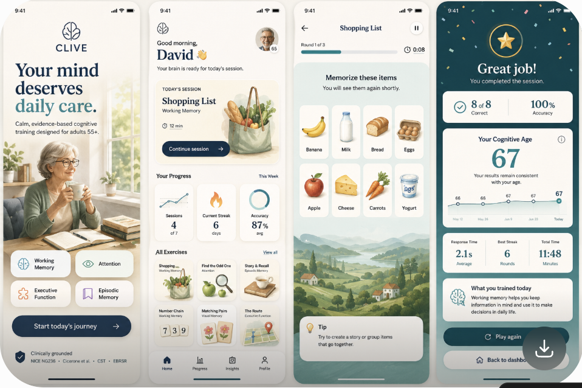

### Welcome / Onboarding
The first version included a person (a woman at a window with a cup of coffee). The final direction removed the person in favor of a calm still-life with light, shown below.

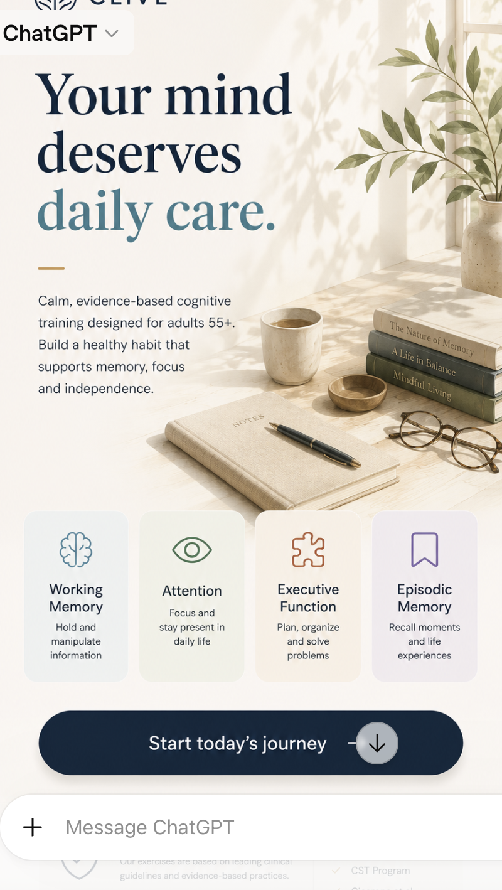

### Dashboard
Post-onboarding home screen: name-based greeting, one large "Today's session" card, a Your Progress block, and an Exercises collection below.

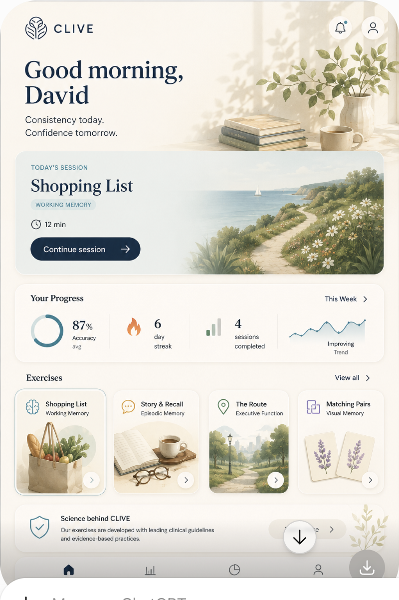

### Session Complete (Results)
Calm, motivating session close: personal address, stats (Correct / Accuracy / Total time), a "Your Cognitive Age" block, a Performance breakdown by domain, and a daily tip.

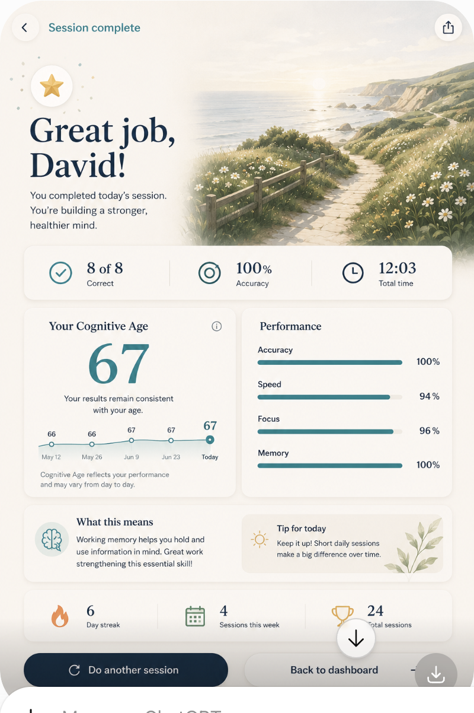

### Insights
Progress analytics: weekly summary, a radar chart across cognitive domains, a Progress Over Time chart, and a Strengths & Opportunities block.

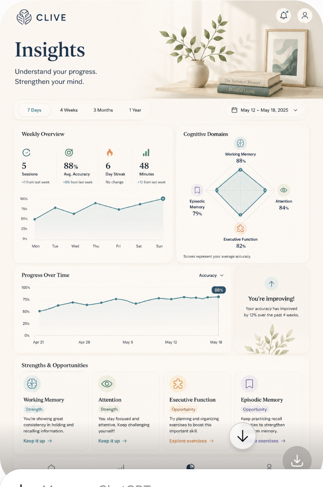

### Profile
Focused on habits, goals, and long-term progress rather than "settings for settings' sake": Goals, Your Journey, Preferences, Achievements.

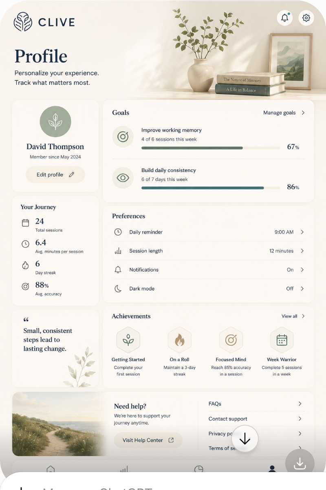

### Settings
Settings framed as part of the overall brand rather than dry technical configuration: App Preferences, Privacy & Data, About — with the branded still-life kept in the header.

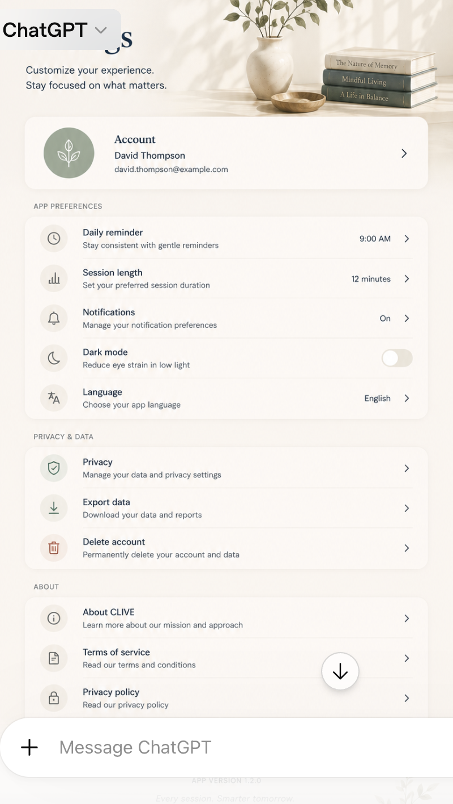

### Help Center
The help section as part of the premium experience rather than plain documentation: article search, Top Topics, Popular Articles, Guides & Resources, FAQ.

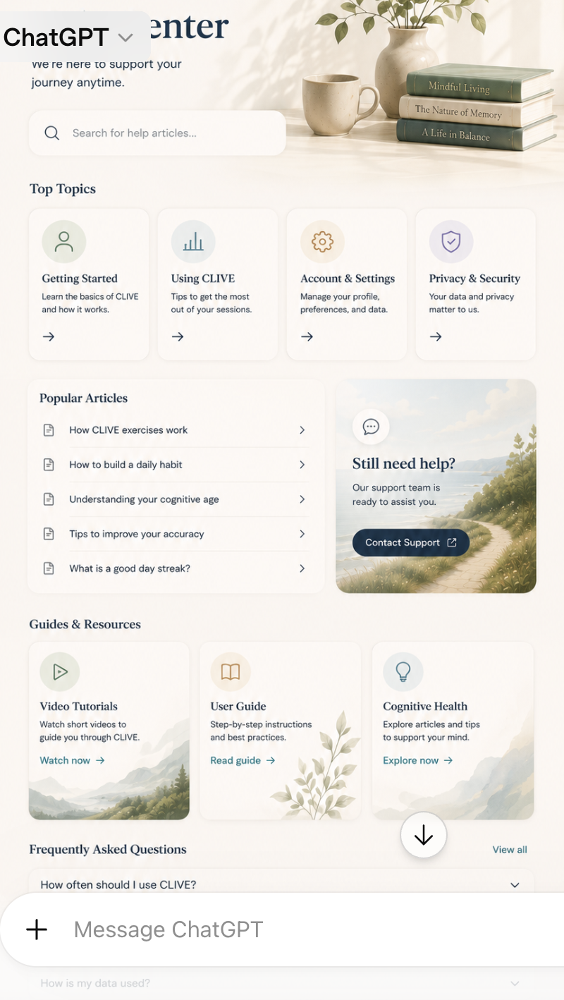

---

## N.3 Exercise Screens

From this point on, the concepts fully abandon emoji in favor of branded illustrations and custom pictograms.

### Shopping List — list management (early direction, superseded)
The first explored version of this screen looked more like a general grocery list app (categories, search, Meal Inspiration) than a memory-training mechanic. Kept here for the record of direction-finding; the final mechanic is shown next.

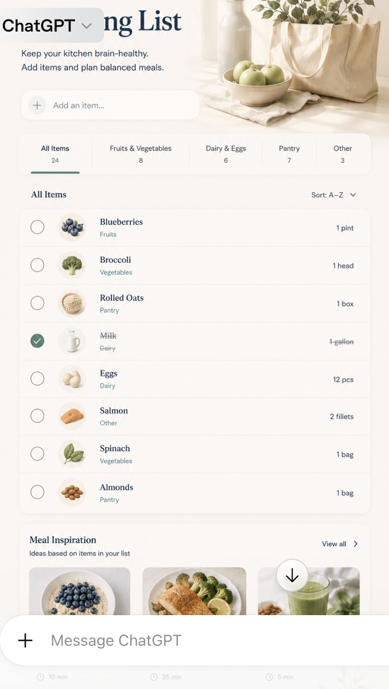

### Shopping List — memorize phase (final mechanic)
The final direction closer to CLIVE's actual game mechanic: a timer and a grid of items to memorize ahead of the subsequent Recall step.

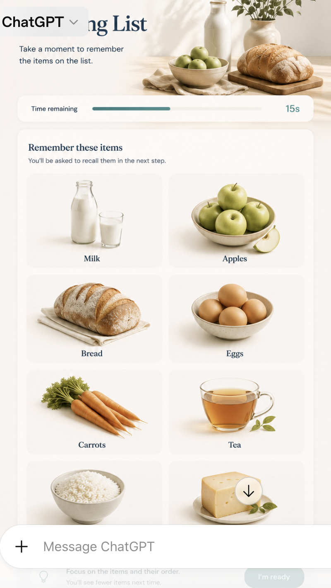

### Find the Odd One
Full flow: intro screen, difficulty selection (4–16 items), rules, gameplay rounds, correct-answer confirmation, and the results screen.

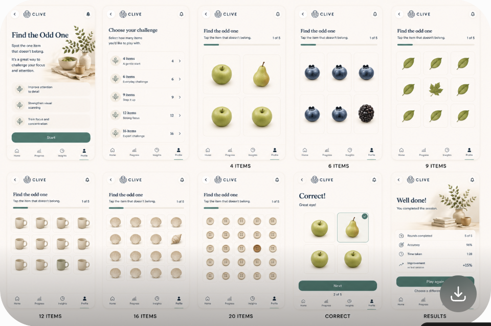

### Story & Recall
*Image unavailable — the ChatGPT-generated preview for this screen expired in the shared conversation link.* Per the chat's description: the flow includes difficulty selection, reading a short story with large typography and illustrations, recall questions, and a results screen — in the same calm, premium CLIVE style as the other games.

### Number Chain
Full flow: intro screen, chain-length selection (5–20 numbers), a "how to play" instruction card, gameplay rounds on a number grid, mid-flow encouragement ("Well done!"), and the results screen.

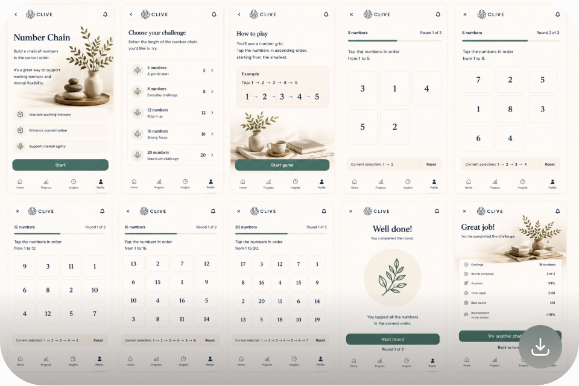

### Matching Pairs
Full flow: intro screen, pair-count selection (4–20), rules, card flipping and matching, in-flow feedback, and the results screen.

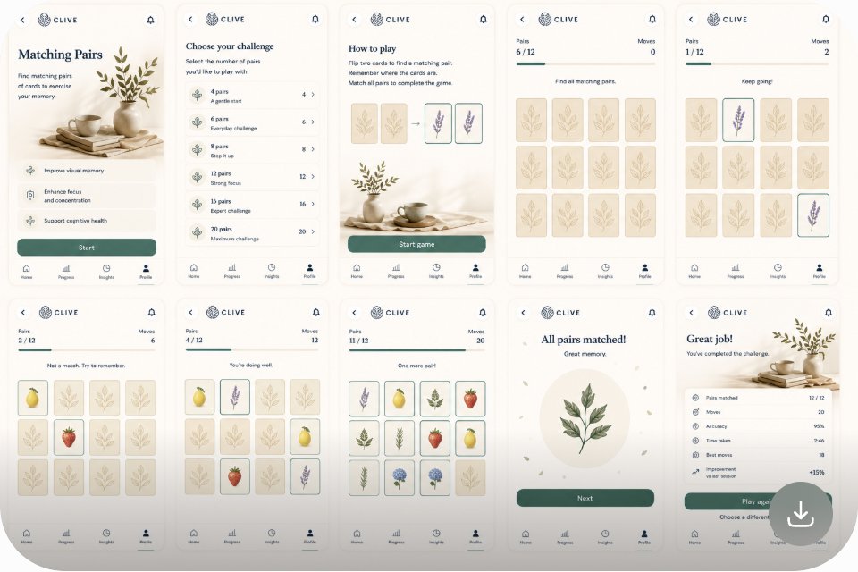

### The Route (Executive Function)
Full flow: intro screen, difficulty selection (Easy–Master), route-planning rules, gameplay rounds with grid and obstacles, hints, level completion, and the results screen.

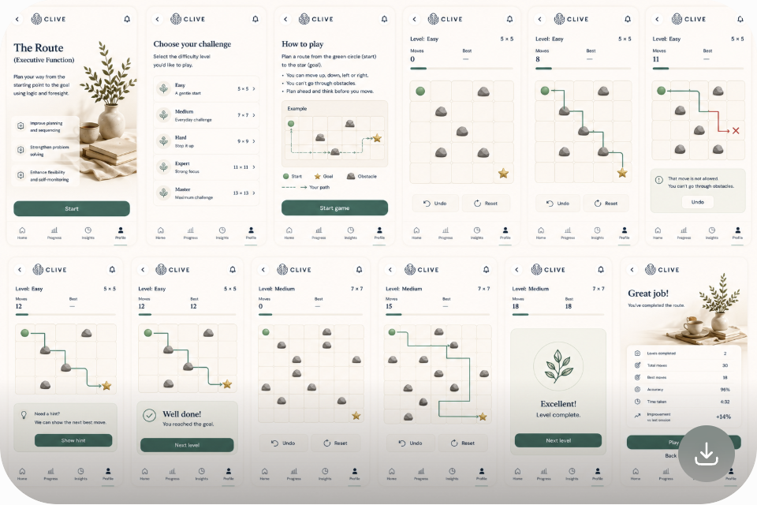

---

# Appendix O. Component Inventory & Design System Registry

This appendix defines the complete inventory of UI components included in the CLIVE
Design System, along with ownership, lifecycle, dependencies, versioning, documentation
standards, and governance rules.

The objective is to maintain a single source of truth for every reusable interface element
throughout the product.

Every visible interface element should originate from this registry.

---

# Registry Principles

Each component should be

Reusable

Documented

Accessible

Tested

Versioned

Token-driven

Platform-consistent

---

Duplicate components should never exist.

---
# Component Classification

## Foundation

Colors

Typography

Spacing

Elevation

Radius

Motion Tokens

Opacity

Grid

Breakpoints

Icons

Illustrations

---

## Layout

Screen Container

Section

Card Grid

Responsive Stack

Content Group

Split Layout

Scrollable Area

Safe Area Wrapper

---
## Navigation

Bottom Navigation

Top Navigation

Navigation Drawer (Future)

Breadcrumb

Tab Bar

Segmented Control

Pagination

Back Button

---

## Inputs

Primary Button

Secondary Button

Tertiary Button

Icon Button

FAB (Future)

Text Field

Search Field

Dropdown

Checkbox

Radio

Toggle

Slider

Stepper
Date Picker (Future)

Time Picker (Future)

---

## Feedback

Toast

Snackbar

Banner

Progress Ring

Progress Bar

Loading Indicator

Skeleton Loader

Modal

Bottom Sheet

Confirmation Dialog

Alert

Success State

Error State

Empty State

Offline State

---

## Data Display

Statistic Card

Insight Card

Recommendation Card
Achievement Card

Exercise Card

History Card

Article Card

Profile Card

List Item

Divider

Tag

Badge

Avatar

Chart

Trend Graph

Score Ring

Timeline

---

## Exercise Components

Exercise Header

Instruction Panel

Timer Display

Question Container

Answer Grid

Memory Grid

Story Viewer

Number Sequence
Route Grid

Card Deck

Completion Summary

Difficulty Indicator

Hint Panel

Exercise Footer

---

## Profile Components

Profile Header

Progress Summary

Weekly Activity

Goal Tracker

Preferences List

Subscription Panel

Privacy Panel

---

## Educational Components

Article Header

Key Takeaways

Reference Block

Tip Card

Quote Block

Illustration Panel

Related Reading
---

# Component Metadata

Each component documents

Identifier

Version

Category

Owner

Status

Design File

Code Reference

Accessibility Review

Last Updated

---

Example

```
component.exercise-card

Version

1.4.0
```

---

# Component Status

Draft

---

Experimental

---
Beta

---

Stable

---

Deprecated

---

Archived

---

Only Stable components may be used in production.

---

# Ownership

Every component has

Design Owner

Engineering Owner

QA Owner

Accessibility Reviewer

Documentation Reviewer

---

Ownership should always be explicit.

---

# Dependency Mapping

Each component records

Required tokens

Child components
Parent components

Animation dependencies

Accessibility dependencies

Localization dependencies

Analytics hooks

---

Dependencies should remain minimal.

---

# Variant Management

Variants include

Default

Hover

Pressed

Focused

Selected

Disabled

Loading

Error

Success

Compact

Large

Dark Mode

---

Each variant documented separately.
---

# Accessibility Registry

Each component records

Touch target

Contrast validation

Screen reader behavior

Keyboard support

Focus behavior

Dynamic Type support

Reduce Motion behavior

---

Accessibility approval required before Stable status.

---

# Token Usage

Every component references

Color tokens

Typography tokens

Spacing tokens

Radius tokens

Shadow tokens

Motion tokens

Opacity tokens

---

Hardcoded values prohibited.
---

# Responsive Behavior

Every component documents

Minimum width

Maximum width

Expansion rules

Wrapping rules

Overflow behavior

Tablet behavior

Future desktop behavior

---

# Interaction Model

Each interactive component specifies

Tap

Long press

Hover

Focus

Keyboard activation

Gesture support

Animation timing

Error handling

---

Interaction behavior must remain consistent across components.

---
# Documentation Package

Every component includes

Purpose

Usage guidelines

Do

Don't

Accessibility notes

Examples

Variants

Specifications

Code snippet

Known limitations

---

Documentation evolves alongside implementation.

---

# Deprecation Process

Deprecated components

Remain documented.

Cannot receive new features.

Receive migration guidance.

Eventually archived.

---

Existing screens migrate before removal.

---
# Naming Convention

Use

```
component.<category>.<name>
```

Examples

```
component.button.primary

component.card.exercise

component.input.search

component.feedback.toast
```

---

Names should be descriptive and stable.

---

# Component Versioning

Major

Breaking visual or behavioral change.

---

Minor

New variants.

Additional capabilities.

---

Patch

Documentation.

Accessibility improvements.
Bug fixes.

---

# Registry Audits

Monthly

Unused components.

Duplicate components.

Token compliance.

Accessibility compliance.

---

Quarterly

Architecture review.

Documentation review.

Performance review.

---

# Metrics

Track

Component reuse rate.

Duplicate implementations.

Documentation completeness.

Accessibility approval.

Regression frequency.

Average maintenance effort.

---

Metrics support Design System health.
---

# Future Components

Reserved categories

Voice Controls

AI Coach

Caregiver Dashboard

Research Dashboard

Wearable Widgets

Calendar Planner

Adaptive Goals

Collaborative Features

Desktop Navigation

---

Future components follow identical governance.

---

# Component Acceptance Criteria

A component is production-ready when

✓ Design approved.

✓ Engineering implemented.

✓ Accessibility verified.

✓ Localization verified.

✓ Responsive behavior documented.

✓ Tokens applied.

✓ Tests completed.
✓ Documentation published.

✓ Analytics integrated where applicable.

---

# Registry Philosophy

The Component Registry is the living inventory of the CLIVE interface.

Every reusable element should be discoverable, documented, governed, and continuously
improved.

A disciplined registry reduces duplication, improves implementation speed, strengthens
accessibility, and ensures that every future feature inherits the same level of quality that
defines the CLIVE experience.
---

# Appendix P. Metrics, KPIs & Success Measurement Framework

This appendix defines how the CLIVE platform measures product quality, user engagement,
cognitive training consistency, operational excellence, and long-term product health.

The objective is to create measurable indicators that guide product decisions while
respecting user privacy and avoiding manipulative optimization.

Metrics should improve the product—not pressure users.

---

# Measurement Principles

Every metric should be

Actionable

Transparent

Privacy-preserving

Scientifically meaningful

Consistent

Long-term oriented

---
Metrics should support product improvement rather than individual evaluation.

---

# KPI Categories

Product

User Experience

Accessibility

Performance

Reliability

AI Quality

Exercise Quality

Engagement

Operations

Business

---

# Product KPIs

Track

Daily Active Users (DAU)

Weekly Active Users (WAU)

Monthly Active Users (MAU)

Retention

Returning Users

Average Sessions per Week

Feature Adoption

Exercise Completion Rate
---

Metrics should be segmented by application version.

---

# User Experience KPIs

Track

Average Session Duration

Session Completion Rate

Tutorial Completion

Navigation Success

Task Completion

Error Recovery Success

Recommendation Acceptance

User Satisfaction

---

Target

High completion.

Low frustration.

---

# Cognitive Training KPIs

Track

Training consistency

Exercise diversity

Weekly balance

Recovery session usage
Difficulty progression

Long-term adherence

---

Avoid rewarding excessive daily usage.

---

# Exercise KPIs

Every exercise records

Starts

Completions

Abandonments

Average duration

Difficulty distribution

Mistake frequency

Adaptive adjustments

Replay rate

---

Low completion should trigger UX review.

---

# Recommendation KPIs

Track

Recommendation impressions

Recommendation acceptance

Recommendation completion

Recommendation effectiveness
Recommendation diversity

Recommendation fatigue

---

Repeated ignored recommendations should be reevaluated.

---

# Insight KPIs

Track

Insight views

Insight expansion

Weekly summary views

Educational article opens

Educational article completion

Insight usefulness feedback

---

Insights should remain concise and meaningful.

---

# Accessibility KPIs

Track

Accessibility issues

Accessibility regressions

Dynamic Type compatibility

Screen reader compatibility

Contrast failures

Keyboard support
Reduce Motion compatibility

---

Accessibility metrics receive equal priority to functional metrics.

---

# Localization KPIs

Track

Translation completion

Fallback language usage

Localization defects

RTL issues

Text overflow

Native review completion

---

Localization quality should remain measurable.

---

# Performance KPIs

Measure

Cold launch time

Warm launch time

Exercise loading

Dashboard loading

Frame rate

Memory usage

Battery impact
Network latency

---

Performance targets reviewed quarterly.

---

# Reliability KPIs

Track

Crash-free users

Crash-free sessions

Synchronization success

Offline recovery

API availability

Error frequency

Automatic recovery success

---

Reliability targets should improve over time.

---

# AI Quality KPIs

Track

Recommendation accuracy

Insight consistency

Prompt validation failures

Content generation failures

Fallback frequency

Prompt execution latency
Human review findings

---

AI quality should prioritize trustworthiness over novelty.

---

# Analytics Quality

Track

Duplicate events

Missing events

Schema validation

Timestamp consistency

Event latency

Version compatibility

---

Analytics integrity is essential for meaningful decisions.

---

# Operational KPIs

Track

Deployment frequency

Rollback frequency

Critical incidents

Mean Time To Recovery

Release success rate

Support response time

Documentation coverage
---

Operational metrics improve engineering processes.

---

# Business KPIs

Examples

Free to Premium conversion

Trial completion

Subscription renewal

Churn

Revenue per subscriber

Customer Lifetime Value

Support cost

---

Business metrics should never encourage manipulative product design.

---

# User Feedback KPIs

Track

App ratings

Support satisfaction

Feature requests

Accessibility feedback

Localization feedback

Reported confusion

Bug reports
---

Qualitative feedback complements analytics.

---

# Dashboard Structure

Executive Dashboard

↓

Product Dashboard

↓

Engineering Dashboard

↓

Accessibility Dashboard

↓

AI Dashboard

↓

Support Dashboard

↓

Business Dashboard

---

Every dashboard should present only actionable information.

---

# Metric Review Frequency

Daily

Operational monitoring.

---
Weekly

Product health.

---

Monthly

Strategic review.

---

Quarterly

Trend analysis.

---

Annually

Long-term planning.

---

# Alert Thresholds

Examples

Crash rate spike.

Synchronization failure increase.

Accessibility regression.

API latency increase.

Recommendation failure increase.

Localization regression.

---

Alerts should notify responsible teams automatically.

---

# Data Visualization Standards
Charts should

Use accessible colors.

Support screen readers.

Provide summaries.

Avoid unnecessary decoration.

Display trends clearly.

---

Visualization should emphasize understanding over aesthetics.

---

# Benchmarking

Compare

Current release

Previous release

Quarterly averages

Annual trends

Platform differences

Regional differences where appropriate

---

Avoid comparing individual users.

---

# Privacy Safeguards

Metrics must

Use anonymous identifiers where possible.

Avoid storing unnecessary personal information.
Aggregate sensitive data.

Respect user privacy preferences.

Support applicable privacy regulations.

---

# Continuous Improvement Cycle

Measure

↓

Analyze

↓

Prioritize

↓

Improve

↓

Validate

↓

Measure Again

---

Every KPI should influence future product decisions.

---

# KPI Documentation

Every metric documents

Identifier

Definition

Calculation method
Owner

Review frequency

Visualization

Alert threshold

Related product goals

---

Metric definitions should remain stable across releases.

---

# Success Definition

CLIVE succeeds when users

Return consistently.

Understand their progress.

Feel encouraged.

Experience reliable performance.

Trust recommendations.

Benefit from accessible design.

Enjoy a calm, predictable experience.

---

Success is measured by sustained value rather than short-term engagement.

---

# Framework Philosophy

Metrics are meaningful only when they help create a better product.

The purpose of measurement is not to maximize numbers—it is to continuously improve the
quality, accessibility, reliability, and long-term usefulness of the CLIVE experience while
preserving the dignity, autonomy, and trust of every user.
---

# Appendix Q. Research, Experimentation & Evidence Framework

This appendix defines how CLIVE evaluates new ideas, validates product improvements,
measures user outcomes, and incorporates evidence into future releases.

The objective is to ensure that product evolution is driven by measurable learning rather than
assumptions.

Every significant product decision should be supported by evidence.

---

# Research Principles

Research should be

Ethical

Transparent

Repeatable

Privacy-preserving

Scientifically informed

Actionable

Inclusive

---

Research should improve the product experience without compromising user trust.

---

# Research Categories

Foundational Research

Generative Research

Usability Testing

Accessibility Research
Behavioral Analytics

A/B Experiments

Longitudinal Studies

Qualitative Interviews

Survey Research

Future Scientific Collaboration

---

# Research Lifecycle

Research Question

↓

Hypothesis

↓

Study Design

↓

Ethics Review

↓

Participant Recruitment

↓

Data Collection

↓

Analysis

↓

Recommendations

↓
Implementation

↓

Validation

---

Every completed study should produce documented findings.

---

# Research Questions

Examples

Do users understand onboarding?

Are recommendations perceived as helpful?

Does adaptive difficulty improve consistency?

Which exercise instructions create the least confusion?

Do accessibility improvements increase completion?

How does session length affect retention?

---

Questions should be specific and measurable.

---

# Hypothesis Template

Every experiment defines

Hypothesis

Primary metric

Secondary metrics

Target audience

Success criteria
Risk assessment

Rollback criteria

Expected duration

---

Example

Users receiving adaptive recovery sessions will complete more weekly sessions than users
receiving fixed recommendations.

---

# Participant Recruitment

Recruit representative participants including

Adults aged 55+

First-time users

Experienced users

Low-vision users

Screen reader users

Users with motor impairments

Multilingual users

---

Participant diversity improves research quality.

---

# Consent

Research participation requires

Clear explanation

Voluntary participation

Withdrawal option
Privacy disclosure

Purpose statement

Data retention information

---

Consent should be understandable without legal expertise.

---

# Usability Testing

Evaluate

Task completion

Navigation

Instruction clarity

Interaction confidence

Perceived effort

Overall satisfaction

---

Observe behavior before asking for opinions.

---

# Accessibility Research

Evaluate

VoiceOver usage

TalkBack usage

Large Text

Reduce Motion

High Contrast
Alternative input methods

---

Accessibility feedback receives equal priority to general usability feedback.

---

# Survey Standards

Surveys should

Be concise

Use neutral wording

Avoid leading questions

Support localization

Allow optional free-text responses

---

Recommended completion time

Less than 5 minutes.

---

# Interview Guidelines

Interviews explore

Motivation

Routine

Barriers

Confusion

Positive experiences

Feature requests

Accessibility needs
---

Interviewers should avoid suggesting preferred answers.

---

# Behavioral Analytics

Analyze

Exercise completion

Recommendation acceptance

Navigation paths

Session frequency

Recovery behavior

Drop-off points

Feature discovery

---

Analytics complement—but do not replace—direct user research.

---

# A/B Testing

Every experiment defines

Control group

Variant group

Randomization method

Primary success metric

Minimum sample size

Maximum duration

Stopping criteria
---

Only one primary hypothesis should be tested at a time.

---

# Experiment Rules

Experiments must never

Reduce accessibility.

Mislead users.

Hide privacy controls.

Manipulate emotions.

Delay critical functionality.

Compromise security.

---

User well-being takes precedence over experimentation.

---

# Statistical Considerations

Document

Sample size

Confidence level

Observed effect

Limitations

Potential bias

Unexpected outcomes

---

Statistical interpretation should be reviewed before implementation decisions.
---

# Longitudinal Research

Track over extended periods

Training consistency

Habit formation

Exercise diversity

Recommendation effectiveness

User satisfaction

Accessibility improvements

Retention

---

Long-term studies should prioritize participant privacy.

---

# Scientific Collaboration

Future collaborations may include

Universities

Research institutes

Healthcare researchers

Accessibility organizations

Human-computer interaction laboratories

---

Collaborations require formal agreements and ethical review.

---

# Research Repository
Every study documents

Identifier

Title

Objective

Methodology

Participants

Timeline

Findings

Recommendations

Status

Related releases

---

Research documentation should remain searchable.

---

# Decision Framework

Research outcomes may lead to

Immediate implementation

Prototype

Additional research

No action

Feature removal

Documentation update

---

Not every finding requires a product change.
---

# Research KPIs

Track

Studies completed

Participant diversity

Research coverage

Validated hypotheses

Accessibility findings

Implementation rate

Follow-up studies

---

Research quality is more important than research quantity.

---

# Ethical Boundaries

Research should never

Diagnose cognitive conditions.

Influence medical decisions.

Encourage excessive usage.

Create psychological pressure.

Misrepresent scientific certainty.

---

All communication should remain respectful and transparent.

---

# Continuous Learning
Insights from research should improve

Design System

Exercise mechanics

Adaptive engine

Accessibility

Localization

Educational content

AI prompts

Documentation

---

Knowledge should accumulate over time.

---

# Future Research Roadmap

Potential areas

Voice-guided training

Wearable integration

Adaptive coaching

Family support

Sleep and routine education

Expanded accessibility tools

Cross-device experiences

---

Future studies should align with the long-term product vision.

---
# Appendix Philosophy

Research transforms assumptions into evidence.

The long-term success of CLIVE depends not on releasing the greatest number of features,
but on continuously learning from users, validating decisions with data, and improving the
experience in thoughtful, measurable, and ethical ways.

Every release should leave the product more understandable, more accessible, and more
valuable than the one before it.
---

# Appendix R. Content Governance & Editorial Standards

This appendix defines the governance model for all written content within the CLIVE
ecosystem, including interface copy, educational articles, AI-generated text, notifications,
achievements, onboarding, and future editorial resources.

The objective is to ensure that every piece of content reflects a consistent voice, scientific
integrity, accessibility, and long-term maintainability.

Every word presented to users should reinforce trust.

---

# Editorial Principles

All content should be

Clear

Concise

Calm

Supportive

Evidence-informed

Accessible

Inclusive

Timeless

---
Content should reduce cognitive effort rather than increase it.

---

# Editorial Scope

Governed content includes

User Interface

Exercise Instructions

Educational Articles

Recommendations

AI Insights

Achievements

Notifications

Emails

Support Articles

Help Center

Release Notes

Privacy Information

Legal Notices

---

Every content type follows the same editorial standards.

---

# Brand Voice

Primary characteristics

Warm

Professional
Encouraging

Respectful

Confident

Patient

---

Avoid sounding

Clinical

Robotic

Overly enthusiastic

Patronizing

Sales-oriented

---

# Reading Level

Target

CEFR B1–B2

Equivalent to approximately Grade 6–8 reading level.

---

Prefer

Short paragraphs

Simple sentences

Concrete language

Common vocabulary

---

Avoid
Long compound sentences.

Complex terminology.

Unnecessary abbreviations.

---

# Writing Style

Prefer

Active voice.

Direct instructions.

Positive framing.

Consistent terminology.

---

Instead of

"You have failed today's exercise."

Use

"Let's try another exercise."

---

# Inclusive Language

Content should

Avoid assumptions.

Avoid stereotypes.

Avoid unnecessary gender references.

Avoid culturally specific idioms.

---

Users should always feel respected.
---

# Medical Language

Allowed

General educational information.

Healthy habits.

Sleep.

Exercise.

Learning.

Routine.

Memory strategies.

---

Prohibited

Diagnosis.

Treatment recommendations.

Medical predictions.

Clinical claims.

Personal health conclusions.

---

Educational material must clearly remain informational.

---

# Scientific Review

Content requiring scientific review

Educational articles.

AI recommendations.
Insight templates.

Health-related terminology.

Exercise explanations.

---

Scientific reviewers verify

Accuracy.

Clarity.

Evidence quality.

Appropriate limitations.

---

# Accessibility Writing

Instructions should

Contain one primary action.

Use consistent terminology.

Avoid unnecessary memory load.

Remain understandable when read aloud.

---

Screen reader labels require dedicated editorial review.

---

# AI-Generated Content

Every AI-generated text must satisfy

Grammar validation.

Readability validation.

Safety validation.
Localization validation.

Tone validation.

Scientific validation where applicable.

---

Generated content must be editable by human reviewers.

---

# Notification Standards

Preferred length

Less than 80 characters.

---

Examples

Training reminder

Ready for today's session?

---

Achievement

You've reached a new milestone.

---

Weekly summary

Your weekly progress is ready.

---

Avoid urgency.

Avoid guilt.

Avoid fear.

---
# Achievement Copy

Achievements should celebrate

Consistency.

Learning.

Exploration.

Routine.

Recovery.

---

Avoid

Competition.

Ranking.

Comparison.

Pressure.

---

# Recommendation Copy

Every recommendation includes

Observation.

Reason.

Suggested action.

Optional educational explanation.

---

Recommendations should explain *why* they appear.

---

# Error Messages
Structure

What happened.

↓

Why (if helpful).

↓

What to do next.

---

Example

Your progress couldn't be synced right now.

We'll try again automatically.

---

# Help Center Standards

Every article includes

Summary.

Step-by-step guidance.

Frequently asked questions.

Accessibility notes.

Related articles.

Last updated date.

---

Help content should solve problems quickly.

---

# Editorial Workflow

Draft
↓

Peer Review

↓

Scientific Review

↓

Accessibility Review

↓

Localization

↓

QA

↓

Publication

↓

Monitoring

---

All significant content changes require version history.

---

# Version Control

Each content asset records

Identifier

Author

Reviewer

Scientific reviewer

Accessibility reviewer
Version

Approval date

Status

---

# Content Status

Draft

In Review

Approved

Published

Deprecated

Archived

---

Only approved content may be released.

---

# Terminology Registry

Preferred terms

Exercise

Session

Progress

Insight

Recommendation

Achievement

Goal

Routine
Memory

Attention

Cognitive Score

Dashboard

Weekly Summary

---

Avoid introducing synonyms that create inconsistency.

---

# Image Caption Standards

Captions should

Describe purpose.

Remain concise.

Support accessibility.

Avoid redundant wording.

---

Decorative illustrations require no visible caption.

---

# Editorial QA Checklist

Every published item verifies

✓ Grammar.

✓ Spelling.

✓ Readability.

✓ Accessibility.

✓ Localization readiness.
✓ Scientific accuracy.

✓ Tone consistency.

✓ Brand terminology.

✓ Link validation.

✓ Metadata complete.

---

# Governance Roles

Content Author

↓

Editor

↓

Scientific Reviewer

↓

Accessibility Reviewer

↓

Localization Reviewer

↓

Product Owner

↓

Publication Approval

---

Responsibilities should remain clearly defined.

---

# Annual Editorial Audit
Review

Terminology consistency.

Outdated articles.

Broken links.

Scientific accuracy.

Accessibility.

Localization quality.

AI-generated content.

Support documentation.

---

Editorial debt should be tracked alongside technical debt.

---

# Future Editorial Areas

Reserved for

AI Coach conversations.

Voice guidance.

Caregiver education.

Research participation.

Wearable insights.

Community content.

Video transcripts.

Interactive tutorials.

---

All future content follows the same editorial governance.
---

# Editorial Philosophy

Words are part of the user interface.

Every sentence should make CLIVE easier to understand, more reassuring to use, and more
trustworthy over time.

Consistent, thoughtful writing is essential to creating a premium cognitive wellness
experience that users can rely on every day.
---

# Appendix S. AI Ethics, Responsible AI & Trust Framework

This appendix establishes the ethical principles, governance processes, and operational
safeguards that guide every use of Artificial Intelligence within the CLIVE platform.

Its purpose is to ensure that AI remains transparent, explainable, privacy-preserving,
scientifically responsible, and beneficial for all users.

AI exists to support users—not to replace their judgment.

---

# Core Principles

Every AI capability should be

Human-centered

Transparent

Explainable

Reliable

Privacy-preserving

Accessible

Inclusive

Accountable

---
Ethics should be considered during design, development, deployment, and ongoing
maintenance.

---

# Responsible AI Goals

The AI system should

Support cognitive training.

Provide understandable recommendations.

Adapt responsibly.

Avoid manipulation.

Respect autonomy.

Promote confidence.

Protect privacy.

---

AI should never become the primary authority on a user's health or cognitive abilities.

---

# Human Oversight

All high-impact AI systems require

Scientific review.

UX review.

Accessibility review.

Privacy review.

Security review.

Product approval.

---

Human reviewers remain responsible for production decisions.
---

# Transparency

Users should always understand

Why a recommendation appears.

How adaptive difficulty changes.

What data influences AI output.

When content is AI-generated.

How to learn more.

---

Opaque AI behavior reduces trust.

---

# Explainability

Every AI-generated recommendation should be explainable using observable information
such as

Recent exercise performance.

Exercise consistency.

Difficulty history.

Completion trends.

Training balance.

---

Explanations should use plain language.

---

# Data Minimization

AI should only process
Necessary information.

Relevant exercise history.

Adaptive state.

Preference settings.

Language.

Accessibility preferences.

---

Avoid collecting unnecessary personal information.

---

# Privacy by Design

AI architecture should

Limit data exposure.

Use secure processing.

Separate identifiers from analytics.

Respect deletion requests.

Support regulatory compliance.

---

Privacy is a design requirement.

---

# Bias Prevention

Evaluate AI for

Language bias.

Age bias.

Cultural bias.
Accessibility bias.

Difficulty bias.

Recommendation bias.

---

Regular audits should identify unintended patterns.

---

# Inclusive AI

Recommendations should remain appropriate regardless of

Language.

Culture.

Device.

Reading level.

Accessibility needs.

Usage frequency.

---

No user group should receive lower-quality experiences.

---

# Safety Constraints

AI must never

Diagnose medical conditions.

Estimate disease risk.

Predict lifespan.

Provide legal advice.

Provide financial advice.
Offer emergency guidance.

Replace healthcare professionals.

---

Appropriate boundaries should be communicated clearly.

---

# AI Recommendation Rules

Recommendations should

Encourage variety.

Support gradual improvement.

Avoid excessive repetition.

Adapt conservatively.

Avoid punishment.

---

Users should always remain free to choose another exercise.

---

# Adaptive Difficulty Ethics

Difficulty increases only when supported by

Consistent performance.

High confidence.

Multiple observations.

Stable completion.

---

Difficulty decreases when

Fatigue detected.
Repeated mistakes.

Long inactivity.

Recovery sessions needed.

---

Adaptation should never feel punitive.

---

# User Control

Users may

Skip recommendations.

Repeat preferred exercises.

Disable optional AI features where applicable.

Access explanations.

Review privacy information.

---

Control improves trust.

---

# AI Content Disclosure

Where appropriate, users should know when

Insights are AI-assisted.

Recommendations are algorithmically generated.

Educational summaries use AI.

Future AI Coach responses are generated dynamically.

---

Transparency should be proportional to impact.
---

# Monitoring

Track

Recommendation accuracy.

Prompt failures.

Unexpected outputs.

User feedback.

Accessibility issues.

Localization issues.

Bias indicators.

Latency.

---

Monitoring supports continuous improvement.

---

# Incident Management

If AI produces inappropriate content

Detect.

Log.

Review.

Mitigate.

Correct.

Document.

Monitor recurrence.

---
Critical incidents receive priority response.

---

# Prompt Governance

Production prompts require

Version control.

Approval.

Safety review.

Regression testing.

Documentation.

Audit history.

---

Prompt changes follow change-management procedures.

---

# Hallucination Prevention

AI should

Use available data only.

Avoid speculation.

Express uncertainty.

Reject unsupported conclusions.

Avoid fabricated statistics.

---

Confidence should never be overstated.

---

# Educational Responsibility
Educational content should

Reflect current evidence.

Use accessible language.

Acknowledge limitations.

Avoid certainty where evidence is evolving.

---

Education supports informed users rather than authoritative instruction.

---

# Accessibility in AI

AI-generated content should

Support screen readers.

Respect Dynamic Type.

Avoid emoji-only meaning.

Maintain sufficient readability.

Remain understandable when spoken aloud.

---

Accessibility applies equally to generated content.

---

# Continuous Evaluation

Regular reviews assess

Recommendation quality.

Bias.

Accessibility.

Localization.
Scientific consistency.

User satisfaction.

Prompt performance.

---

Evaluation should continue throughout the product lifecycle.

---

# Documentation

Every AI capability documents

Purpose.

Inputs.

Outputs.

Limitations.

Review history.

Owner.

Prompt version.

Known risks.

Mitigation strategies.

---

Documentation should remain synchronized with implementation.

---

# Regulatory Alignment

The AI framework should support alignment with applicable regulations concerning

Privacy.

Consumer protection.
Accessibility.

Emerging AI governance requirements.

---

Compliance should evolve alongside legislation.

---

# Future AI Capabilities

Potential future systems

Voice Coach.

Conversation Memory (user-controlled).

Personalized Learning Plans.

Adaptive Goal Planning.

Caregiver Summaries.

Wearable Insights.

Routine Suggestions.

---

Each future capability requires independent ethical review before release.

---

# Trust Metrics

Evaluate

User understanding.

Recommendation acceptance.

Reported confusion.

Transparency satisfaction.

Privacy confidence.
AI usefulness.

Accessibility satisfaction.

---

Trust should be measured continuously.

---

# AI Governance Board

Recommended participants

Product.

UX.

Engineering.

Scientific Advisor.

Accessibility Specialist.

Security.

Privacy.

Localization.

Customer Support.

---

Major AI changes require multidisciplinary review.

---

# Ethical Decision Process

Identify issue

↓

Assess user impact

↓
Scientific review

↓

Accessibility review

↓

Privacy review

↓

Risk assessment

↓

Decision

↓

Documentation

↓

Monitoring

---

Every important AI decision should be traceable.

---

# Framework Philosophy

Artificial Intelligence should make CLIVE feel more personal, more supportive, and easier to
use—but never less understandable.

The highest standard for AI is not sophistication alone. It is the ability to earn and preserve
user trust through transparency, responsibility, accessibility, and consistent respect for
human autonomy.
---

# Appendix U. Risk Management & Business Continuity Framework

This appendix defines the processes, responsibilities, and governance required to identify,
evaluate, mitigate, monitor, and recover from operational, technical, organizational, and
strategic risks affecting the CLIVE platform.
The objective is to ensure that the product remains reliable, secure, maintainable, and
resilient throughout its lifecycle.

Risk management is an ongoing discipline rather than a one-time activity.

---

# Risk Management Principles

Every identified risk should be

Documented

Evaluated

Owned

Mitigated

Monitored

Reviewed

Communicated

---

Risk decisions should be transparent and evidence-based.

---

# Risk Categories

Strategic

Product

Technical

Operational

Security

Privacy

Accessibility

Scientific
AI

Legal

Financial

Vendor

Infrastructure

Reputation

---

Each category maintains an independent risk register.

---

# Risk Lifecycle

Identify

↓

Describe

↓

Assess

↓

Prioritize

↓

Mitigate

↓

Monitor

↓

Review

↓
Close

---

Closed risks remain archived for historical reference.

---

# Risk Assessment Matrix

Evaluate each risk using

Likelihood

Very Low

Low

Medium

High

Very High

---

Impact

Negligible

Minor

Moderate

Major

Critical

---

Overall priority is derived from likelihood and impact.

---

# Risk Register

Every entry includes
Risk ID

Title

Description

Category

Owner

Likelihood

Impact

Priority

Mitigation Plan

Contingency Plan

Status

Review Date

---

Example

```
RISK-042

Adaptive recommendation degradation after major model update.
```

---

# Strategic Risks

Examples

Loss of product focus

Uncontrolled feature expansion

Market changes

Regulatory changes
Scientific misalignment

Poor adoption

---

Strategic risks are reviewed quarterly.

---

# Product Risks

Examples

Complex onboarding

Low engagement

Feature confusion

Exercise imbalance

Poor recommendation quality

Navigation complexity

---

Product metrics should detect early warning signs.

---

# Technical Risks

Examples

Performance degradation

Database failures

Memory leaks

Scaling bottlenecks

API instability

Technical debt
---

Engineering should maintain mitigation plans.

---

# Security Risks

Examples

Unauthorized access

Credential theft

Data exposure

API abuse

Malicious automation

Dependency vulnerabilities

---

Security incidents follow the Security Framework.

---

# Privacy Risks

Examples

Improper data retention

Excessive data collection

Consent failures

Synchronization issues

Analytics leakage

---

Privacy reviews occur before major releases.

---
# Accessibility Risks

Examples

Regression after redesign

Insufficient contrast

Broken screen reader support

Dynamic Type failures

Keyboard navigation defects

---

Accessibility risks receive high priority regardless of business impact.

---

# AI Risks

Examples

Poor recommendations

Prompt failures

Hallucinations

Bias

Unexpected outputs

Localization inconsistency

Loss of explainability

---

AI changes require multidisciplinary review.

---

# Scientific Risks

Examples
Outdated educational content

Unsupported claims

Misleading explanations

Incorrect terminology

Improper interpretation of performance

---

Scientific advisors review high-impact changes.

---

# Vendor Risks

Potential dependencies

Cloud provider

Authentication provider

Analytics platform

Payment processor

Notification provider

Translation service

AI provider

---

Vendor reliability should be monitored continuously.

---

# Infrastructure Risks

Examples

Regional outage

Storage failure
Network disruption

Synchronization failure

Monitoring outage

Deployment failure

---

Infrastructure redundancy should minimize downtime.

---

# Operational Risks

Examples

Documentation drift

Knowledge loss

Incomplete testing

Insufficient staffing

Delayed releases

Support overload

---

Operational reviews occur monthly.

---

# Financial Risks

Examples

Subscription decline

Unexpected infrastructure costs

Vendor pricing changes

Operational overhead
Research funding changes

---

Financial monitoring supports sustainable growth.

---

# Reputation Risks

Examples

Accessibility criticism

Privacy concerns

Scientific inaccuracies

Negative reviews

Security incidents

Poor AI behavior

---

Trust recovery plans should be documented in advance.

---

# Mitigation Planning

Every mitigation plan includes

Preventive actions

Monitoring

Owner

Timeline

Success criteria

Residual risk

---
Mitigation effectiveness should be measurable.

---

# Contingency Planning

Each high-priority risk defines

Trigger

Immediate response

Communication

Recovery actions

Verification

Post-incident review

---

Contingency plans should be tested periodically.

---

# Business Continuity

Critical services

Authentication

Exercise delivery

Synchronization

Progress history

Subscription validation

Accessibility features

---

Critical functions receive recovery priority.

---
# Disaster Recovery

Recovery objectives

Restore infrastructure

Validate data integrity

Recover synchronization

Restore monitoring

Resume deployments

Communicate status

Conduct retrospective

---

Recovery procedures should be documented and rehearsed.

---

# Incident Classification

Severity 1

Critical platform outage

---

Severity 2

Major feature unavailable

---

Severity 3

Partial degradation

---

Severity 4

Minor issue
---

Response expectations scale with severity.

---

# Communication

During major incidents communicate

Current status

Affected services

Expected recovery

Temporary workarounds

Resolution confirmation

---

Communication should remain factual and timely.

---

# Risk Monitoring

Review continuously

Crash trends

Performance metrics

Support tickets

Accessibility reports

Security alerts

AI monitoring

User feedback

---

Monitoring supports early intervention.
---

# Governance

Responsibilities

Executive Sponsor

Product Owner

Engineering Lead

Security Lead

Accessibility Lead

Scientific Advisor

QA Lead

Operations Lead

---

Each critical risk has a clearly assigned owner.

---

# Audit Schedule

Monthly

Operational risks

---

Quarterly

Strategic review

Security review

Accessibility review

Vendor assessment

---
Annually

Business continuity simulation

Disaster recovery exercise

Risk framework review

---

# Success Metrics

Track

Open high-priority risks

Average mitigation time

Incident frequency

Recovery duration

Repeat incidents

Accessibility regressions

Security findings

Documentation completeness

---

Metrics guide continuous improvement.

---

# Lessons Learned

Every major incident documents

Timeline

Root cause

Resolution

Preventive actions
Documentation updates

Ownership changes

Follow-up review

---

Learning from incidents strengthens future resilience.

---

# Framework Philosophy

Risk cannot be eliminated, but it can be understood, managed, and reduced.

A resilient product is built not by assuming failures will never occur, but by preparing
thoughtfully for when they do.

The long-term success of CLIVE depends on disciplined governance, continuous monitoring,
transparent communication, and a commitment to learning from every challenge.
---

# Appendix V. Product Documentation Governance & Knowledge Management

This appendix defines how all product knowledge, specifications, technical documentation,
design artifacts, scientific references, accessibility guidance, operational procedures, and
future documentation are created, maintained, reviewed, and archived throughout the CLIVE
product lifecycle.

The objective is to ensure that documentation remains accurate, discoverable,
version-controlled, and useful for every stakeholder.

Documentation is considered a product asset.

---

# Documentation Principles

Documentation should be

Accurate

Current

Understandable
Searchable

Versioned

Reviewable

Accessible

Complete

---

Documentation should reduce uncertainty rather than introduce it.

---

# Documentation Categories

Product Documentation

Design Documentation

Engineering Documentation

Scientific Documentation

Accessibility Documentation

Editorial Documentation

Localization Documentation

Operations Documentation

Security Documentation

QA Documentation

AI Documentation

Business Documentation

---

Each category follows common governance rules.

---
# Documentation Hierarchy

Vision

↓

Strategy

↓

Specifications

↓

Architecture

↓

Implementation

↓

Testing

↓

Operations

↓

Maintenance

↓

Archive

---

Each level references the documentation above and below it.

---

# Source of Truth

Every document identifies

Primary owner
Supporting contributors

Approval authority

Current version

Publication date

Review date

Status

---

Only one document should serve as the authoritative source for a given topic.

---

# Documentation Lifecycle

Create

↓

Review

↓

Approve

↓

Publish

↓

Maintain

↓

Audit

↓

Archive

---
Archived documentation remains available for historical reference.

---

# Required Metadata

Every document includes

Document ID

Title

Version

Author

Reviewer

Approver

Status

Created

Last Updated

Next Review

Related Documents

---

Metadata supports governance and searchability.

---

# Document Status

Draft

Review

Approved

Published

Deprecated
Archived

---

Only approved documentation should guide implementation.

---

# Versioning

Major

Structural or architectural changes.

---

Minor

New sections.

Clarifications.

Expanded guidance.

---

Patch

Corrections.

Grammar.

Formatting.

Broken references.

---

Version history should remain permanently available.

---

# Ownership

Each document has

Primary Owner
Technical Reviewer

Design Reviewer

Accessibility Reviewer

Scientific Reviewer (where applicable)

Product Approval

---

Ownership should remain explicit throughout the document lifecycle.

---

# Cross-References

Documentation should reference

Design System

Component Registry

API Specification

Accessibility Standards

Analytics Framework

QA Library

Security Framework

Localization Standards

---

References reduce duplication.

---

# Review Frequency

Critical documentation

Quarterly
---

Operational documentation

Every six months

---

Historical documentation

Annually

---

Reviews confirm ongoing accuracy.

---

# Accessibility Requirements

Documentation should

Use semantic headings

Support screen readers

Provide alternative text

Use accessible tables

Avoid color-only meaning

Maintain sufficient contrast

Support keyboard navigation (digital formats)

---

Documentation is subject to the same accessibility standards as the product.

---

# Searchability

Documentation should support

Keywords
Categories

Tags

Related documents

Version history

Full-text search

Permanent identifiers

---

Knowledge should be easy to discover.

---

# Templates

Standard templates include

Requirement Specification

Feature Specification

Architecture Decision Record (ADR)

API Contract

Design Proposal

Experiment Report

Accessibility Review

QA Report

Incident Report

Release Notes

Postmortem

---

Templates improve consistency.
---

# Architecture Decision Records

Every major architectural decision records

Context

Decision

Alternatives considered

Trade-offs

Consequences

Date

Owner

Related systems

---

ADRs preserve engineering knowledge over time.

---

# Meeting Documentation

Important decisions should include

Agenda

Participants

Summary

Action items

Owners

Deadlines

Related documents

---
Meeting notes should capture decisions—not transcripts.

---

# Knowledge Base

The internal knowledge base includes

FAQs

Implementation guides

Troubleshooting

Coding standards

Design standards

Scientific references

Accessibility examples

Operational procedures

---

Knowledge should accumulate rather than be repeatedly recreated.

---

# Change Management

Documentation updates require

Change description

Affected documents

Reviewer approval

Version update

Publication

Notification (if applicable)

---
Significant changes should include migration guidance.

---

# Documentation QA

Every published document verifies

✓ Grammar

✓ Consistency

✓ References

✓ Accessibility

✓ Formatting

✓ Version metadata

✓ Ownership

✓ Review dates

✓ Link integrity

---

Documentation quality should be measurable.

---

# Knowledge Retention

Reduce organizational knowledge loss by

Maintaining decision history

Documenting implementation rationale

Recording lessons learned

Archiving deprecated systems

Maintaining onboarding guides

Capturing operational procedures
---

Institutional knowledge should not depend on individual team members.

---

# AI Documentation

Every AI capability documents

Purpose

Prompt versions

Input data

Output schema

Limitations

Safety constraints

Monitoring

Review history

---

AI documentation evolves alongside AI systems.

---

# Incident Documentation

Every significant incident records

Timeline

Impact

Root cause

Resolution

Preventive actions

Follow-up tasks
Lessons learned

Documentation updates

---

Incident documentation supports continuous improvement.

---

# Release Documentation

Each release includes

Features

Fixes

Known issues

Migration notes

Risk assessment

Rollback procedures

Support notes

Documentation updates

---

Release documentation should remain publicly understandable where appropriate.

---

# Documentation Metrics

Track

Coverage

Freshness

Review completion

Broken references
Search success

Contributor activity

Documentation debt

Average update time

---

Metrics encourage continuous maintenance.

---

# Archive Policy

Archived documentation

Remains searchable

Cannot be edited

Maintains historical versions

References replacement documents where applicable

Preserves decision history

---

Archives provide organizational memory.

---

# Future Knowledge Expansion

Potential additions

Interactive documentation

AI-assisted documentation search

Video walkthroughs

Architecture visualizations

Developer onboarding academy
Accessibility learning center

Scientific reference library

---

Future systems should integrate with existing governance.

---

# Documentation Philosophy

Documentation is more than written information—it is the shared memory of the product.

Well-maintained documentation enables better decisions, faster development, stronger
collaboration, improved accessibility, and long-term sustainability.

As CLIVE evolves, its documentation should grow with the same care, precision, and
consistency as the product itself, ensuring that knowledge remains accessible, reliable, and
valuable for every future contributor.
---

# Appendix W. Long-Term Product Vision & Innovation Roadmap

This appendix defines the strategic direction for CLIVE over the next decade, outlining how
the platform can evolve while preserving its core values of accessibility, scientific integrity,
simplicity, and trust.

The objective is to provide a long-term reference that guides future investment, product
planning, technology decisions, and organizational priorities.

Innovation should reinforce the product vision rather than distract from it.

---

# Vision Statement

CLIVE aspires to become the world's most trusted cognitive wellness platform for adults,
empowering lifelong learning, healthy cognitive habits, and accessible digital experiences
through thoughtful design, adaptive technology, and evidence-informed guidance.

---

# Long-Term Product Principles

Future development should remain

Human-centered
Scientifically responsible

Accessible by default

Technically sustainable

Privacy-first

Inclusive

Transparent

---

Technology should always serve the user.

---

# Strategic Pillars

## Pillar 1

Accessible Cognitive Training

Objectives

Expand exercise variety

Support broader accessibility needs

Improve personalization

Reduce cognitive load

Maintain ease of use

---

## Pillar 2

Personalized Learning

Objectives

Adaptive learning paths

Routine recommendations
Personal goal planning

Progress forecasting

Motivational support

---

## Pillar 3

Educational Platform

Objectives

Evidence-based articles

Interactive learning

Expert interviews

Practical guides

Micro-learning experiences

---

## Pillar 4

Artificial Intelligence

Objectives

Explainable recommendations

Voice interactions

Conversational coaching

Natural language summaries

Context-aware assistance

---

## Pillar 5

Research & Evidence
Objectives

University collaboration

Anonymous research datasets

Longitudinal studies

Continuous validation

Publication support

---

# Product Evolution Timeline

## Years 1–2

Establish product foundation

Launch mobile applications

Validate adaptive engine

Improve onboarding

Optimize accessibility

Grow educational library

---

## Years 3–4

Expand exercise catalog

Introduce AI Coach

Launch tablet experience

Improve analytics

Advanced personalization

International expansion

---
## Years 5–6

Desktop platform

Voice-guided interaction

Caregiver features

Research collaboration tools

Expanded educational ecosystem

---

## Years 7–10

Wearable integration

Cross-platform ecosystem

Advanced adaptive learning

Predictive planning

Community learning experiences

Global accessibility leadership

---

Timelines are directional and subject to ongoing validation.

---

# Innovation Framework

Potential innovation areas

Adaptive cognitive routines

Emotion-neutral coaching

Natural language interaction

Voice accessibility

Context-aware recommendations
Visual simplification

Passive progress summaries

Cross-device continuity

---

Innovation should always support the core mission.

---

# Emerging Technologies

Potential future adoption

On-device AI

Edge computing

Voice synthesis

Speech recognition

Wearable sensors

Augmented accessibility tools

Privacy-preserving machine learning

---

Technology adoption should prioritize maturity and user benefit.

---

# Platform Ecosystem

Potential companion products

Tablet application

Desktop application

Caregiver dashboard

Professional portal
Research portal

Educational website

Public API

---

Each product should share the same design language.

---

# Global Accessibility Leadership

Future goals

Exceed WCAG requirements where practical

Expand multilingual support

Improve cognitive accessibility

Support additional assistive technologies

Collaborate with accessibility organizations

Publish accessibility case studies

---

Accessibility remains a strategic differentiator.

---

# Educational Ecosystem

Future content formats

Interactive tutorials

Video explainers

Audio lessons

Printable guides

Live webinars
Expert Q&A sessions

Community challenges

---

Learning should remain optional and self-paced.

---

# Scientific Leadership

Future initiatives

Peer-reviewed collaborations

Conference participation

Evidence repository

Scientific advisory board expansion

Transparent methodology publications

---

Scientific credibility strengthens user trust.

---

# Community & Engagement

Potential future initiatives

Personal milestones

Learning groups

Family participation

Community events

Seasonal cognitive challenges

Volunteer research opportunities

---
Community features should avoid competitive pressure.

---

# Sustainability

Product sustainability includes

Efficient infrastructure

Long-term maintainability

Responsible AI usage

Accessible documentation

Energy-efficient engineering

Vendor resilience

---

Sustainability includes both environmental and organizational considerations.

---

# Organizational Growth

As CLIVE grows

Expand multidisciplinary teams

Formalize governance

Strengthen documentation

Increase automation

Improve knowledge sharing

Maintain product consistency

---

Growth should not compromise quality.

---
# Success Indicators

The long-term vision succeeds when

Users trust recommendations.

Accessibility remains exemplary.

Scientific integrity is preserved.

Documentation remains comprehensive.

Engineering remains maintainable.

Innovation remains purposeful.

Users continue returning over many years.

---

# Vision Review

The strategic vision should be reviewed

Annually

After significant technological changes

Following major scientific developments

After substantial market shifts

---

The vision evolves while preserving core values.

---

# Guiding Questions

Before pursuing any major initiative, ask

Does this improve users' cognitive wellness?

Does this reduce or increase complexity?

Is the feature accessible?
Can it be scientifically justified?

Does it respect privacy?

Will it remain maintainable?

Does it strengthen user trust?

---

Projects unable to answer these questions positively should be reconsidered.

---

# Innovation Governance

Major innovations require

Product review

Scientific review

Accessibility review

Security review

Privacy assessment

Engineering feasibility

Business evaluation

Executive approval

---

Innovation should be disciplined rather than reactive.

---

# Long-Term Philosophy

The future of CLIVE is not defined by the number of features it delivers, but by the
consistency with which it delivers meaningful value.

Every year, the platform should become more understandable, more inclusive, more reliable,
and more effective—without losing the simplicity and calmness that define its identity.
The ultimate measure of success is a product that people continue to trust, recommend, and
benefit from throughout their lifelong cognitive wellness journey.
---

# Appendix X. Design System Maintenance & Evolution Framework

This appendix defines the long-term maintenance strategy for the CLIVE Design System,
ensuring that visual consistency, accessibility, engineering efficiency, and design quality are
preserved as the product evolves.

The Design System is a living product that requires continuous governance, measurement,
and improvement.

---

# Objectives

The Design System should

Remain consistent.

Scale efficiently.

Support new features.

Improve accessibility.

Reduce implementation effort.

Prevent visual fragmentation.

Remain well documented.

---

# Core Principles

The Design System is

Token-driven

Component-based

Accessibility-first

Platform-agnostic
Version-controlled

Continuously reviewed

Backward compatible where practical

---

Every visual decision should originate from the Design System.

---

# Governance Structure

Recommended ownership

Design System Lead

↓

Product Design

↓

Engineering

↓

Accessibility Specialist

↓

QA

↓

Localization

↓

Product Management

---

Major changes require cross-functional approval.

---
# Design System Lifecycle

Research

↓

Proposal

↓

Prototype

↓

Review

↓

Implementation

↓

Documentation

↓

Release

↓

Monitoring

↓

Iteration

---

Every change follows the same lifecycle.

---

# Foundations

The foundation layer includes

Color Tokens
Typography Tokens

Spacing Tokens

Elevation Tokens

Border Radius

Opacity Tokens

Animation Tokens

Icon Grid

Illustration Style

Layout Grid

---

Foundations change infrequently.

---

# Component Layer

Component groups

Navigation

Forms

Buttons

Cards

Lists

Dialogs

Feedback

Charts

Exercise Components

Educational Components
Profile Components

---

Components inherit from foundation tokens.

---

# Pattern Library

Patterns define reusable experiences

Onboarding

Authentication

Exercise Flow

Completion Flow

Recommendations

Progress Dashboard

Settings

Subscription

Error Recovery

Offline Mode

---

Patterns improve UX consistency.

---

# Component Evolution

Changes should prioritize

Improved accessibility

Reduced complexity

Better reuse
Performance

Developer simplicity

Scientific clarity

---

Avoid unnecessary visual redesigns.

---

# Design Tokens

Every token should define

Identifier

Category

Value

Usage

Status

Version

Owner

Deprecation status

---

Hardcoded design values are prohibited.

---

# Component Documentation

Each component documents

Purpose

Usage

Variants
States

Accessibility

Responsive behavior

Motion

Dependencies

Known limitations

Examples

---

Documentation is mandatory.

---

# Contribution Process

Contributors submit

Problem statement

Design proposal

Prototype

Accessibility review

Engineering review

Documentation

Approval request

---

Unreviewed components should not enter production.

---

# Change Categories

Major
Breaking changes

New interaction model

Large redesign

---

Minor

New variants

Improved accessibility

Additional states

---

Patch

Documentation

Bug fixes

Token corrections

---

Version numbers should reflect change scope.

---

# Accessibility Evolution

Every release validates

Contrast

Touch targets

Dynamic Type

Screen readers

Keyboard support

Reduce Motion
Focus order

---

Accessibility improvements should accumulate over time.

---

# Engineering Integration

Design System packages should include

Design tokens

Component library

Icons

Illustrations

Motion tokens

Documentation

Code examples

Migration guides

---

Design and code remain synchronized.

---

# Visual Regression

Automated validation should compare

Components

Screens

Themes

Responsive layouts

States
Animations

---

Visual regressions should block releases until reviewed.

---

# Deprecation Policy

Deprecated assets

Remain documented

Receive migration guidance

Cannot receive enhancements

Eventually archived

---

Migration should be predictable.

---

# Release Cadence

Suggested schedule

Patch

As needed

---

Minor

Monthly

---

Major

Quarterly or semi-annually

---
Release frequency should remain predictable.

---

# Quality Metrics

Track

Component reuse

Duplicate components

Design debt

Accessibility compliance

Documentation coverage

Regression count

Developer adoption

Implementation time

---

Metrics support continuous improvement.

---

# Design Debt

Common examples

Duplicate styles

Unused components

Inconsistent spacing

Legacy typography

Obsolete icons

Outdated illustrations

Unreviewed colors
---

Design debt should be reviewed alongside technical debt.

---

# Platform Expansion

Future platforms

Tablet

Desktop

Web

Wearables

Smart displays

Voice interfaces

---

New platforms inherit existing foundations whenever possible.

---

# Figma Governance

Recommended organization

Foundations

↓

Components

↓

Patterns

↓

Templates

↓
Screens

↓

Archived Assets

---

Libraries should remain modular.

---

# Design Reviews

Every significant release includes

Visual review

Accessibility review

Interaction review

Engineering review

Localization review

Scientific review where applicable

---

Review outcomes should be documented.

---

# Training & Onboarding

New contributors should receive

Design principles

Token usage

Component standards

Accessibility training

Documentation standards
Contribution workflow

---

Consistent onboarding improves long-term quality.

---

# Future Evolution

Potential future additions

Adaptive themes

Accessibility presets

Dynamic personalization

Motion personalization

Voice-first UI

Spatial interfaces

Context-aware layouts

---

Future innovations should preserve the Design System's core principles.

---

# Annual Audit

Review

Foundations

Tokens

Components

Patterns

Documentation

Accessibility
Performance

Design debt

Adoption metrics

---

Annual audits guide strategic improvements.

---

# Success Criteria

The Design System succeeds when

Designers work faster.

Developers implement consistently.

Accessibility remains excellent.

Users experience predictable interactions.

Documentation stays current.

Visual quality improves over time.

---

# Framework Philosophy

A Design System is not a collection of UI components—it is the operational foundation of
product quality.

As CLIVE grows, the Design System should remain the single source of visual truth,
enabling every new feature to inherit the same clarity, accessibility, consistency, and
craftsmanship that define the product experience.
---

# Appendix Y. Data Governance, Master Data & Information Architecture

This appendix defines how information is structured, stored, classified, governed, and
maintained across the CLIVE platform to ensure consistency, scalability, security,
accessibility, and long-term maintainability.

The objective is to establish a single information architecture that supports every application
layer—from the user interface to analytics and AI systems.
Information should have one authoritative source and one consistent meaning.

---

# Governance Principles

All data should be

Consistent

Accurate

Traceable

Secure

Accessible

Versioned

Well documented

Privacy-preserving

---

Every data element should have a defined owner.

---

# Information Domains

Core domains include

User

Profile

Exercise

Session

Recommendation

Insight

Achievement
Educational Content

Notification

Subscription

Analytics

Localization

Accessibility

AI

Settings

---

Domains should remain logically independent.

---

# Information Architecture

Platform Structure

```
Platform
│
├── User
├── Exercises
├── Sessions
├── Progress
├── AI
├── Education
├── Recommendations
├── Notifications
├── Accessibility
├── Analytics
├── Settings
└── Administration
```

---

# Master Data
Master entities

User

Exercise

Difficulty Level

Cognitive Domain

Achievement

Article

Language

Accessibility Profile

Subscription Plan

Recommendation Type

---

Master data changes infrequently.

---

# Transactional Data

Examples

Exercise attempt

Completed session

Recommendation viewed

Article opened

Achievement unlocked

Notification received

Sync event

AI prompt execution
---

Transactional data grows continuously.

---

# Reference Data

Reference datasets include

Supported languages

Country list

Theme identifiers

Exercise categories

Difficulty labels

Error codes

Animation identifiers

Color tokens

Typography tokens

---

Reference data should be centrally maintained.

---

# Data Ownership

Each domain has

Business Owner

Technical Owner

Documentation Owner

Security Reviewer

Accessibility Reviewer
---

Ownership must remain explicit.

---

# Naming Standards

Use

Singular entity names

Examples

```
Exercise

Session

Recommendation

Achievement

Insight
```

---

Identifiers remain immutable.

---

# Identifier Standards

Every entity includes

Unique ID

Version

Creation timestamp

Modification timestamp

Status

Owner
---

IDs should never be reused.

---

# Relationships

Examples

User

↓

Sessions

↓

Exercises

↓

Recommendations

↓

Insights

↓

Analytics

---

Relationships should avoid unnecessary duplication.

---

# Data Classification

Categories

Public

Internal

Confidential
Restricted

Sensitive

---

Classification determines handling requirements.

---

# Metadata Standards

Every dataset includes

Description

Purpose

Owner

Schema version

Retention policy

Source

Related systems

Review date

---

Metadata enables governance.

---

# Data Quality Dimensions

Measure

Accuracy

Completeness

Consistency

Timeliness
Validity

Uniqueness

Integrity

---

Quality should be monitored continuously.

---

# Validation Rules

Every dataset validates

Required fields

Data type

Allowed values

Relationships

Localization

Accessibility metadata

Version compatibility

---

Invalid records should never enter production databases.

---

# Retention Policies

Examples

Exercise history

Long-term

Analytics events

According to policy
Crash logs

Limited retention

Temporary cache

Automatic deletion

AI processing logs

Policy-defined retention

---

Retention should comply with applicable regulations.

---

# Archiving

Archived information

Remains searchable

Cannot be modified

Maintains history

References replacement records

Preserves identifiers

---

Historical integrity should be maintained.

---

# Synchronization

Synchronization principles

Conflict detection

Timestamp comparison

Offline queue
Retry mechanism

Integrity verification

Recovery logging

---

Synchronization should remain deterministic.

---

# Localization Data

Every localized asset stores

Language

Region

Version

Fallback language

Translation status

Reviewer

---

Localization metadata supports quality control.

---

# Accessibility Metadata

Every UI asset records

Screen reader label

Accessibility hint

Role

State

Touch target
Contrast validation

Reduce Motion behavior

---

Accessibility metadata is part of the data model.

---

# Analytics Governance

Analytics events include

Schema version

Event owner

Purpose

Related feature

Privacy classification

Retention policy

Documentation link

---

Every analytics event should have documented business value.

---

# AI Data Governance

AI datasets define

Input schema

Output schema

Validation

Prompt version

Confidence metadata
Review history

Safety status

---

AI information requires enhanced governance.

---

# Documentation Requirements

Every entity documents

Definition

Purpose

Relationships

Owner

Validation rules

Lifecycle

Example

Known limitations

---

Documentation supports shared understanding.

---

# Change Management

Data model changes require

Proposal

Architecture review

Security review

Accessibility review
Migration plan

Testing

Approval

Documentation update

---

Breaking changes should be minimized.

---

# Governance Reviews

Monthly

Schema validation

Quality metrics

Documentation review

---

Quarterly

Architecture review

Security review

Accessibility review

Master data audit

---

Annually

Complete information architecture assessment

---

# Success Metrics

Track
Schema consistency

Duplicate entities

Validation failures

Documentation coverage

Synchronization success

Metadata completeness

Migration success

---

Metrics guide governance improvements.

---

# Future Expansion

Reserved domains

Voice Interaction

Wearable Data

Caregiver Information

Research Participation

AI Conversation History

Routine Planning

Calendar Integration

Organization Management

---

Future domains should integrate into the existing governance model.

---

# Information Architecture Philosophy
Information is the foundation upon which every interface, recommendation, insight, and
adaptive experience is built.

By maintaining a clear, consistent, and well-governed information architecture, CLIVE
ensures that every part of the platform speaks the same language, supports the same
product vision, and remains scalable for years to come.

Reliable data enables reliable experiences.
---

# Appendix Z. Operational Excellence & Continuous Improvement Framework

This appendix establishes the operational principles, review processes, quality standards,
and continuous improvement methodology that govern the day-to-day evolution of the CLIVE
platform after launch.

The objective is to ensure that the product improves continuously through disciplined
execution, measurable outcomes, cross-functional collaboration, and long-term stewardship.

Operational excellence is achieved through consistent improvement rather than isolated
successes.

---

# Operational Principles

Every operational process should be

Reliable

Repeatable

Transparent

Efficient

Measurable

Collaborative

Documented

User-centered

---

Operations should minimize friction for both users and internal teams.
---

# Continuous Improvement Cycle

Observe

↓

Measure

↓

Analyze

↓

Prioritize

↓

Implement

↓

Validate

↓

Document

↓

Repeat

---

Every improvement should complete the full cycle before being considered finished.

---

# Operational Areas

Product

Engineering

Design
Accessibility

Scientific Review

Localization

Security

Customer Support

AI

Analytics

Documentation

Infrastructure

---

Each area maintains independent objectives while contributing to shared product goals.

---

# Weekly Operational Review

Agenda

Platform stability

Open incidents

Performance trends

Accessibility findings

Support trends

Product metrics

Release readiness

Risks

Action items

---
Meetings should focus on decisions rather than status reporting.

---

# Monthly Product Review

Review

Adoption metrics

Retention

Exercise usage

Recommendation quality

AI performance

Accessibility progress

Localization quality

Documentation health

Technical debt

---

Monthly reviews identify strategic improvements.

---

# Quarterly Operational Review

Evaluate

Architecture

Infrastructure

Security

Performance

Accessibility

Research findings
Scientific updates

Vendor relationships

Roadmap alignment

---

Quarterly reviews support long-term planning.

---

# Annual Review

Assess

Vision alignment

Product maturity

Design System

Documentation

Technology stack

Accessibility maturity

Research outcomes

Business performance

Organizational growth

---

Annual reviews should produce strategic recommendations.

---

# Operational Dashboards

Executive Dashboard

Engineering Dashboard

Accessibility Dashboard
Product Dashboard

AI Dashboard

Support Dashboard

Security Dashboard

Operations Dashboard

---

Dashboards should highlight trends rather than isolated events.

---

# Service Health Indicators

Monitor

Application availability

API availability

Synchronization success

Exercise loading

Crash-free sessions

Recommendation generation

Notification delivery

Subscription validation

---

Health indicators should update continuously.

---

# Release Readiness Checklist

Before every release verify

✓ QA complete
✓ Accessibility approved

✓ Scientific review complete

✓ Localization complete

✓ Documentation updated

✓ Monitoring configured

✓ Rollback prepared

✓ Analytics validated

✓ Support informed

---

Releases should follow a standardized checklist.

---

# Operational Documentation

Maintain

Runbooks

Incident procedures

Deployment guides

Recovery procedures

Architecture diagrams

Support playbooks

Release notes

Decision records

---

Documentation should evolve with operations.

---
# Customer Support Integration

Support teams should capture

Bug reports

Feature requests

Accessibility concerns

Localization issues

AI feedback

Recommendation confusion

Usability barriers

---

Support insights feed the product backlog.

---

# Incident Reviews

Every major incident documents

Summary

Timeline

Root cause

User impact

Resolution

Preventive actions

Ownership

Follow-up verification

---

Blameless postmortems encourage learning.
---

# Continuous Accessibility Review

Regular audits verify

Contrast

Dynamic Type

VoiceOver

TalkBack

Keyboard navigation

Reduce Motion

New feature compliance

---

Accessibility is reviewed continuously, not only before release.

---

# Technical Debt Management

Track

Legacy code

Duplicate components

Outdated dependencies

Incomplete documentation

Performance bottlenecks

Obsolete APIs

---

Technical debt should receive scheduled investment.

---
# Design Debt

Examples

Inconsistent spacing

Outdated icons

Duplicate patterns

Legacy typography

Unused components

Conflicting interactions

---

Design debt affects long-term usability.

---

# AI Operations

Monitor

Prompt versions

Latency

Fallback frequency

Recommendation quality

Localization quality

Validation failures

Human review findings

---

AI systems require operational oversight.

---

# Knowledge Sharing
Encourage

Internal workshops

Documentation updates

Architecture reviews

Accessibility training

Scientific presentations

Design critiques

Engineering demos

---

Knowledge sharing reduces organizational risk.

---

# Operational KPIs

Track

Deployment frequency

Lead time for changes

Mean Time To Recovery

Incident recurrence

Documentation freshness

Accessibility regressions

Customer satisfaction

Release success rate

---

Operational KPIs measure process quality.

---
# Governance Meetings

Recommended cadence

Weekly

Operational review

---

Monthly

Product governance

---

Quarterly

Strategic governance

---

Annually

Vision review

---

Governance ensures consistent decision-making.

---

# Improvement Backlog

Every improvement records

Description

Category

Priority

Expected benefit

Owner

Dependencies
Target release

Status

Outcome

---

Backlogs should remain visible and prioritized.

---

# Operational Automation

Automate where appropriate

Testing

Deployments

Monitoring

Alerting

Documentation checks

Analytics validation

Dependency updates

Accessibility scans

---

Automation reduces repetitive work and improves consistency.

---

# Future Operational Capabilities

Potential additions

AI-assisted incident analysis

Predictive monitoring

Automated accessibility validation
Smart release recommendations

Operational analytics assistant

Cross-team knowledge search

---

Automation should augment, not replace, human judgment.

---

# Maturity Model

### Level 1

Reactive

Processes are inconsistent.

---

### Level 2

Managed

Core processes documented.

---

### Level 3

Defined

Governance established.

---

### Level 4

Measured

KPIs drive improvements.

---

### Level 5
Optimized

Continuous improvement is embedded in daily operations.

---

The objective is to steadily increase operational maturity over time.

---

# Success Criteria

Operational excellence is achieved when

Releases are predictable.

Documentation remains current.

Accessibility is preserved.

Incidents become less frequent.

Recovery becomes faster.

Cross-team collaboration improves.

Users experience a stable, trustworthy product.

---

# Closing Philosophy

Operational excellence is the discipline that transforms a well-designed product into a
dependable long-term platform.

By continuously measuring, learning, documenting, and improving, CLIVE can evolve
confidently while preserving the qualities that define its identity: simplicity, accessibility,
scientific integrity, reliability, and trust.

This appendix concludes the enterprise governance series and establishes the operational
foundation for the ongoing stewardship of the CLIVE platform throughout its lifecycle.
---

# Appendix AA. Enterprise Architecture & Technical Governance Framework

This appendix defines the enterprise architecture principles, governance processes, and
decision-making standards that guide the long-term technical evolution of the CLIVE
platform.
Its objective is to ensure that architecture remains scalable, maintainable, secure,
observable, and aligned with the product vision throughout every stage of growth.

Architecture is a strategic asset rather than an implementation detail.

---

# Architecture Principles

Every architectural decision should be

Simple

Modular

Observable

Testable

Secure

Scalable

Accessible

Well documented

---

Complexity should be introduced only when justified by measurable value.

---

# Architectural Layers

Presentation Layer

↓

Application Layer

↓

Domain Layer

↓
Service Layer

↓

Data Layer

↓

Infrastructure Layer

↓

Monitoring Layer

---

Each layer has clearly defined responsibilities.

---

# Architectural Goals

Support

High availability

Offline functionality

Rapid iteration

Internationalization

Accessibility

Future AI services

Cross-platform development

---

Architecture should enable change rather than resist it.

---

# Guiding Principles

Prefer
Composition over inheritance.

Loose coupling.

High cohesion.

Explicit interfaces.

Predictable behavior.

Stateless services where practical.

---

Avoid

Hidden dependencies.

Business logic in UI.

Duplicate implementations.

Large monolithic modules.

Implicit behavior.

---

# Domain Architecture

Primary domains

Authentication

User Profile

Exercises

Adaptive Engine

Recommendations

Progress

Insights

Education
Achievements

Notifications

Subscription

Administration

---

Each domain owns its own business logic.

---

# Service Boundaries

Every service documents

Purpose

Inputs

Outputs

Dependencies

Failure modes

Performance expectations

Owner

---

Services communicate through stable contracts.

---

# API Governance

APIs should

Be versioned.

Remain backward compatible.

Return standardized responses.
Use consistent naming.

Support pagination.

Support localization.

Return meaningful errors.

---

API contracts are reviewed before implementation.

---

# Infrastructure Principles

Infrastructure should be

Automated

Reproducible

Observable

Secure

Recoverable

Scalable

Cost-efficient

---

Manual infrastructure changes should be minimized.

---

# Configuration Management

Configuration categories

Application

Environment

Security
Localization

Feature Flags

Analytics

AI Services

Monitoring

---

Configuration should never contain hardcoded secrets.

---

# Dependency Management

Dependencies should

Be actively maintained.

Receive security updates.

Have documented ownership.

Be evaluated before adoption.

Avoid unnecessary duplication.

---

Unused dependencies should be removed.

---

# Architectural Decision Records

Every major decision records

Context

Problem

Alternatives

Decision
Trade-offs

Consequences

Owner

Date

---

Architecture should preserve decision history.

---

# Scalability Strategy

Support

Horizontal scaling

Caching

Asynchronous processing

Background jobs

Distributed services

Load balancing

Future microservices where justified

---

Scalability should be incremental.

---

# Performance Governance

Architectural performance goals

Fast startup

Responsive UI

Efficient synchronization
Low memory usage

Battery efficiency

Reliable offline behavior

---

Performance budgets should be documented.

---

# Security Architecture

Core principles

Least privilege

Encryption

Defense in depth

Secure defaults

Zero trust where applicable

Auditability

---

Security architecture evolves continuously.

---

# Observability

System observability includes

Metrics

Logs

Tracing

Health checks

Performance monitoring
Crash reporting

Analytics validation

---

Operational visibility reduces recovery time.

---

# Fault Tolerance

System should tolerate

Temporary network loss

Partial API failure

Retry scenarios

Offline usage

Interrupted synchronization

Service degradation

---

Graceful degradation improves resilience.

---

# Integration Standards

Integrations should

Be isolated.

Use adapters.

Support versioning.

Expose health status.

Document limitations.

Include retry policies.
---

External systems should not dictate internal architecture.

---

# Documentation Standards

Architecture documentation includes

System overview

Domain diagrams

Sequence diagrams

Data flow

Dependencies

Deployment architecture

Security considerations

Known limitations

---

Documentation should remain synchronized with implementation.

---

# Review Process

Architecture reviews evaluate

Maintainability

Scalability

Accessibility impact

Performance

Security

Operational complexity
Documentation completeness

---

Reviews occur before major implementation begins.

---

# Technical Governance Board

Recommended participants

Engineering Lead

Architect

Product Lead

Design Lead

Accessibility Specialist

Security Lead

Scientific Advisor

QA Lead

---

Cross-functional review improves architectural quality.

---

# Technical Debt Governance

Track

Legacy modules

Duplicate services

Obsolete APIs

Outdated dependencies

Incomplete documentation
Architecture violations

---

Technical debt should be visible and prioritized.

---

# Compliance

Architecture should support

Privacy regulations

Accessibility standards

Security best practices

Operational governance

Documentation requirements

Future regulatory evolution

---

Compliance is an architectural responsibility.

---

# Future Evolution

Potential architectural additions

Event-driven services

On-device AI inference

Plugin architecture

Modular feature delivery

Distributed analytics

Offline-first synchronization engine

Advanced experimentation platform
---

Future technologies should integrate without disrupting existing systems.

---

# Success Metrics

Architecture succeeds when

Systems remain understandable.

Development accelerates.

Reliability improves.

Incidents decrease.

Performance remains stable.

Documentation stays current.

Platform growth requires minimal rework.

---

# Architecture Philosophy

Architecture should quietly enable every great user experience without becoming visible to
users themselves.

A successful architecture is one that allows CLIVE to evolve for many years while preserving
simplicity, reliability, accessibility, and scientific integrity.

The best architecture is not the most complex—it is the one that continues to make future
development easier.
---

# Appendix AB. Brand Guidelines

This appendix defines the visual, verbal, and emotional identity of the CLIVE brand. It
establishes consistent standards for logo usage, typography, color, imagery, iconography,
communication, and future brand evolution across every touchpoint.

The objective is to ensure that every interaction with CLIVE communicates trust, clarity,
accessibility, and scientific credibility.

A strong brand is recognized not only by how it looks, but by how it makes people feel.
---

# Brand Purpose

CLIVE exists to help adults strengthen and maintain cognitive health through engaging,
scientifically informed, and accessible daily training.

The brand should inspire confidence—not pressure.

---

# Brand Mission

To make evidence-informed cognitive wellness simple, enjoyable, and accessible for
everyone.

---

# Brand Vision

To become the world's most trusted cognitive wellness platform by combining thoughtful
design, adaptive technology, and lifelong learning.

---

# Brand Values

CLIVE is

Trustworthy

Accessible

Calm

Scientific

Encouraging

Respectful

Human

Inclusive

Reliable
---

Every visual and written element should reinforce these values.

---

# Brand Personality

Primary traits

Calm

Thoughtful

Professional

Warm

Confident

Supportive

Patient

Optimistic

---

Never appear

Aggressive

Clinical

Cold

Playful to the point of distraction

Competitive

Overly energetic

Sales-driven

---

# Emotional Experience
Users should feel

Comfortable

Capable

Curious

Encouraged

Supported

Safe

Motivated

Respected

---

The experience should reduce anxiety rather than create urgency.

---

# Brand Positioning

CLIVE is a premium cognitive wellness platform designed for adults who value lifelong
mental fitness.

Unlike casual brain games, CLIVE emphasizes scientific integrity, accessibility, and
meaningful long-term progress.

---

# Target Audience

Primary audience

Adults aged 55+

Individuals interested in maintaining cognitive health

Users seeking a calm, premium experience

People with varying levels of digital confidence

---
Secondary audience

Caregivers

Family members

Healthcare professionals

Researchers

---

# Brand Promise

CLIVE promises to deliver

Clear guidance

Respectful communication

Meaningful cognitive training

Accessible experiences

Reliable technology

Transparent AI

Continuous improvement

---

# Logo

The CLIVE logo represents simplicity, clarity, and confidence.

It should remain clean, uncluttered, and easily recognizable.

---

# Logo Variants

Primary Logo

Monochrome Logo

Light Background Version
Dark Background Version

Icon-only Version

Horizontal Version

Vertical Version (optional)

---

No unofficial logo variations should be created.

---

# Logo Clear Space

Minimum clear space

Equal to the height of the letter **C** around all sides.

No visual elements may enter this protected area.

---

# Minimum Size

Digital

24 px height minimum

Print

8 mm height minimum

---

Below these sizes, use the icon-only version if available.

---

# Incorrect Logo Usage

Never

Stretch

Compress
Rotate

Outline

Change colors

Apply gradients

Add shadows

Use busy backgrounds

Place inside unrelated shapes

Reduce contrast

---

Consistency strengthens recognition.

---

# Color Philosophy

Colors communicate

Calm

Trust

Warmth

Focus

Accessibility

---

The palette should never feel overly saturated or visually exhausting.

---

# Primary Colors

Use the Design Token system as the single source of truth.

Primary colors should dominate
Navigation

Buttons

Highlights

Interactive elements

Charts

Brand materials

---

# Secondary Colors

Use for

Supporting information

Cards

Background accents

Illustrations

Charts

Status indicators

---

# Neutral Palette

Neutrals provide

Structure

Hierarchy

Readability

Balance

Whitespace

---
Neutral colors should occupy the majority of the interface.

---

# Semantic Colors

Success

Warning

Error

Information

Disabled

Focus

Selection

---

Semantic meanings should remain consistent throughout the ecosystem.

---

# Accessibility

All brand colors must satisfy

WCAG AA minimum

AAA where practical

High contrast support

Dark mode compatibility

Color-independent communication

---

Accessibility is part of the brand identity.

---

# Typography
Use the approved typography system defined in the Design System.

Typography should communicate

Clarity

Warmth

Professionalism

Confidence

---

Avoid decorative fonts.

---

# Typography Principles

Prefer

Generous spacing

Short paragraphs

Large touch-friendly text

Predictable hierarchy

High readability

---

Reading comfort takes priority over visual density.

---

# Iconography

Icons should be

Simple

Rounded

Consistent
Recognizable

Minimal

Accessible

---

Avoid excessive detail.

---

# Illustration Style

Illustrations should communicate

Calm

Optimism

Daily life

Movement

Learning

Confidence

---

Illustrations should avoid

Medical imagery

Hospital environments

Stressful situations

Competitive themes

Technology overload

---

# Photography Style

Preferred photography
Natural lighting

Real people

Authentic expressions

Comfortable environments

Diverse representation

Everyday activities

---

Avoid

Artificial poses

Corporate stock aesthetics

Excessive editing

Fear-based imagery

Clinical environments

---

# Graphic Language

Graphic elements should be

Soft

Rounded

Balanced

Minimal

Clean

Purposeful

---

Decorative graphics should never distract from content.
---

# Motion Identity

Animations should feel

Smooth

Gentle

Predictable

Reassuring

Responsive

---

Avoid

Fast transitions

Sudden movement

Excessive bouncing

Distracting effects

---

Motion should reinforce calmness.

---

# Voice & Tone

The CLIVE voice is

Friendly

Professional

Supportive

Clear

Encouraging
Respectful

---

The tone adapts to context while preserving consistency.

---

# Writing Principles

Use

Active voice

Simple language

Short sentences

Positive framing

Direct guidance

---

Avoid

Jargon

Fear-based messaging

Exaggerated enthusiasm

Unnecessary technical language

---

# Messaging Pillars

Core messages

Train consistently.

Progress gradually.

Every session matters.

Small improvements accumulate.
Your experience is personal.

Accessibility is important.

Learning never stops.

---

# Tagline

Recommended primary tagline

**Train Your Mind. Every Day.**

Alternative options

**Cognitive Wellness Made Simple.**

**Small Sessions. Lasting Benefits.**

**Support Your Mind for Life.**

---

# Brand Applications

The identity should remain consistent across

Mobile apps

Tablet apps

Desktop applications

Website

Landing pages

Emails

Help Center

Social media

Presentations

Printed materials
Research publications

---

# App Store Assets

Store visuals should emphasize

Clean interface

Progress

Accessibility

Scientific credibility

Calm aesthetics

---

Avoid exaggerated marketing claims.

---

# Social Media

Content themes

Brain health education

Product updates

Accessibility

User tips

Healthy routines

Scientific insights

Success stories

---

Posts should educate before promoting.

---
# Presentation Style

Presentations should use

Minimal layouts

Large typography

Consistent spacing

Limited text per slide

Accessible charts

Brand colors

---

Professional simplicity is preferred.

---

# Email Identity

Emails should

Remain concise

Use the same typography hierarchy

Respect accessibility

Avoid promotional overload

Maintain a supportive tone

---

# Brand Governance

All brand assets require

Version control

Documentation

Ownership
Review

Approval

Archive policy

---

Only approved assets may be used publicly.

---

# Brand Review Checklist

Every branded asset verifies

✓ Logo usage

✓ Typography

✓ Color consistency

✓ Accessibility

✓ Illustration style

✓ Tone of voice

✓ Scientific accuracy

✓ Grammar

✓ Responsive behavior

✓ Localization readiness

---

# Future Evolution

The brand may expand into

Voice experiences

Wearables

Research initiatives
Caregiver platforms

Educational programs

Professional tools

International markets

---

Future growth should preserve the core identity.

---

# Brand Philosophy

The CLIVE brand is built on quiet confidence.

It does not compete for attention through noise, urgency, or exaggerated promises. Instead,
it earns trust through consistency, accessibility, scientific integrity, and thoughtful design.

Every screen, illustration, sentence, animation, and interaction should reinforce one simple
idea:

**CLIVE is a calm, reliable companion for lifelong cognitive wellness.**

---
**End of Appendix AB**
